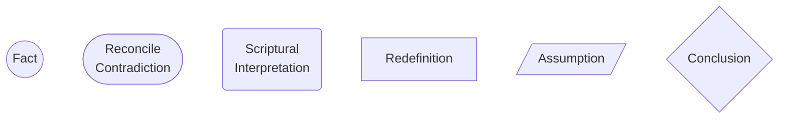
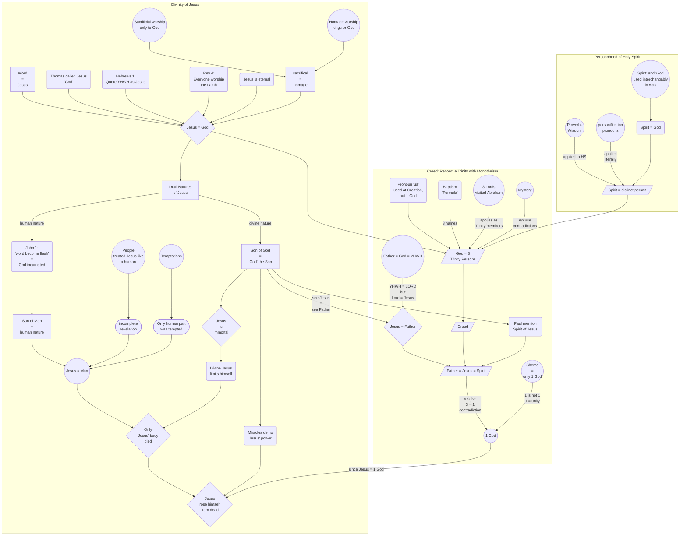
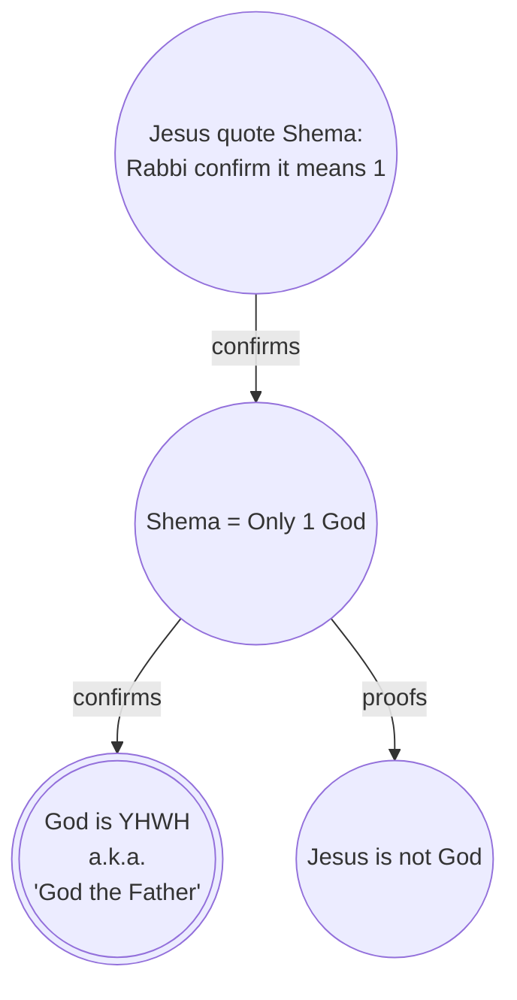
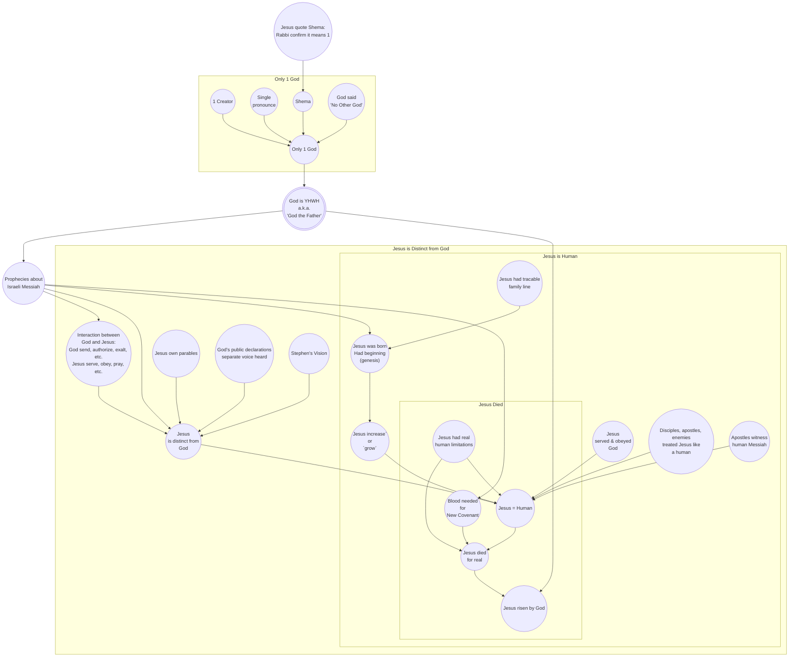

## Legend

# Trinitarian Argument

No single argument proof the Trinity doctrine. This complex collection of arguments are required to support the Trinitarian view. As seen on the diagram below, the Trinitarian case hedge on certain unbiblical assumptions which are complicated to proof. For example the "divinity of Jesus", the "Dual Natures of Jesus", the "Personhood of the Holy Spirit", and the "Reconciliation of the Trinity with Monotheism".

# Unitarian Argument

To proof the Unitarian case is biblical you only need the Shema, written by Moses in the Old Testament, quoted by Jesus himself in the New Testament, and affirmed by the apostles.

Still not convinced? Unlike the Trinitarian case that require all arguments to be true, the Unitarian case require any of the follow arguments to be true to disprove the Trinity:

