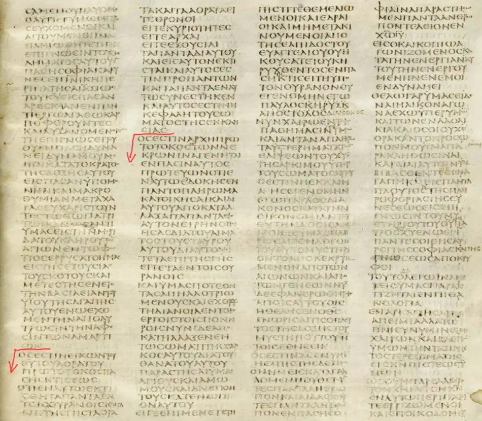

# The Creator

God is Creator, and [there is only one God](../../shema.md). Therefore, [if Jesus is God](../../name/son-as-god.md), he must be the Creator. Do biblical creation texts really identify Jesus as Creator?

## God as Creator

Several biblical writers describe God as the one Creator, acting without assistance.

### Isaiah

> I am the LORD, **Who made all things**, **Who alone** stretched out the heavens, **Who by Myself** spread out the earth. — Isaiah 44:24 (NRSV)

> **I made the earth, and created humankind** upon it; it was **My hands** that stretched out the heavens, and **I commanded** all their host. — Isaiah 45:12 (NRSV)

> My hand laid the foundation of the earth, and My right hand spread out the heavens; when **I call to them**, they stand forth together. — Isaiah 48:13 (ESV)

### Malachi

> Have we not all one Father?  
> Has not one **God created us**?  
> Why then are we faithless to one another, profaning the covenant of our fathers?
>
> — Malachi 2:10 (ESV)

### John

> All things were **made through Him**, and without Him nothing was made that was made.
>
> ...
>
> He was in the world, and **the world was made through Him**, and the world did not know Him.
>
> — John 1:3,10 (NKJV)

### Paul

> We always thank God, the Father of our Lord Jesus [Christ](https://kingdom.ofgod.info/christ)...
>
> ***He*** has delivered us from the domain of darkness and transferred us to the kingdom of His beloved Son, in whom we have redemption, the forgiveness of sins. He is the image of the invisible God, the firstborn of all creation.
>
> For by ***Him*** all things were created, in heaven and on earth, visible and invisible, whether thrones or dominions or rulers or authorities. All things were created ***through Him*** and ***for Him***. And ***He*** is before all things, and in ***Him*** all things hold together.
>
> — Colossians 1:3,13-17 (ESV)

### Hebrews

> God, who at various times and in various ways spoke in time past to the fathers by the prophets, has in these last days spoken to us by His Son, whom He has appointed heir of all things, **through whom also He made the worlds**. — Hebrews 1:1-2 (NKJV)

If these verses are read selectively and each pronoun is assumed to refer to Jesus, the conclusion may be that Jesus is God Almighty because Malachi identifies the Creator as God.

### Acts

> But you denied the Holy and Righteous One, and asked for a murderer to be granted to you, and you killed **the Author of life**... — Acts 3:14-15 (ESV)

The following sections consider these passages in context.

## Genesis 1

> Then God said, “**Let us make man in our image, after our likeness**. And let them have dominion over the fish of the sea and over the birds of the heavens and over the livestock...” — Genesis 1:26 (ESV)

Some readers take this verse as evidence that God has a human form, which they see as supporting the claim that Jesus is God.

According to Strong's Concordance, *image* and *likeness* can also convey resemblance or representation.

Therefore, some interpretations are:

* Humankind was to rule over creation as God rules.
* Humankind was to represent God's character within creation.

## John 1

Some readers [identify Jesus with God in John 1 because they assume that Jesus is "the Word"](../../name/word.md). In many English translations, the references to God, the Word, and Jesus are closely connected. This can give the impression that they are the same and that Jesus is the Creator.

## Acts 3

> But you denied the Holy and Righteous One, and asked for a murderer to be granted to you, and you killed **the Author of life**... — Acts 3:14-15 (ESV)

This verse is sometimes presented as proof that Jesus is God, because God alone is understood to be the source of life.

However, [Strong's Concordance](https://biblehub.com/greek/747.htm) gives a wider range of meanings for the Greek word translated as *Author*:

| Field           | Detail                                      |
| --------------- | ------------------------------------------- |
| Original word   | ἀρχηγός, οῦ, ὁ                              |
| Transliteration | *archégos*                                  |
| Definition      | Founder; leader                             |
| Usage           | Originator; author; founder; prince; leader |

### Translation Renderings

Other translations render the term differently:

> And killed **the Prince of life**, whom God hath raised from the dead; whereof we are witnesses. — Acts 3:15 (KJV)

> and killed **the Prince of life**; whom God raised from the dead; whereof we are witnesses. — Acts 3:15 (ASB)

> “And you killed him, **The Ruler of Life**, whom God raised from among the dead, and we are all his witnesses.” — Acts 3:15 (Aramaic Bible in Plain English)

> and you killed **the one who leads people to life**. But God raised him from death, and all of us can tell you what he has done. — Acts 3:15 (CEV)

> and killed **the Prince of life**; whom God raised from the dead; whereof we are witnesses. — Acts 3:15 (ERV)

> You killed **the one who leads to life**, but God raised him from death—and we are witnesses to this. — Acts 3:15 (GNT)

> and **the Prince of life** you killed, whom God raised out of the dead, of which we are witnesses; — Acts 3:15 (LSV)

> and **the Prince of the life** ye did kill, whom God did raise out of the dead, of which we are witnesses; — Acts 3:15 (YLT)

> and kylled **the Lorde of lyfe** whom God hath raysed from deeth of the which we are wytnesses. — Acts 3:15 (Tyndale Bible of 1526)

> "But you killed **the Prince of life**, whom Elohim raised from the dead, of which we are witnesses." — Acts 3:15 (TS2009)

In the context of:

> God exalted him at his right hand **as Leader and Savior**, to give repentance to Israel and forgiveness of sins. — Acts 5:31 (ESV)

the author of Acts may have intended the sense of “leader”, “ruler”, or “prince of life”.

### Context

Acts 3:14-15 continues:

> But you denied the Holy One and the Just, and asked for a murderer to be granted to you, and killed *the Prince of life*, **whom God** raised from the dead, of which we are witnesses.

This interpretation distinguishes Jesus from God, because the passage says that God raised him from the dead.

## Colossians 1

> He has delivered us from [the power of darkness](https://kingdom.ofgod.info/darkness) and conveyed us into [the kingdom](https://kingdom.ofgod.info) of the Son of His love, in whom we have [redemption through his blood](https://kingdom.ofgod.info/covenants/christ), the [forgiveness](https://word.ofgod.info/terms/forgiveness) of sins.
>
> He is the image of [the invisible God](https://ofgod.info/appearance), [the firstborn](../divine/firstborn.md) over all creation. **For by him all things were created that are in [heaven](https://word.ofgod.info/terms/heaven) and that are on earth, visible and invisible, whether thrones or dominions or principalities or powers. All things were created through him and for him.** And he is before all things, and in him all things consist. And he is the head of [the body](https://kingdom.ofgod.info/christ/body), [the church](https://church.ofgod.info), who is the beginning, [the firstborn](../divine/firstborn.md) from the dead, that in all things he may have the preeminence.
>
> For it pleased [the Father](https://ofgod.info) that in him all the fullness should dwell, and by him to reconcile all things to himself, by him, whether things on earth or things in [heaven](https://word.ofgod.info/terms/heaven), having made peace through the blood of his [cross](https://kingdom.ofgod.info/christ/crucifixion).
>
> — Colossians 1:13-20 (NKJV)

> [!WARNING]
> The phrase "in him" means "what exist in Christ now, because of what he has done". To be "in him" is to be in his [kingdom](https://kingdom.ofgod.info). Both the NASB and ESV both translate the same Greek phrase "in him" consistenly the same, except in Colossians 1:16, **they changed the phrase** to *"by him"* to fit their biased view so that it appear to look like *Jesus is the Creator*. NASB is hard to read because it is supposed to be more accurate, but they failed with Colossians. Therefore I choose the NKJV version in this case.

> [!WARNING]
> Some bible translations adds the word "fullness of God" to verse 19 which does not exist in original Greek manuscripts.

The choice of where to end sentences and begin new paragraphs lies with the English translator. Ancient Greek runs all the text continuously. There are not many word or paragraph seperators. When they do occur, it is significant. As seen in the screenshot of the Colossians 1 manuscript below, the outdents highlighted with red arrows indicate the beginning of the 2 strophes of Colossians 1:15-20. Visit [Codex Sinaiticus](https://codexsinaiticus.org/en/manuscript.aspx?__VIEWSTATEGENERATOR=01FB804F&book=43&chapter=1&lid=en&side=r&verse=16&zoomSlider=0) to see the ancient manuscripts in more detail.

A very literal translation of Colossians 1:15-20 by [Sean Finnegan](https://youtu.be/bAv10XKLA2I?si=aa5CUsdCgmsJST7I) divided into 2 strophes reads:

| Verse | Strophe 1: Colossian 1:15-18a                         | Verse | Strope 2: Colossians 1:18b-20                   |
| ----- | ----------------------------------------------------- | ----- | ----------------------------------------------- |
| 15a   | who is [the] image of the invisible God,              | 18b   | who is [the] beginning,                         |
| 15b   | firstborn of all creation                             | 18c   | firstborn from the dead,                        |
| -     | -                                                     | 18d   | in order that he may be first in all things,    |
| 16a   | for in him were created all things                    | 19    | for in him was pleased all the fulness to dwell |
| 16b   | in the heavens and upon the earth,                    | -     | -                                               |
| 16c   | the visible and the invisible,                        | -     | -                                               |
| 16d   | whether throne or dominions or domains or authorities | -     | -                                               |
| 16e   | all things have been created through him and for him  | 20a   | and through him to reconcile all things in him  |
| 17a   | and he is before all things                           | 20b   | making peace through the blood of his cross     |
| 17b   | and all things hold together in him                   | 20c   | whether the things upon the earth               |
| 18a   | and he is the head of the body of the Church          | 20d   | or the things in the heavens                    |

Sean explains that although the strophes are not a perfect symmetry of each other, they do align a lot. The gaps were possibly caused by elaborations.

We should not let our theology drive the structure, as in the case of most English bible translations. We should rather let the structure of the text drive the theology.

If Strophe 1 was about the creation of the universe, it makes little sense to end the strophe with the church. The church only came into existance after Christ.

Verse 17a-18a serves as a summary of what "all things" means and serve as a conclusion to Strophe 1.

### Problems with Creation Readings of Colossians 1:16

1. The context of Colossians 1:13-14 is **about redemption, not creation**. Likewise, subsequent context Colossians 1:21-22 are also redemptive. What would flow more naturally from redemption (Christ saving us from sin) is the do doctrine of the church instead of creation theory. According to Sean, most scholar generally agree that Colossians 1:15-20 were an insertion. If one reads Colossians 1:1-14 and then skips to verse 21 and continue, the text reads smoothly with no breaks or discontinuality. Scholars are debating whether Paul wrote the inserted the Colossians 1:15-20 poetic unit in the text. *It is possible that he cited it from somewhere else.*
2. Biblically to be made in the image of God is **to be human** (Genesis 1:26- 27). The bible does not mention some angelic being been created in His image. **Nobody believes Jesus was a human at Creation.** Colossians 1:16 is therefore not speaking about something that happened at the Creation but something that happened during or after Jesus human life.
3. [Firstborn](../divine/firstborn.md) of some class, means to be the most the first or most important in that class. For example, **Jesus was not the first human being been born** of creation.
4. As seen [above](#colossians-1), if "in him" is the correct phrase to use in Colossians 1:16, it changes the meaning from *"Jesus is the Creator"* to *"being in Jesus Church/Kingdom"*.
5. Paul mentions at verse 18 that Christ is the "head of the body of the Church". If this was about Creation it meant *the Church was the entire universe*.
6. **Second Creator** contradicts clear exclusive statements (Isaiah 44:24). The same "all things" phrase are used in both passages.

James D.G. Dunn argues:

> If then Christ is what God's power/wisdom came to be recognized as, of Christ is can be said what was first of wisdom - that 'in him (the divine wisdom now embodied in Christ) were created all things.' In other words the language may be used here to indicate the continuity between God's creative power and Christ without the implication being intended that Christ himself was active in creation. -- Christology in the Making, 2nd ed. (Grand Rapids, MI: Eerdmans, 1996), 191.

1. Shared Jewish vocabularly **does not mean dependence** between the passages. Paul never used the word "wisdom". Wisdom is also often personified as a female, not a male Christ.
2. Still implies pre-existance. If you replace "wisdom" with "Christ" it means you need to proof that Paul meant Christ pre-existed as Wisdom pre-existed.
3. Analogy works one-way. If one say "Wisdom has found her home in Christ" is not mean one could give Christ the credit for what Wisdom did before it became incarnated in Christ. It would be like punishing Nazi decendants for something their anchestors did.

### New Creation Language

What it means:

1. "Image of God" implies rulership of a new humanity. Christ is the new Adam in the "new Creation".
2. "Firstborn of all creation" is already taken with respect to the original creation, but from the new creation perspective dovetails nicely with "firstborn from the dead" (resurrected) in verse 18c.
3. "Head of the body, the church" in verse 18a implies new creation since the church didn't exist before Christ came.
4. New creation better fits the contextual frame of Colossians 1:13-14 and Colossians 1:21-22.

#### Scope of “All Things”

Colossians 1:16 names thrones, dominions, rulers, and authorities among visible and invisible things, rather than naming rocks, water, plants, or animals.

What about "in him ***all*** things were created"?

*In this reading, Jesus created authority structures within his kingdom, and “**all things**” is understood in that context.* The passage does not settle that limit by its list alone; a broader cosmic reading remains possible.

For example, saying that children ate all the cookies usually means all the cookies available to them, not every cookie in the world.

For example:

* “All the men of Israel agreed” (2 Samuel 17:14) need not mean that every Israelite was present.
* “All the people seized Jeremiah” (Jeremiah 26:8) can refer to those present, since others later released him.
* “You know all things” (1 John 2:20) does not require that a person knows everything without limit.

Colossians 1:15-20 parallels Ephesians 1:20-23. Both speaks of "all things", "from the dead", "dominions", "domains", "authorities", "head of the body", "church", "the fullness". The same person wrote both Colossians and Ephesians. Therefore it make sense to read them together to have a better understanding of Paul's intend. This means "in Christ" God bring about a "new creation" as Christ ascended into heaven at God's right hand.

What was created? Church structures, positions like apostles, prophets, etc.

Colossians 1:16 is talking about a new creation. "In Christ" God has brough about a whole new reality with new authority structures. These authorities are both visible and invisible both in heaven and upon the earth. These power structures manage the new realm where Christ is Lord.

### Jesus' Reference to the Creator

This interpretation also notes that Jesus refers to the Creator as someone else:

> He *(Jesus)* answered, "Have you not read that He Who created them from the beginning made them male and female?" — Matthew 19:4 (ESV)

## Hebrews 1

> God, who at various times and in various ways spoke in time past to the fathers by the prophets, has in these last days spoken to us by His Son, whom He has appointed heir of all things, **through whom also He made the worlds**; — Hebrews 1:1-2 (NKJV)

The Greek [Interlinear Bible](https://biblehub.com/interlinear/hebrews/1-2.htm) shows that the word translated as “worlds” is *aión*, which can refer to an age or span of time.

|                   | Strong's Concordance    |
| ----------------- | ----------------------- |
| Original Word     | αἰών, ῶνος, ὁ           |
| Part of Speech    | Noun, Masculine         |
| Transliteration   | aión                    |
| Phonetic Spelling | (ahee-ohn')             |
| Definition        | a space of time, an age |

The phrase “in these last days” may imply that God had not previously spoken through his Son. This reading therefore distinguishes the Son's role from God's speech in Genesis 1.

Under this interpretation, appointing the Son as “heir of all things” distinguishes him from the one who already owns everything.

## Revelation 10:5-6

> Then I saw another **mighty angel coming down from heaven**, wrapped in a cloud, with a rainbow over his head, and **his face was like the sun**, and his legs like pillars of fire. He had a little scroll open in his hand. And he set his right foot on the sea, and his left foot on the land, and called out with a loud voice, like **a lion** roaring... And **the angel** whom I saw standing on the sea and on the land... **Who lives forever and ever, Who created heaven and what is in it, the earth and what is in it, and the sea and what is in it**, that there would be no more delay. — Revelation 10:1-3,5-6 (ESV)

Some scholars connect the descriptions of this “mighty angel” with Jesus. They therefore infer that [Jesus, as “the angel of the LORD”](../../name/son-as-angel.md), created the world.

However, the angel “raised his right hand to heaven and swore by Him” who lives for ever. This changes the subject from the angel to God, who lives for ever. Therefore, this passage does not explicitly state that the angel created the world.

## Co-operative Creators?

Some explain the passages by proposing that the Father authorised creation and Jesus performed the creative work. They cite translations such as:

> For us,
>
> 1. There is one God, the Father, by whom all things were *created*, and for whom we live.
> 2. And there is one Lord, Jesus Christ, through whom all things were *created*, and through whom we live.
>
> — 1 Corinthians 8:6 (NLT)

### Translation Comparison

They argue that the Father acted as architect and enabled Jesus to do the work. This interpretation notes that “created”, added by some translators, is absent from the Greek text shown in the [Interlinear Bible](https://biblehub.com/interlinear/1_corinthians/8-6.htm):

| English          | Greek                                                    | Lexicon                                                                  | [Strong's Description](https://biblehub.com/strongs/1_corinthians/8-6.htm)                                                                                                 |
| ---------------- | -------------------------------------------------------- | ------------------------------------------------------------------------ | -------------------------------------------------------------------------------------------------------------------------------------------------------------------------- |
| YET              | [all](https://biblehub.com/greek/all%E2%80%99_235.htm)   | Conjunction                                                              | [But, except, however. Neuter plural of allos; properly, other things, i.e. contrariwise.](https://biblehub.com/greek/235.htm)                                             |
| FOR US           | [hēmin](https://biblehub.com/greek/he_min_1473.htm)      | Personal / Possessive Pronoun - Dative 1st Person Plural                 | [I, the first-person pronoun. A primary pronoun of the first person I.](https://biblehub.com/greek/1473.htm)                                                               |
| *[there is but]* |                                                          |                                                                          |                                                                                                                                                                            |
| ONE              | [heis](https://biblehub.com/greek/heis_1520.htm)         | Adjective - Nominative Masculine Singular                                | [One. (including the neuter Hen); a primary numeral; one.](https://biblehub.com/greek/1480.htm)                                                                            |
| GOD              | [theos](https://biblehub.com/greek/theos_2316.htm)       | Noun - Nominative Masculine Singular                                     | [A deity, especially the supreme Divinity; figuratively, a magistrate; by Hebraism, very.](https://biblehub.com/greek/2316.htm)                                            |
| THE              | [ho](https://biblehub.com/greek/ho_3588.htm)             | Article - Nominative Masculine Singular                                  | [The, the definite article. Including the feminine he, and the neuter to in all their inflections; the definite article; the.](https://biblehub.com/greek/3588.htm)        |
| FATHER           | [patēr](https://biblehub.com/greek/pate_r_3962.htm)      | Noun - Nominative Masculine Singular                                     | [Father, (Heavenly) Father, ancestor, elder, senior. Apparently a primary word; a 'father'.](https://biblehub.com/greek/3962.htm)                                          |
| FROM             | [ex](https://biblehub.com/greek/ex_1537.htm)             | Preposition                                                              | [From out, out from among, from, suggesting from the interior outwards. A primary preposition denoting origin, from, out.](https://biblehub.com/greek/1537.htm)            |
| WHOM             | [hou](https://biblehub.com/greek/hou_3739.htm)           | Personal / Relative Pronoun - Genitive Masculine Singular                | [Who, which, what, that.](https://biblehub.com/greek/3739.htm)                                                                                                             |
| ALL              | [panta](https://biblehub.com/greek/panta_3956.htm)       | Adjective - Nominative Neuter Plural                                     | [All, the whole, every kind of. Including all the forms of declension; apparently a primary word; all, any, every, the whole.](https://biblehub.com/greek/3956.htm)        |
| THINGS           | [ta](https://biblehub.com/greek/ta_3588.htm)             | Article - Nominative Neuter Plural                                       | [The, the definite article. Including the feminine he, and the neuter to in all their inflections; the definite article; the](https://biblehub.com/greek/3588.htm)         |
| ***[created]***  | -                                                        | -                                                                        | ***Added by translator!***                                                                                                                                                 |
| AND              | [kai](https://biblehub.com/greek/kai_2532.htm)           | Conjunction                                                              | [And, even, also, namely.](https://biblehub.com/greek/2532.htm)                                                                                                            |
| FOR              | [eis](https://biblehub.com/greek/eis_1519.htm)           | Preposition                                                              | [A primary preposition; to or into, of place, time, or purpose; also in adverbial phrases.](https://biblehub.com/greek/1519.htm)                                           |
| *[whom]*         | [auton](https://biblehub.com/greek/auton_846.htm)        | Personal / Possessive Pronoun - Accusative Masculine 3rd Person Singular | [He, she, it, they, them, same. From the particle au; the reflexive pronoun self, used of the third person, and of the other persons.](https://biblehub.com/greek/846.htm) |
| WE               | [hēmeis](https://biblehub.com/greek/he_meis_1473.htm)    | Personal / Possessive Pronoun - Nominative 1st Person Plural             | [I, the first-person pronoun. A primary pronoun of the first person I.](https://biblehub.com/greek/1473.htm)                                                               |
| ***[exist]***    | -                                                        | -                                                                        | ***Added by translator!***                                                                                                                                                 |
| AND              | [kai](https://biblehub.com/greek/kai_2532.htm)           | Conjunction                                                              | [And, even, also, namely.](https://biblehub.com/greek/2532.htm)                                                                                                            |
| *[there is but]* |                                                          |                                                                          |                                                                                                                                                                            |
| ONE              | [heis](https://biblehub.com/greek/heis_1520.htm)         | Adjective - Nominative Masculine Singular                                | [One. (including the neuter Hen); a primary numeral; one.](https://biblehub.com/greek/1480.htm)                                                                            |
| LORD             | [Kyrios](https://biblehub.com/greek/kyrios_2962.htm)     | Noun - Nominative Masculine Singular                                     | [Lord, master, sir; the Lord. From kuros; supreme in authority, i.e. controller; by implication, Master.](https://biblehub.com/greek/2962.htm)                             |
| JESUS            | [Iēsous](https://biblehub.com/greek/ie_sous_2424.htm)    | Noun - Nominative Masculine Singular                                     | [Of Hebrew origin; Jesus, the name of our Lord and two other Israelites.](https://biblehub.com/greek/ie_sous_2424.htm)                                                     |
| CHRIST           | [Christos](https://biblehub.com/greek/christos_5547.htm) | Noun - Nominative Masculine Singular                                     | [Anointed One; the Messiah, the Christ. From chrio; Anointed One, i.e. The Messiah, an epithet of Jesus.](https://biblehub.com/greek/5547.htm)                             |
| THROUGH          | [di’](https://biblehub.com/greek/di%E2%80%99_1223.htm)   | Preposition                                                              | [A primary preposition denoting the channel of an act; through.](https://biblehub.com/greek/1223.htm)                                                                      |
| WHOM             | [hou](https://biblehub.com/greek/hou_3739.htm)           | Personal / Relative Pronoun - Genitive Masculine Singular                | [Who, which, what, that.](https://biblehub.com/greek/3739.htm)                                                                                                             |
| ALL              | [panta](https://biblehub.com/greek/panta_3956.htm)       | Adjective - Nominative Neuter Plural                                     | [All, the whole, every kind of. Including all the forms of declension; apparently a primary word; all, any, every, the whole.](https://biblehub.com/greek/3956.htm)        |
| THINGS           | [ta](https://biblehub.com/greek/ta_3588.htm)             | Article - Nominative Neuter Plural                                       | [The, the definite article. Including the feminine he, and the neuter to in all their inflections; the definite article; the](https://biblehub.com/greek/3588.htm)         |
| ***[created]***  | -                                                        | -                                                                        | ***Added by translator!***                                                                                                                                                 |
| AND              | [kai](https://biblehub.com/greek/kai_2532.htm)           | Conjunction                                                              | [And, even, also, namely.](https://biblehub.com/greek/2532.htm)                                                                                                            |
| THROUGH          | [di’](https://biblehub.com/greek/di%E2%80%99_1223.htm)   | Preposition                                                              | [A primary preposition denoting the channel of an act; through.](https://biblehub.com/greek/1223.htm)                                                                      |
| *[whom]*         | [auton](https://biblehub.com/greek/auton_846.htm)        | Personal / Possessive Pronoun - Accusative Masculine 3rd Person Singular | [He, she, it, they, them, same. From the particle au; the reflexive pronoun self, used of the third person, and of the other persons.](https://biblehub.com/greek/846.htm) |
| WE               | [hēmeis](https://biblehub.com/greek/he_meis_1473.htm)    | Personal / Possessive Pronoun - Nominative 1st Person Plural             | [I, the first-person pronoun. A primary pronoun of the first person I.](https://biblehub.com/greek/1473.htm)                                                               |
| ***[exist]***    | -                                                        | -                                                                        | ***Added by translator!***                                                                                                                                                 |

Compare the same verse with the NKJV, which more closely follows this Greek construction:

> For us there is:
>
> 1. one God, the Father, of Whom are all things, and **we for Him**; and
> 2. one Lord Jesus Christ, *through whom* are all things, and **through whom we** *[live]*.
>
> — 1 Corinthians 8:6 (NKJV)

This verse should be read in its immediate context. Paul is not giving a separate account of how creation happened. In 1 Corinthians 8, he answers a practical question about food offered to idols. He contrasts the one God, the Father, with idols that have no real existence.

The phrase translated *“through whom”* is [δι’ οὗ (*di’ hou*)](https://biblehub.com/interlinear/1_corinthians/8-6.htm): διά (*dia*) with the genitive relative pronoun ὅς (*hos*). Its standard gloss is “through whom” or “by means of whom”. This grammar marks means or agency. It does not identify Jesus as a divine being. [2 Corinthians 1:19](https://biblehub.com/interlinear/2_corinthians/1-19.htm) uses **δι’ ἡμῶν … δι’ ἐμοῦ**, “by us … by me”, for human preachers who proclaim Christ; [Romans 15:18](https://biblehub.com/interlinear/romans/15-18.htm) uses **δι’ ἐμοῦ**, “through me”, for Christ working through Paul. These examples show that the construction can describe human agency and that grammar alone does not proof that Jesus is divine.

The Father is described as “from whom are all things” (ἐξ οὗ τὰ πάντα, ἡμεῖς εἰς αὐτόν). The phrase explicitly gives believers’ purpose or direction to the Father. Jesus is described as “through whom are all things” (δι’ οὗ τὰ πάντα, ἡμεῖς δι’ αὐτοῦ). Saying that Jesus enables that purpose interprets **διά** as agency.

The following verses remain focused on conscience, love, and food offered to idols (1 Corinthians 8:7-13). Paul warns that eating such food may become “a stumbling block to those who are weak” (1 Corinthians 8:9). Read in that setting, 1 Corinthians 8:6 [distinguishes God from Jesus](../../human/distinct.md). It identifies the Father as the source of all things and gives believers’ purpose or direction explicitly to him. It identifies Jesus as the one Lord through whom all things are and through whom believers exist. It does not itself identify Jesus as the Creator.

Another passage from Paul may indicate this emphasis:

> Blessed be the God and Father of our Lord Jesus Christ, who has blessed us in Christ with every spiritual blessing in the heavenly places, even as **He chose us in Him before the foundation of the world**, that we should be holy and blameless before Him. In love **He predestined us for adoption to Himself [as sons](../../name/sons-of-god.md) through Jesus Christ**, according to the purpose of His will, to the praise of His glorious grace, with which He has blessed us in the Beloved. — Ephesians 1:3-6 (ESV)

## Conclusion

The passages considered here identify God as Creator and can be read as distinguishing him from Jesus. The discussion of [Genesis 1](#genesis-1), [Acts 3](#acts-3), [Colossians 1](#colossians-1), [Hebrews 1](#hebrews-1), and [1 Corinthians 8:6](#co-operative-creators) presents this interpretation in detail.

Jesus refers to God as Creator rather than claiming that role for himself:

> And Jesus, answering them, began to say: “Take heed that no one deceives you... For in those days there will be tribulation, such as has not been since the beginning of the creation which **God created** until this time, nor ever shall be. — Mark 13:5,19 (NKJV)
