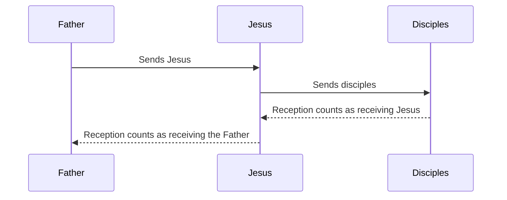

# Omnipresence

Jesus promises to be among those gathered in his name and with his disciples to the end of the age. Other passages speak of filling all things, making a home with believers and being present among churches. Do these statements establish omnipresence?

## Defining Omnipresence

Cambridge Dictionary defines the noun omnipresence:

> the fact of **being present** or having an effect everywhere at the same time. — [Cambridge Dictionary](https://dictionary.cambridge.org/dictionary/english/omnipresence)

The definition includes both presence and effects. The claim assessed here is that Jesus is universally present. This is stronger than a claim of widespread influence or mission support.

The Father explicitly describes his universal reach:

> Am I a God **at hand**, declares the LORD, and not a God **far away**?  
> Can a man **hide himself** in secret places so that **I cannot see him**? declares the LORD.  
> Do I not **fill heaven and earth**? declares the LORD.
>
> — Jeremiah 23:23-24 (ESV)

The Father fills heaven and earth and sees hidden people.

## Matthew 18:20 (Gathering in Jesus Name)

In contrast to the LORD's omnipresence, Jesus' promise addresses followers gathered under his authority:

> “If your brother sins against you:
>
> 1. go and tell him his fault, between you and him alone. If he listens to you, you have  gained your brother.
> 2. But if he does not listen, take **one or two** others along with you, that every charge may be established by the evidence of **two or three witnesses**.
> 3. If he refuses to listen to them, tell it to the church.
>
> And if he refuses to listen even to the church, let him be to you as a Gentile and a tax collector.
>
> Truly, I say to you, whatever you bind on earth shall be bound in heaven, and whatever you loose on earth shall be loosed in heaven. Again I say to you, **if two of you** agree on earth about anything they ask, it will be done for them by my Father in heaven. For where **two or three are gathered** in my *name ([authority](../../name.md))*, there am I ***[among](https://biblehub.com/greek/3319.htm)*** them.”
>
> — Matthew 18:15-20 (ESV)

Gathering [in Jesus' name](../../name.md) expresses allegiance to him and acting under his authority. [Jesus' authority is exercised through his commissioned followers.](#the-logic-of-representation) He made this promise while his disciples regarded him as their Rabbi. Jesus could not have been physically present at every location where his disciples gathered.

> [!WARNING]
> Some bible translations add paragraph breaks or biased titles to the text which were not part of the original manuscripts. This gives the impression that the topic changed from dealing with sin to *omnipresence*.
>
> When Matthew's message should be read together as it was originally intended.

### Paul's Presence in Spirit

> When you are assembled **in the name of the Lord Jesus** and **my spirit is present**, with the **power of our Lord Jesus**, you are to deliver this man to Satan for the destruction of the flesh, so that his spirit may be saved in the day of the Lord. — 1 Corinthians 5:4-5 (ESV)

Paul, a human messenger, describes his spirit as present in a disciplinary assembly. A plausible interpretation is [*Paul shares the assembly's judgement and purpose through his message and entrusted authority without being bodily present.*](https://hermeneutics.stackexchange.com/questions/50129/colossians-25-i-am-present-with-you-in-spirit-is-this-literal-or-metaphor) Paul could not have meant "omnipresence". **"Presence" language does not establishes omnipresence.**

## Matthew 28:20 (With Disciples to the End)

> And Jesus came and said to them, "All authority in heaven and on earth **has been given to me**. Go therefore and **make disciples of all nations**, baptizing them in the name of the Father and of the Son and of the Holy Spirit, **teaching them to observe all that I have commanded you**. And behold, **I am with you always, to the end of the age**." — Matthew 28:18-20 (ESV)

Jesus continues to support the disciples' work under the authority granted to him.

In this context Jesus was concerned about [the Kingdom of God](https://kingdom.ofgod.info). The goal is to make "disciples of all nations". Jesus previously said that he would return to gather his own (Matthew 24:23-44).

Matthew also records Jesus speaking of his future return: “When the Son of Man **comes in his glory**” (Matthew 25:31). It does not establish that the promise “I am with you always” is about continuous physical presence. Matthew presents both the continuing promise and the future coming, so they should be read together without treating either as a contradiction.

Furthermore, a parallel witness in the book of Acts states:

> So when they had come together, they asked him *(Jesus)*, “Lord, will you at this time restore the kingdom to Israel?”  
> He said to them, “It is not for you to know times or seasons that [the Father](../../human/distinct.md) has fixed by [His own authority](../../human/has-a-god.md). But you will receive power when the Holy Spirit has come upon you, and you will be my witnesses in Jerusalem and in all Judea and Samaria, and to the end of the earth.”
>
> And when he had said these things, as they were looking on, he was lifted up, and a cloud took him out of their sight. And while they were gazing into heaven as he went, behold, two men stood by them in white robes, and said,
>
> “Men of Galilee, why do you stand **looking into heaven**?
> This Jesus, who **was taken up from you** into heaven, **will come in the same way** as you saw him go into heaven.”
>
> — Acts 1:6-11 (ESV)

This shows that the disciples did not think that Jesus was [omnipresent](#omnipresence).

## Support in Corinth

Acts confirms an assurance connected with a particular mission. The Lord speaks to Paul in a vision:

> Do not be afraid, but **go on speaking** and do not be silent, for **I am with you**, and **no one will attack you to harm you**, for I have many in this city who are my people. — Acts 18:9-10 (ESV)

The assurance concerns continued preaching and protection, not a definition of presence in every location. The reference to people in the city does not say that protection comes through those believers. This supports the [mission setting](#with-disciples-to-the-end) already established in Matthew, rather than serving as its sole foundation.

## Further Presence Texts

### Filling All Things

> And he put **all things under his feet** and gave him as **head over all things to the church**, which is his body, the fullness of him who **fills all in all**. — Ephesians 1:22-23 (ESV)

> He who **descended** is the one who also **ascended far above all the heavens**, that he might **fill all things**. — Ephesians 4:10 (ESV)

The strongest opposing interpretation is *"The ascended Christ fills the universe by actual divine presence everywhere."* It does not require bodily duplication. The Expositor's Greek Testament expresses this interpretation as:

> *“pervading and energising omnipresence”* — [Expositor's Greek Testament on Ephesians 4:10](https://biblehub.com/commentaries/ephesians/4-10.htm)

This is the commentator's theological interpretation, not Paul's explicit definition. Ellicott, in the same collection, assumes divine and human natures. Those natures are part of his interpretation, not a stated conclusion of the verse.

Ephesians 1:20-23 describes the Father raising Christ, seating him above every power and putting all things under Christ's feet. The passage connects Christ's rule over the universe with his headship over the church. Ephesians 4:8-12 connects his ascension with gifts that equip believers and build the church.

A context-supported reading is *"The exalted Messiah fills the universe through cosmic sovereignty and activity under the Father's authority."* Cosmic sovereignty means rule over the universe, with church-building as one expression rather than the limit of that activity. This preserves the scope relevant to the [Jeremiah comparison](#defining-omnipresence). The readings can overlap: universal rule could operate through omnipresence, so actual universal presence remains plausible.

Genuine effects everywhere at the same time would fit the [dictionary's broad usage](#defining-omnipresence). That definition does not establish whether these verses describe such effects or how Christ fills all things. Such functional reach would not by itself establish intrinsic divine presence or nature. [Granted authority and agency](#limits-of-the-inference) do not disprove personal omnipresence. Neither reading alone settles Jesus' nature or proves non-omnipresence. This remains the strongest unresolved omnipresence argument considered here.

### The John 3:13 Variant

> No one has **ascended into heaven** except he who **descended from heaven**, the Son of Man. — John 3:13 (ESV)

The ESV omits the longer ending, **“who is in heaven”**. A [NET textual note](https://www.biblegateway.com/passage?search=John+3%3A13-15&version=NET%3BESV) records its omission in P66, P75, א and B. The shorter text, preferred here, describes ascent and descent without explicitly asserting simultaneous heavenly residence.

The longer reading is textually disputed, not dismissed here for theological reasons. If original, it may support simultaneous presence in heaven and on earth. Even then, two locations are not everywhere; the [common inference limit](#limits-of-the-inference) still applies.

### Indwelling and Church Oversight

> If anyone loves me, he will keep my word, and **my Father** will love him, and **we will come to him and make our home with him**. — John 14:23 (ESV)

The strongest opposing inference is *"Christ is personally present wherever believers live, so he possesses divine omnipresence."* The promise involves both the Father and Jesus.

Romans 8:9-11 connects Christ's presence in believers with God's Spirit. It distinguishes the Father who raised Jesus, the risen Jesus and the Spirit dwelling in believers.

2 Corinthians 13:5 connects Christ being in believers with testing their faith. Galatians 2:20 describes Paul living by faith with Christ living in him. In Colossians 3:11, **“Christ is all, and in all”** applies across ethnic and social distinctions in the renewed community.

A context-supported alternative is *"The Father and Jesus are genuinely present to believers through God's Spirit, shaping their life and faith."* This is a real spiritual relationship, not merely past influence or empty metaphor. The passages describe life in and with believers, without explicitly placing Jesus at every location. Indwelling should not be confused with [agency](#the-logic-of-representation). The [common inference limit](#limits-of-the-inference) applies to both readings.

#### Walking Among the Churches

> who **walks among the seven golden lampstands** — Revelation 2:1 (ESV)

Revelation 1:20 identifies the lampstands as seven churches. The vision portrays Christ's active presence and oversight among communities, confirming the [picture of continuing involvement](#indwelling-and-church-oversight).

Symbolic walking does not explicitly claim presence at every location. The [common inference limit](#limits-of-the-inference) applies here too. The vision is confirming evidence, not the foundation of the argument.

## Human Location and Departure

The [human-location passages](../../human/limitations.md#jesus-is-not-omnipresent) portray Jesus in one place rather than another, and as departing and returning. They must be considered alongside the presence promises.

### Absence, Departure and Return

After announcing Lazarus' death, Jesus speaks of his absence (John 11:14-15):

> I was **not there** — John 11:15 (ESV)

John 14:2-4,14:28,16:28 describe Jesus going to the Father and coming again. In his prayer, Jesus contrasts the disciples remaining in the world with his own departure:

> And I am **no longer in the world**, but they are in the world, and **I am coming to you**. — John 17:11 (ESV)

John 17:11-13 continues that contrast. These passages describe Jesus' location, departure and return. They remain relevant to the [promises of continuing presence](#with-disciples-to-the-end).

### The Ascension Account

Acts 1:6-11 supports the distinction between Jesus' departure and the continuing mission. The Father sets times by his own authority, and the Holy Spirit empowers the disciples' witness. Jesus is taken into heaven, and his return is promised.

The account presents Jesus' movement alongside the disciples' continuing work. It does not explain how the [presence promised during that work](#with-disciples-to-the-end) is fulfilled. Supplementary discussions address [Jesus' distinction from the Father](../../human/distinct.md) and [his relationship to his God](../../human/has-a-god.md).

### What Bodily Absence Can Show

These passages support [Jesus' human identity](../../name/son-of-man) and distinguish his bodily presence from absence. They do not establish that he lacks non-bodily presence after the resurrection or at all times. The [same inference limit](#limits-of-the-inference) applies here.

The narrower human rebuttal is *"The promises can be read within Jesus' granted authority and continuing mission without treating inherent omnipresence as an established attribute."* This reading must still account for the [continuing assurance](#with-disciples-to-the-end). It interprets the cited evidence rather than proving universal incapacity from earthly absence.

## Agency and Its Limits

Jesus says that receiving him is receiving the one who sent him. His words raise a question about personal identity and authorised representation. The same question arises when Jesus speaks about receiving or rejecting his disciples. Their commission, together with examples involving Moses, Samuel, the prophets and David's envoys, provides a way to examine the distinction.

### The Logic of Representation

Agency means acting for someone with their authority. A sender authorises a messenger to carry a message or fulfil a mission. Responding to that work can count as responding to the sender, but the messenger remains distinct from the sender.

The expression [law of agency](https://biblehub.com/commentaries/matthew/10-40.htm) describes this pattern. It is not the name of a biblical statute or a claim about ancient legal history. The authority concerns the commissioned work. It does not automatically extend to every private opinion, personal fault or unrelated act of a representative.

The pattern provides a model for authorised work beyond a sender's bodily location. A proposed reading of the presence promises is *"Jesus sustains his mission through his entrusted message and authority, with Spirit-empowered disciples carrying out the work."* The mission passages support considering this reading, but the reception sayings do not show exactly how Jesus is present.

Reception is a response to a person or mission; presence concerns being with people. The reception examples show how a response counts towards the sender, not how the sender is present.

An agency reading must respect the [same inference limit](#limits-of-the-inference) as the [human-location evidence](#what-bodily-absence-can-show).

### Non-Jesus Examples of Representation

The Old Testament gives independent examples in which a response to messengers counts as a response to their sender. Each example has its own setting and limits.

#### Moses and Aaron: Grumbling Against the LORD

Israel complained about food to Moses and Aaron, who administered the LORD's provision. Moses explained whose provision the complaint challenged:

> "Your **grumbling** is not against us but **against the LORD**." — Exodus 16:8 (ESV)

Moses and Aaron represent the LORD's provision, so Israel's complaint concerns him. They do not become the LORD, nor does this make every disagreement with them an offence against God.

#### Samuel: Rejecting the LORD's Kingship

The LORD addresses Samuel after Israel demands a king like the surrounding nations:

> "**they have not rejected you**, but **they have rejected me from being king over them**" — 1 Samuel 8:7 (ESV)

The words "from being king over them" identify the issue as rejection of the LORD's kingship. Samuel is the human representative through whom that rejection is expressed, not the God whose rule is rejected.

#### Prophets: Rejecting God's Message

Deuteronomy describes how authorised prophetic speech works. The LORD promises to supply a prophet's words and hold hearers accountable for refusing them:

> I will raise up for them a prophet like you from among their brothers. And **I will put my words in his mouth**, and **he shall speak to them all that I command him**. And whoever will not listen to **my words that he shall speak in my name**, I myself will require it of him. — Deuteronomy 18:18-19 (ESV)

The prophet speaks words commanded by the Father, in the Father's name. Rejecting them concerns the Father, not merely the speaker's private judgement. This is a general pattern of prophetic commissioning; the comparison does not require excluding Jesus from it.

Judah's treatment of the prophets illustrates rejection of their message. The account describes God approaching the people:

> sent persistently to them by his **messengers** — 2 Chronicles 36:15 (ESV)

The people's response follows:

> **mocking the messengers of God**, **despising his words** — 2 Chronicles 36:16 (ESV)

The people mock God's messengers and despise his words, and judgement follows. The prophets are not God. Their treatment matters because God's message is rejected.

#### David's Envoys: Insulting the Sender

David sent servants to console Hanun rather than going himself:

> "David **sent** by his **servants** to console him" — 2 Samuel 10:2 (ESV)

Hanun humiliated the servants, including by shaving their beards:

> "**shaved off half the beard**" — 2 Samuel 10:4 (ESV)

The envoys were ashamed, and the account describes the damage to relations with David:

> "**become a stench to David**" — 2 Samuel 10:6 (ESV)

Humiliating the envoys harms relations with David, who sent them. This is a diplomatic analogy: an insult to a messenger affects the sender, but the servants do not become the king.

### Receiving Jesus

> **Whoever receives you receives me**, and whoever receives me receives **him who sent me**. — Matthew 10:40 (ESV)

> Truly, truly, I say to you, whoever **receives the one I send** receives me, and whoever receives me receives **the one who sent me**. — John 13:20 (ESV)

These sayings keep the disciples, Jesus and the Father distinct. Receiving commissioned disciples counts as receiving Jesus and the Father, but does not make the disciples Jesus or additional Messiahs.

The inference *"Receiving Jesus counts as receiving the Father, so Jesus must have divine nature"* need not identify Jesus literally with the Father. Yet the same language applies to human disciples, so reception alone does not establish a messenger's identity or nature. The [agency principle](#the-logic-of-representation) concerns receiving commissioned work, not giving every messenger the same status.

Luke confirms the same relationship through hearing and rejection:

> The one who **hears you hears me**, and the one who **rejects you rejects me**, and the one who rejects me rejects **him who sent me**. — Luke 10:16 (ESV)

This confirms the pattern in Matthew 10:40 and John 13:20. The same [mission-based relationship](#the-logic-of-representation) applies to hearing and rejection.

#### Commission and Reception

The solid arrows show commissioning. The dashed arrows show how reception counts towards the senders in the sayings above.

The diagram describes relationships and the effect of reception. It does not represent personal identity, spatial movement or a mode of omnipresence.

### Unity Between Father and Son

Jesus connects believing in him and seeing him with the Father who sent him:

> Whoever believes in me, **believes not in me but in him who sent me**. And whoever sees me **sees him who sent me**. — John 12:44-45 (ESV)

In the same speech, Jesus explains the source of his message:

> For **I have not spoken on my own authority**, but the Father who sent me has himself **given me a commandment** — what to say and what to speak. And I know that his commandment is eternal life. **What I say, therefore, I say as the Father has told me**. — John 12:49-50 (ESV)

A context-supported interpretation is *"Jesus makes the Father known through the mission and message entrusted to him."* The Father's command about what Jesus should say supports this mission explanation of [unity with the Father](1-with-father.md). An [explanation of biblical agency](https://trueunitarian.com/biblical-agency/) offers supplementary discussion.

This [representative relationship](#the-logic-of-representation) explains encountering the sender through the messenger. It does not give a complete account of Jesus' nature. Nor does seeing the Father through Jesus explain how Jesus is present.

### Addressing the Unique Role of Jesus

A serious objection is *"Jesus' mission and continuing presence are unique, so ordinary messengers cannot explain everything about him."* The comparisons do not give every messenger the same status, mission or relationship to the sender. They test inferences from [reception](#receiving-jesus) and [presence language](#pauls-presence-in-spirit), rather than equating Jesus with Paul or other prophets.

The reading defended here is *"Jesus is fully human in nature, yet uniquely commissioned and empowered as Messiah by the Father."* Humanity does not make his role trivial or exclude divine empowerment. His granted authority, entrusted teaching and distinctive promises remain important. The comparisons do not prove this reading of his nature. They show why the cited sayings need not imply inherent omnipresence or divine nature.

Exodus illustrates the seriousness of a commission:

> Behold, I **send an angel** before you to guard you on the way and to bring you to the place that I have prepared. Pay careful attention to him and **obey his voice**; do not rebel against him, for he **will not pardon your transgression**, for **my name is in him**. — Exodus 23:20-21 (ESV)

The Father's [name](https://word.ofgod.info/terms/name) and the command to obey show the weight of this commission. The warning about not pardoning transgression does not establish a power to choose whether to forgive. The example illustrates commissioned authority; it is not used here to identify the angel or argue for omnipresence.

Jesus' promises must be assessed in the [commission context](#with-disciples-to-the-end) and against the [limits of location evidence](#what-bodily-absence-can-show), not settled by comparison alone.

## Conclusion

The [presence promises](#presence-promises), [human-location evidence](#what-bodily-absence-can-show) and [agency pattern](#the-logic-of-representation) support the [reading of Jesus as fully human in nature and uniquely commissioned as Messiah](#addressing-the-unique-role-of-jesus). They do not prove [all-time incapacity for non-bodily presence](#limits-of-the-inference).

The [John 3:13 variant](#the-john-313-variant) requires textual caution. [Indwelling and church oversight](#indwelling-and-church-oversight) must be read in their relational context. [Ephesians' universe-wide filling language](#filling-all-things) remains the strongest unresolved omnipresence argument considered here. The [Old Testament benchmark](#universal-scope-benchmark) and [common inference limit](#limits-of-the-inference) provide the framework for assessing it.
