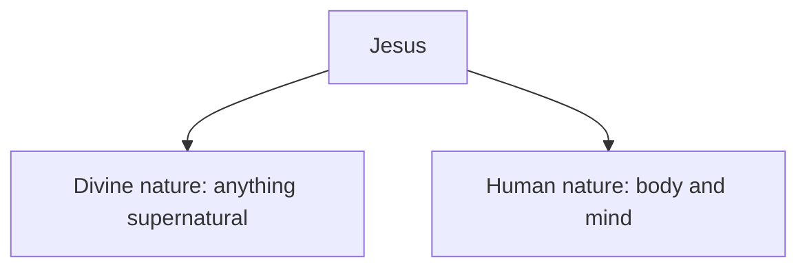

# Is Jesus God-Man?

The church creeds require Jesus to be the divine God. However, divine attributes are incompatible with a genuine human Jesus. For example:

| Divine God                                                                                              | Jesus                                                                                                                       |
| ------------------------------------------------------------------------------------------------------- | --------------------------------------------------------------------------------------------------------------------------- |
| [God is eternal](https://eternal.family.net.za/god/father/time) (Psalm 90:2; Isaiah 40:25–28)           | Jesus had a beginning ("genesis") (Matthew 1:17-21; Luke 1:26-35)                                                           |
| There was no period where God was temporary not God (Isaiah 40:27; Romans 16:26)                        | [Jesus was limited in many aspects](human/limitations.md)                                                                   |
| God is Spirit (John 4:21-24) and not human (Numbers 23:19)                                              | [Jesus is human](human.md) (John 1:30; Romans 5:15-17; 1 Timothy 2:5-7; 1 Corinthians 15:21-22)                             |
| God forms babies in a womb (Psalm 139:13-14)                                                            | Jesus was a baby in a womb (Matthew 1:18; Galatians 4:4)                                                                    |
| God is perfect (Matthew 5:48) and never changes (Malachi 3:6)                                           | Jesus had to grow (Luke 2:52; Hebrews 5:8-9)                                                                                |
| [God has never been fully seen](https://ofgod.info/appearance) (Exodus 33:20; John 1:18;  :17, 6:13-16) | Jesus was seen and touched (Luke 24:38-43)                                                                                  |
| God is [the Father](https://ofgod.info) (Psalm 68:5; Matthew 23:9)                                      | Jesus is [the Son](index.md) (Matthew 3:16-17; Mark 1:9-11, 9:7; Luke 3:21; John 1:51; 2 Peter 1:16-18; 1 John 5:20).       |
| God is metaphorically "the Vinedresser" (John 15:1-9)                                                   | Jesus is metaphorically "the vine" (John 15:1-9; Zechariah 3:10)                                                            |
| God does not dwell on earth; The highest heaven cannot contain God (1 Kings 8:27)                       | Jesus did, and he will return again (Acts 1:11)                                                                             |
| God is omnipresent (Psalm 139:7-10; Ephesians 4:6; Revelation 19:6)                                     | Jesus left (John 14:2-4, 16:28); Jesus is not in the world (John 17:11, 13); Jesus was not present (John 11:14-15)          |
| God is almighty (Genesis 17:1, 28:3, 35:11, 43:14, 48:3, 49:25; Job 11:7; Luke 1:37)                    | Jesus works are limited (John 5:19; 14:12)                                                                                  |
| God sees everything (Proverbs 15:3; Psalm 139:7-10; Matthew 6:4,18)                                     | Jesus did not notice that they mixed gall with his drink (Matthew 27:33-34)                                                 |
| God knows everything (Genesis 22:14; Psalm 139:1-6; Isaiah 40:13-14, 42:9; 48:5; Matthew 6:8,32)        | Jesus had limited knowledge (Matthew 24:36; Mark 13:32; John 7:16; 8:28; 14:24; Hebrews 5:8)                                |
| God does not repent (Numbers 23:19); God is holy (Psalm 99:3; Isaiah 6:3; Habakkuk 1:13)                | Jesus was baptised with a "baptism of repentance" (Mark 1:9; Acts 19:4) and [sanctified](divine.md#jesus-was-sanctified)    |
| God does not sleep (Psalm 121:4)                                                                        | Jesus slept (Matthew 8:24; Mark 4:38)                                                                                       |
| God is immortal (Romans 1:22-23); Paul calls the Father immortal and invisible (1 Timothy 1:17)         | Jesus was seen, weak (Matthew 4:11; Mark 1:13; Luke 22:43) and died (1 Corinthians 15:1-8; Romans 10:9; Revelation 1:17-18) |
| God maintains the universe (Matthew 6:26; 7:11; 10:29; James 1:17)                                      | Jesus never made such claims. If God had died, the universe would have been unattended for a period.                        |
| God adopts believers as children (Psalm 48:5)                                                           | Jesus accept believers as brothers or sisters (Matthew 12:50, Romans 8:17)                                                  |
| God, is the God of Jesus (John 20:17; Matthew 27:46; Mark 15:34)                                        | Jesus is the [servant of God](divine.md#jesus-serves-god) (John 3:16-18, 4:34, 6:57, 8:29, 14:24, 17:1-3; 1 John 4:14)      |
| God does not pray to another god (​Isaiah 45:5-7, 46:9-10)                                               | Jesus prayed to God (Matthew 5:8-9, 14:19, 15:36; ​Luke 3:21, 5:16, 9:16; ​Mark 1:35, 6:41; ​John 6:11, 11:41-42, 17:1-26)     |
| God has more authority than Jesus (Matthew 20:23; John 12:49-50)                                        | Jesus authority was given to him by God (Matthew 26:53; 28:18; John 5:19,22-23; 12:49-50; 17:2; Acts 2:36)                  |
| Nobody instructs God (Isaiah 40:13-14; Romans 11:34)                                                    | Jesus was instructed by the Spirit (Matthew 4:1; Mark 1:12; Luke 4:1-2)                                                     |

## Chalcedonian Solution

To solve these tensions [the Chalcedonian Christianity](https://www.ewtn.com/catholicism/library/definition-on-the-two-natures-of-christ-1454) formalized in 451 AD a doctrine that teaches that Jesus has ***two natures***, namely divine and human. This means all divine god attributes are solved by his divine nature and all human attributes by his human nature.

This did not mean that two separate people became one person. Nor did it mean that divinity and humanity mixed into a third kind of nature or that Jesus became a shape-shifter. It meant that **one person had both natures**.

The name for this claim is **hypostatic union** which means that Jesus' *divine and human natures are joined in the same hypostasis*. A **nature** describes **what someone is**, including their abilities and limits. For example a human. A hypostasis is the Greek word the council uses for an individual person. A person means **who someone is**. In plain English, to the council defined Jesus as 1 *who* (person) with 2 *whats* (natures).

This union was meant to keep three claims together:

1. The Son is divine.
2. The Son is human.
3. The Son is one person, not two.

> [!TIP]
> If [Jesus is only human](human.md), then no Greek philosophical explanations or unions are needed.

When faced with oxymorons like [immortal death](#immortal-death), [eternally begotten](#eternally-begotten), [known unknown](#known-unknown), [innocent guilt](#innocent-guilt) and [divine human](#divine-human) Chalcedonian explanations appeal to the above mentioned formula so that each nature satisfy its properties. For example, Jesus divine nature is immortal, but his human nature died.

### Immortal Death

The [classical account of Christ’s natures](https://www.vatican.va/archive/ENG0015/__P1J.HTM) holds that one person, Jesus Christ, truly died according to his humanity while his divine nature remained alive.

Identifying Jesus as the immortal (1 Timothy 1:17) [Creator](divine/creator.md) nevertheless requires more than showing that those qualifications avoid a contradiction.

Opponents often quote 1 Peter 3:18 to contrasts Christ being put to death in the flesh with being made alive in the spirit. However, the verse does not itself identify an immortal divine nature that remained alive while the human nature was dead.

The issue therefore concerns [the meaning of "death"](https://kingdom.ofgod.info/death) and the evidence for attributing it to the Son according to one nature. A *living dead* person is not really dead. A defence must explain from biblical texts, not Greek philosophy, how a dead person can resurrect himself.

### Eternally Begotten

Classical Christology understands eternal generation as the Son's timeless relation to God the Father, not a birth at a moment in time. On that account, ***begotten does not mean born*** like it does for all other people.

Changing the meaning of "begot" (birth) to "eternally generated" is neither biblical nor does it solve the contradiction.

Naturally there is a period in time where only a father exist before his son is born. If both are eternal, neither can be a Father or Son. Even if you argue that the Father adopted the Son at some point, it would still mean there was a period where the Son was not adopted yet. Without this relationship we would have two gods, which is [clearly denied biblically](shema.md).

### Known Unknown

> “But concerning that day or that hour, no one knows, not even the angels in heaven, **nor the Son, but only the Father**. — Mark 13:32 (ESV)

The Son does not know and but the Father as knows. The same person cannot not know and know simultaneously.

The classical reply claims that the Son knows the day and hour through his divine nature while not knowing them through his human nature.

This is still a contradiction because if the divine all knowing nature, already had this knowlege before the human nature was "generated" ([begotten](#eternally-begotten)), then the human nature would have known too.

Other possibility to resolve the tension is to say:

- Jesus forgot the hour
- Jesus was ["generated"](#eternally-begotten) without access to this knowlege
- Jesus is deliberately hiding this knowledge

No, bible text affirm any of these explanations. Instead of making Jesus a liar, just accept that he really do not know.

### Innocent Guilt

If bearing sins meant becoming morally sinful, Christ's innocence would be contradicted. But Scripture does not describe salvation as God becoming contaminated by the sin he intends to remove.

God the Father's holiness excludes moral evil:

> For you are not a God who delights in wickedness; **evil may not dwell with you**. — Psalm 5:4 (ESV)

Sin separates people from God rather than becoming compatible with his holiness (Isaiah 59:2). God the Father does not remedy human sin by becoming sinful himself. Instead, he sends His Son and condemns sin (Romans 8:3). Salvation addresses human rebellion without compromising God's holiness.

Bearing sins must therefore be distinguished from committing them. Peter says that Christ “**bore our sins in his body on the tree**” (1 Peter 2:24).

### Divine Human

Chalcedonian Christology affirms Jesus' genuine humanity *while adding a divine nature within the same person*.

A genuine human **does not have a second divine nature** like "the Son" that the Chalcedonian Council described.

Jesus is repeatedly called ["a man"](human.md) by various bible authors. Nobody referred to Jesus as someone "*like* a man" or "*in the appearance* of a man".

A philosophical account cannot establish a doctrine simply by offering a way to organise its claims. An account that identifies Jesus with [the Almighty Creator](divine/creator.md) while affirming his humanity must establish those claims from relevant evidence, not merely describe how these terms might be combined.

Terms such as *hypostasis* (person) and *consubstantial* (of the same substance) help state the creeds' declarations, but it do not independently establish the truth.

### Obvious Mystery

Christians claim that their fundamental faith is based on obvious plain truth. Yet when Chalcedonian Christians need to defend the logical contradictions presented by the dual-nature of Jesus, many appeal to [mystery](https://church.ofgod.info/terms/mystery) or to the limits of a finite human mind that cannot "grasp" God's infinite "complexity".

However, even this reasoning require that [the meaning of "mystery"](https://church.ofgod.info/terms/mystery) must be changed. In biblical context "mystery" refers to unfulfilled prophecies of God (1 Timothy 3:16; 1 Corinthian  13:12; James 3:17), not complex church creeds that requires years of theological studies.

## Conclusion

*On the biblical evidence examined, this article finds the [Chalcedonian solution](#chalcedonian-solution) inadequate: its formula of one person in two natures does not, by itself, establish a biblical solution.*

- The [death discussion](#immortal-death) questions whether 1 Peter 3:18 supports an immortal divine nature remaining alive while Christ dies according to his humanity.
- [Eternal generation](#eternally-begotten) is understood as timeless, not temporal birth; the objection concerns its biblical warrant and the ordinary father/son analogy.
- The [knowledge discussion](#known-unknown) questions the textual basis for qualifying the Son’s exclusion in Mark 13:32 by distinguishing divine and human knowledge.
- [Technical terms](#divine-human) organise the doctrine but do not independently establish its truth, while an [appeal to mystery](#obvious-mystery) cannot supply missing evidence.
- The [sin-bearing distinction](#innocent-guilt) is a necessary correction: bearing sins is not committing them, so it is not independent proof against Chalcedon.

These [disputed qualifications](#chalcedonian-solution) are not deductively disproved simply by their lack of demonstrated textual support. *The article instead favours reading Jesus as [a human being](#divine-human), the [Son sent by God the Father](#innocent-guilt).*
