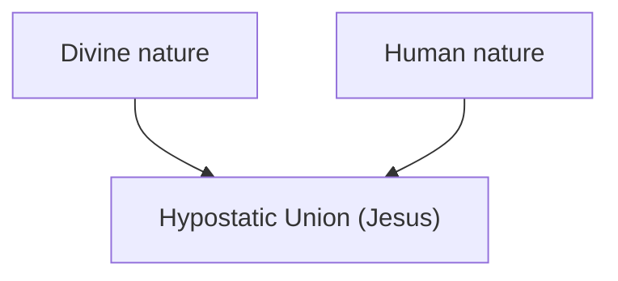

# Is Jesus Both God & Human?

The church creeds require Jesus to be the divine God. However, divine attributes are incompatible with a genuine human Jesus. For example:

| Divine God                                                                                              | Jesus                                                                                                                       |
| ------------------------------------------------------------------------------------------------------- | --------------------------------------------------------------------------------------------------------------------------- |
| [God is eternal](https://eternal.family.net.za/god/father/time) (Psalm 90:2; Isaiah 40:25–28)           | Jesus had a beginning ("genesis") (Matthew 1:17-21; Luke 1:26-35)                                                           |
| There was no period where God was temporary not God (Isaiah 40:27; Romans 16:26)                        | [Jesus was limited in many aspects](human/limitations.md)                                                                   |
| God is Spirit (John 4:21-24) and not human (Numbers 23:19)                                              | [Jesus is human](human.md) (John 1:30; Romans 5:15-17; 1 Timothy 2:5-7; 1 Corinthians 15:21-22)                             |
| God forms babies in a womb (Psalm 139:13-14)                                                            | Jesus was a baby in a womb (Matthew 1:18; Galatians 4:4)                                                                    |
| God is perfect (Matthew 5:48) and never changes (Malachi 3:6)                                           | Jesus had to grow (Luke 2:52; Hebrews 5:8-9)                                                                                |
| [God has never been fully seen](https://ofgod.info/appearance) (Exodus 33:20; John 1:18;  :17, 6:13-16) | Jesus was seen and touched (Luke 24:38-43)                                                                                  |
| God is [the Father](https://ofgod.info) (Psalm 68:5; Matthew 23:9)                                      | Jesus is [the Son](index.md) (Matthew 3:16-17; Mark 1:9-11, 9:7; Luke 3:21; John 1:51; 2 Peter 1:16-18; 1 John 5:20).       |
| God is metaphorically "the Vinedresser" (John 15:1-9)                                                   | Jesus is metaphorically "the vine" (John 15:1-9; Zechariah 3:10)                                                            |
| God does not dwell on earth; The highest heaven cannot contain God (1 Kings 8:27)                       | Jesus did, and he will return again (Acts 1:11)                                                                             |
| God is omnipresent (Psalm 139:7-10; Ephesians 4:6; Revelation 19:6)                                     | Jesus left (John 14:2-4, 16:28); Jesus is not in the world (John 17:11, 13); Jesus was not present (John 11:14-15)          |
| God is almighty (Genesis 17:1, 28:3, 35:11, 43:14, 48:3, 49:25; Job 11:7; Luke 1:37)                    | Jesus works are limited (John 5:19; 14:12)                                                                                  |
| God sees everything (Proverbs 15:3; Psalm 139:7-10; Matthew 6:4,18)                                     | Jesus did not notice that they mixed gall with his drink (Matthew 27:33-34)                                                 |
| God knows everything (Genesis 22:14; Psalm 139:1-6; Isaiah 40:13-14, 42:9; 48:5; Matthew 6:8,32)        | Jesus had limited knowledge (Matthew 24:36; Mark 13:32; John 7:16; 8:28; 14:24; Hebrews 5:8)                                |
| God does not repent (Numbers 23:19); God is holy (Psalm 99:3; Isaiah 6:3; Habakkuk 1:13)                | Jesus was baptised with a "baptism of repentance" (Mark 1:9; Acts 19:4) and [sanctified](divine.md#jesus-was-sanctified)    |
| God does not sleep (Psalm 121:4)                                                                        | Jesus slept (Matthew 8:24; Mark 4:38)                                                                                       |
| God is immortal (Romans 1:22-23); Paul calls the Father immortal and invisible (1 Timothy 1:17)         | Jesus was seen, weak (Matthew 4:11; Mark 1:13; Luke 22:43) and died (1 Corinthians 15:1-8; Romans 10:9; Revelation 1:17-18) |
| God maintains the universe (Matthew 6:26; 7:11; 10:29; James 1:17)                                      | Jesus never made such claims. If God had died, the universe would have been unattended for a period.                        |
| God adopts believers as children (Psalm 48:5)                                                           | Jesus accept believers as brothers or sisters (Matthew 12:50, Romans 8:17)                                                  |
| God, is the God of Jesus (John 20:17; Matthew 27:46; Mark 15:34)                                        | Jesus is the [servant of God](divine.md#jesus-serves-god) (John 3:16-18, 4:34, 6:57, 8:29, 14:24, 17:1-3; 1 John 4:14)      |
| God does not pray to another god (​Isaiah 45:5-7, 46:9-10)                                               | Jesus prayed to God (Matthew 5:8-9, 14:19, 15:36; ​Luke 3:21, 5:16, 9:16; ​Mark 1:35, 6:41; ​John 6:11, 11:41-42, 17:1-26)     |
| God has more authority than Jesus (Matthew 20:23; John 12:49-50)                                        | Jesus authority was given to him by God (Matthew 26:53; 28:18; John 5:19,22-23; 12:49-50; 17:2; Acts 2:36)                  |
| Nobody instructs God (Isaiah 40:13-14; Romans 11:34)                                                    | Jesus was instructed by the Spirit (Matthew 4:1; Mark 1:12; Luke 4:1-2)                                                     |

## Chalcedonian Solution

To solve these tensions [the Chalcedonian Christianity](https://www.ewtn.com/catholicism/library/definition-on-the-two-natures-of-christ-1454) formalized in 451 AD a doctrine that teaches that Jesus has ***two natures***, namely divine and human. This means all divine god attributes are solved by his divine nature and all human attributes are solved by his human nature.

A **nature** describes what someone is. A **person** identifies who someone is. Chalcedon therefore affirmed one person with two natures, preserving the properties of each.

The name for this claim is **hypostatic union** which means that Jesus' *divine and human natures are joined in the same hypostasis*.

This union was meant to keep three claims together:

1. The Son is divine.
2. The Son is human.
3. The Son is one person, not two.

> [!TIP]
> If [Jesus is only human](human.md), then no Greek philosophical explanations or unions are needed.

When faced with oxymorons like [immortal death](#immortal-death), [eternally begotten](#eternally-begotten), [known unknown](#known-unknown), [innocent guilt](#innocent-guilt) and [divine human](#divine-human) Chalcedonian explanations appeal to the above mentioned formula so that each nature satisfy its properties. For example, they would say *Jesus divine nature is [omnipresent](divine/omnipresence.md)*, but his human can nature leave and return.

> [!WARNING]
> An explanation can show how its own claims might fit together without establishing that those claims are true.

The Chalcedon's formula must therefore be [tested against the bible passages](shema.md) it seeks to explain.

### Immortal Death

The [classical explanation of Christ's death](https://www.vatican.va/archive/ENG0015/__P1P.HTM) affirms that the Son genuinely died. It understands this death as the separation of his human soul and body, *while both remained united to his divine person*.

This is not the claim that an impersonal human nature died while an unrelated divine person survived. An objection must address the actual claim rather than that substitute.

Scripture presents Christ's death and resurrection directly:

> “**God raised him up**, loosing the pangs of death, because it was not possible for him to be held by it.” — Acts 2:24 (ESV)

> “We know that Christ, **being raised** from the dead, will never die again; death no longer has dominion over him.” — Romans 6:9 (ESV)

These statements describe Jesus as having died and **another God as having raised him**. A dead person cannot raise himself, because that would mean the person was not originally dead in the first place.

No scripture describe an *immortal divine nature continuing to live throughout that death*. The belief is based on Greek philosophy of the [immortal soul](https://kingdom.ofgod.info/death/immortal).

Likewise, 1 Peter 3:18 contrasts being put to death in the flesh with being made alive in the spirit. That contrast does not, by itself, establish two natures or identify the spirit as an immortal divine nature. The classical account introduces claims about what continued during Christ's death that these passages do not establish. A *living dead* person is not really dead and incompatible with [what the Bible scriptures teaches about death](https://kingdom.ofgod.info/death).

### Eternally Begotten

Classical Christology understands *eternal generation* as the Son's timeless relation to God the Father, not a birth at a moment in time. On that account, ***begotten does not mean born*** like it does for all other people.

Changing the meaning of "begot" (birth) to "eternally generated" is neither biblical nor does it solve the contradiction.

Naturally there is a period in time where only a father exist before his son is born. If both are eternal, neither can be a Father or Son. Even if you argue that the Father adopted the Son at some point, it would still mean there was a period where the Son was not adopted yet. Without this relationship we would have two gods, which is [clearly denied biblically](shema.md).

### Known Unknown

Jesus says:

> *“But concerning that day or that hour, no one knows, not even the angels in heaven, **nor the Son, but only the Father**.”* — Mark 13:32 (ESV)

A standard defence distinguishes the Son's divine knowledge from his human knowledge. His *divine knowing is unlimited*, while his human knowing can be limited.

That distinction avoids a straightforward contradiction if the two claims concern different ways of knowing. However, the distinction still requires biblical justification.

The statement identifies **the Son** as not knowing. It does not expressly say that one nature lacks knowledge which the same Son possesses through another nature.

The [Catholic Catechism, §474](https://www.vatican.va/archive/ENG0015/__P1J.HTM), offers this explanation:

> *“What he admitted to not knowing in this area, he elsewhere declared himself not sent to reveal”* — Catholic Catechism, §474

But **not knowing** and **not being commissioned to reveal** are different claims. Someone can know information without being authorised to disclose it. Establishing a restriction on disclosure therefore does not, by itself, explain a statement denying knowledge.

Some possible explanations are:

- The Son does not know through his human mind, although *he knows through his divine mind*.
- The Son knows, but is *not commissioned to reveal what he knows*.

Neither qualification appears explicitly in Mark 13:32. The proposed qualification needs support from the passage's context or other relevant scriptures. The two-nature formula supplies a proposed qualification, **not evidence** that Jesus intended it.

The final alternative interpretation that remains is the **direct reading** stating that **the Son does not know what God the Father knows**. It requires no Catholic Catechism explanations and can be accepted as Mark explained it.

### Innocent Guilt

God the Father's holiness is affirmed in Scripture:

> “For you are not a God who delights in wickedness; **evil may not dwell with you**.” — Psalm 5:4 (ESV)

Peter describes Christ as bearing sins:

> “He himself **bore our sins in his body on the tree**, that we might die to sin and live to righteousness. By his wounds you have been healed.” — 1 Peter 2:24 (ESV)

Bearing another person's sins does not mean committing those sins.

However, if "bearing sins" meant "becoming sinful" to make the dealth penalty fair, then Christ's innocence would be contradicted. Scripture does not describe salvation as God becoming contaminated by the sin he intends to remove.

### Divine Human

Chalcedonian Christology affirms genuine humanity while claiming that the same person also possesses a divine nature.

Consequently, showing that Jesus is [a real human being](human.md) does not, by itself, refute Chalcedon. The council already affirms that claim.

The disputed addition is **a divine nature belonging to the same person**. Evidence establishing humanity cannot simply be treated as evidence establishing that additional nature.

Likewise, supernatural acts do not automatically establish an actor's divine nature. **God can act through human servants.** An argument for Jesus' deity must therefore show why the relevant words and actions identify him as [the Almighty Creator](divine/creator.md), rather than as someone empowered by God.

The risen Jesus still distinguishes himself from the one he calls his God:

> *“I am ascending to my Father and your Father, to **my God and your God**.”* — John 20:17 (ESV)

A Chalcedonian reply assigns this relationship to the Son's humanity. The question is whether the text supports that restriction.

Philosophical terms such as *hypostasis* and *consubstantial* express the doctrine, but it do not independently establish its truth.

### Obvious Mystery

An appeal to mystery can acknowledge that God has not yet revealed something. For example, the exact details of a prophecy will only be revealed once the prophecy come into fulfillment. The "mysteries of God" is not a wildcard that replace evidence for  contradictory claims.

If a defender appeals to [mystery](https://church.ofgod.info/terms/mystery), the question remains whether Scripture teaches the disputed claim. Calling an explanation mysterious does not establish its biblical foundation.

Faith does not mean to *accept contradictions as the truth*. [Faith means to trust](https://word.ofgod.info/terms/faith). Trust is build on witnesses, evidence and logic instead of complex Greek philosophies and mysteries.

## Conclusion

The [Chalcedonian formula](#chalcedonian-solution) is unreliable as the controlling interpretation of the passages examined. Its [knowledge explanation](#known-unknown) qualifies the Son's stated ignorance, its [death explanation](#immortal-death) adds an immortal divine life continuing through his death, and [eternal generation](#eternally-begotten) requires a timeless relationship that father-and-son language does not itself establish.

These qualifications must be demonstrated from Scripture, not accepted because the formula needs them. [Technical terms](#divine-human) organise the doctrine but cannot establish its truth, while [mystery](#obvious-mystery) cannot supply missing evidence. Later philosophical distinctions must therefore be tested against the biblical text, not read back into it as though the biblical authors had already taught them.

The more reliable reading begins with what these passages affirm: [the Son did not know what God the Father knew](#known-unknown), [Jesus died and God raised him](#immortal-death), and [the human Jesus calls God the Father “my God”](#divine-human).

**Biblical testimonies should govern doctrine, not the other way around.**
