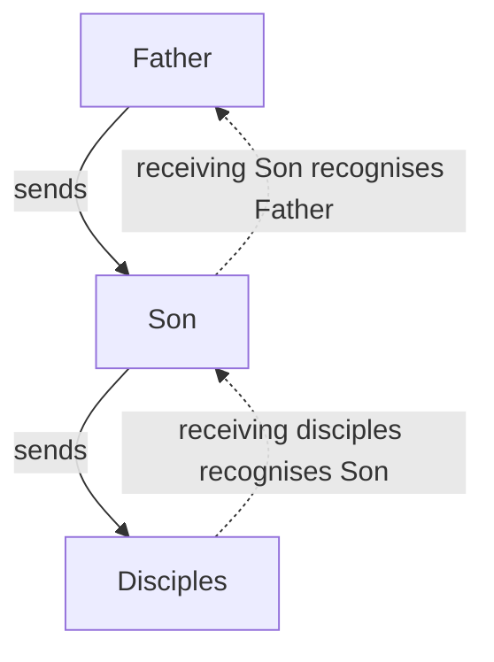

# Agents of God

**Agency** means commissioned representation. An agent speaks or acts for a sender within the sender's commission. It is not a universal rule that magically turns one person into another or transfers every personal quality between them.

**Sonship** is not a synonym for agency, and ‘agent’ is not a replacement translation for ‘son’. Sonship describes the relationship or status of being called God's son. Depending on context, this may involve belonging, family likeness, royal or covenant standing, or inheritance (Exodus 4:22-23; Hosea 11:1; Matthew 5:9,44-45; Galatians 4:4-7). God's sons are called to reflect the Father's character and represent him in their service and conduct (Exodus 4:22-23; Matthew 5:44-45). This calling does not guarantee faithful conduct or divine endorsement of every act. Agency describes acting on God's behalf rather than the whole meaning of sonship; a specific commission, not sonship alone, defines the scope of delegated authority. See [Sons of God](../name/sons-of-god.md) for fuller examples and contextual distinctions.

Three questions must remain separate:

1. **Identity** asks who someone is.
2. **Role and authority** concern the task and power entrusted to that person.
3. **Nature** concerns what that person is. Here, **divine** being a deity, not merely receiving power from God.

This distinction allows Jesus' representation of the Father to be examined without confusing a shared task with shared identity or nature.

> [TIP]
> The article identifies the Father with [the LORD (YHWH)](https://ofgod.info/name) and uses ‘Father’ when discussing him alongside Jesus.

## Agency in Ancient Times

Ancient sources describe messengers carrying another person's words and receiving treatment connected with their commission. They illustrate particular practices, not a universal identity rule.

### Diplomatic Recognition

Homer's *Iliad*, composed around the eighth or seventh century BCE, supplies a legendary scene rather than a diplomatic legal code. Achilles respectfully receives Agamemnon's heralds while distinguishing them from their sender:

> It is not you who are guilty in my sight, but Agamemnon, who sent you forth. — [Homer, *Iliad* 1.334-340, translated by A. T. Murray](https://www.theoi.com/Text/HomerIliad1.html)

The reception recognises their role. It does not establish that every honour paid to a herald automatically belongs to the sender, or that the herald shares the sender's personal faults.

Cicero's speech of 66 BCE recalls Corinth's destruction in 146 BCE:

> Because their envoys had been somewhat disrespectfully addressed, your ancestors decided on the extinction of Corinth. — [Cicero, *Pro Lege Manilia* 11, translated by H. G. Hodge, 1927](https://www.attalus.org/cicero/manilia.html)

This directly presents an insult to Roman envoys as an affront to Rome. It is Cicero's rhetorical justification, not neutral proof that the insult alone caused Corinth's destruction or that every society followed one rule.

Polybius, writing in the second century BCE, describes Ariarathes' embassy to Rome around 160-159 BCE. Its message conveyed:

> the king’s friendly mind towards Rome — [Polybius, *Histories* 32.1.1-2, Loeb translation](https://penelope.uchicago.edu/Thayer/E/Roman/Texts/Polybius/32*.html)

Rome responded with honours and gifts.

### Limits of the Evidence

These examples do not make every representative's virtue or fault attributable to the sender. The relevant connection is the commissioned message or action, not automatic sharing of personality, moral character, or nature.

A later rabbinic witness gives a qualified comparison:

> a person’s messenger is [considered] like himself — [Mishnah Berakhot 5:5, Wikisource translation](https://en.wikisource.org/wiki/Translation:Mishnah/Seder_Zeraim/Tractate_Berakhot/Chapter_5/5)

Compiled around 190-230 CE, this passage concerns a prayer representative whose error is a bad sign for those represented. It is not evidence of a universally codified first-century ‘Law of Agency’, still less a rule about deity.

## Agency in the Bible

Biblical narratives also distinguish senders from representatives. Royal messengers provide a clear starting point before passages about representation of God are considered.

### Royal Messengers

Kings' messengers are commonplace in these accounts. In 2 Samuel 10:1-6, David sends servants to console Hanun after his father's death. Hanun humiliates them by shaving half their beards and cutting their garments. The insult to his envoys is treated as an affront to David, their sender. The Ammonites recognise that they have become offensive to David and prepare for conflict. The servants remain distinct from the king whose goodwill they represented.

In 2 Kings 18:17, the king of Assyria sends officials to Jerusalem. The Rabshakeh introduces the message by identifying its source:

> **Thus says the king** — 2 Kings 18:29 (ESV)

The transmitted speech then uses the king's first person:

> Make your peace with **me** and come out to **me**. — 2 Kings 18:31 (ESV)

The surrounding narrative identifies the speaker as an official sent by the king. The royal message in verses 28-32 does not require the king to be physically present or make the official the king.

Judges 11:12 likewise says that Jephthah sends messengers to the Ammonite king and addresses him through them:

> What do you have against **me**, that you have come to **me** to fight against **my land**? — Judges 11:12 (ESV)

The king replies through the exchange, and Jephthah sends messengers again in verse 14. The first-person words belong to the represented leader. The narrator separately identifies those carrying them.

### God's Commissioned Servants

Representation of God does not require a human representative to become deity. The LORD commissions Moses in relation to Pharaoh:

> See, I have made you **like God to Pharaoh**, and your brother Aaron shall be your prophet. — Exodus 7:1 (ESV)

The stated relationship concerns Moses' appointed role towards Pharaoh. The passage does not describe a change in Moses' nature.

Jeremiah receives commands to go where the LORD sends him and speak what he commands (Jeremiah 1:7-9):

> Behold, I have put **my words** in **your mouth**. — Jeremiah 1:9 (ESV)

The words have a divine source while Jeremiah remains their human speaker. Exodus 23:20-22 adds a commissioned angel: the LORD sends the messenger, commands obedience to him, and connects his voice with the LORD's instructions. Further examples appear in [God Works Through Humans](./benefits.md#god-works-through-humans).

### Reading the Context

The mistaken inference treats a first-person pronoun, shared title, divine work, or name-bearing as sufficient proof of identity. The narratives above show why the relationship must instead be established from context.

| Context Question                  | What to Examine                                                                      |
| --------------------------------- | ------------------------------------------------------------------------------------ |
| Who is sent, and by whom?         | Explicit sending language identifies a commission and its source.                    |
| Whom does the narrator identify?  | Named actors, locations, and movements distinguish sender and messenger.             |
| Whose speech is being quoted?     | A message can contain the sender's first-person words within the messenger's speech. |
| What is received?                 | Commands, words, or authority may be entrusted rather than possessed independently.  |
| Is there dialogue between them?   | Address and reply can identify distinct participants.                                |
| Who receives credit for the work? | Attribution to a source may accompany action through a representative.               |
| What is the commission's scope?   | Authorisation for one task does not establish unlimited power or shared nature.      |

These checks are not permission to insert an agent into every passage. Where the narrator presents the source himself speaking or acting, that presentation should stand unless the context supplies evidence of mediation. Conversely, attribution to the source can coexist with an explicitly identified messenger, as royal speech demonstrates.

Some passages remain unclear about a speaker or means of action. They should remain unclear rather than being forced into either personal identity or a blanket agency explanation. The related [discussion of agency](./benefits.md#law-of-agency) should be read with these contextual limits.

## Angel of the LORD

**Angel** is a title identifying a messenger, not a personal name. A repeated title does not establish that every occurrence concerns the same individual. Each account needs its own contextual reading.

### Old Testament Messengers

Exodus 23:20-22 distinguishes the LORD who sends from the angel sent ahead of Israel. The messenger carries authority connected with the LORD's name:

> Pay careful attention to him and obey his voice; do not rebel against him, for he will not pardon your transgression, for **my name is in him**. — Exodus 23:21 (ESV)

Name-bearing and commanded obedience establish a serious commission. They do not, by themselves, establish that messenger and sender are the same person or share the same nature.

In Genesis 22:15-18, the angel calls to Abraham from heaven and delivers an oath whose source is expressly identified:

> **declares the LORD** — Genesis 22:16 (ESV)

The first-person oath must be read with that attribution. Its wording alone cannot identify the messenger as Jesus.

Zechariah 1:12-13 provides distinct dialogue: the angel addresses the LORD, and the LORD answers the angel with gracious and comforting words. Judges 13:16 also distinguishes the messenger from the recipient of an offering:

> But if you prepare a burnt offering, then **offer it to the LORD**. — Judges 13:16 (ESV)

These passages show why title, speech, and function require separate examination. They do not name their messenger Jesus, nor can [the angel be identified as Jesus](../name/son-as-angel.md).

### Angels and Jesus in Matthew

Matthew 1:20-21 presents an angel speaking to Joseph about Mary's child as someone distinct from the messenger:

> She will bear **a son**, and you shall call his name **Jesus**, for he will save his people from their sins. — Matthew 1:21 (ESV)

Matthew 28:2,5-6 likewise identifies an angel at the tomb who announces what has happened to Jesus:

> **He is not here**, for **he has risen**, as he said. Come, see the place where he lay. — Matthew 28:6 (ESV)

The angel who speaks and Jesus whose resurrection is announced are distinct actors in this scene. Matthew uses ‘an angel of the Lord’ in Matthew 1:20 and ‘the angel of the Lord’ in Matthew 1:24. Neither form turns a role description into Jesus' personal name. Matthew 28:5 refers to ‘the angel’, without repeating the full title.

These New Testament examples establish the distinction in their particular scenes. They cannot alone settle every proposed appearance of Christ in an unnamed Old Testament messenger. Such a proposal requires evidence about that particular passage, not merely matching titles or functions. Further discussion appears in [Interpretations Distinguishing the Angel from Jesus](../name/son-as-angel.md#interpretations-distinguishing-the-angel-from-jesus).

## Jesus Represents His Father

Treating representation as proof of deity uses a role to settle a different question about nature. The passages concerning Jesus should instead be read for what they say about his Father, his humanity, and his received commission.

### The Father and His Human Son

Jesus addresses the Father in John 17 and distinguishes him from the one sent:

> And this is eternal life, that they know you, **the only true God**, and **Jesus Christ whom you have sent**. — John 17:3 (ESV)

After his resurrection, Jesus still speaks of the Father as his God:

> I am ascending to **my Father and your Father**, to **my God and your God**. — John 20:17 (ESV)

Similarly, 1 Corinthians 8:6 identifies the one God as the Father and the one Lord as Jesus Christ. These are distinct parties, not two names for the same person. The related article [Jesus Has a God](../human/has-a-god.md) examines this relationship further.

Paul's description of mediation expressly identifies Jesus as human:

> For there is **one God**, and there is **one mediator** between God and men, **the man Christ Jesus**, — 1 Tim. 2:5 (ESV)

Acts 2:22 likewise identifies Jesus as a man and credits the Father with performing mighty works through him. Acts 10:38 describes the Father anointing Jesus with the Holy Spirit and power, and explains his good works by the Father's presence with him. Together, these passages support a genuinely human Son and Christ whose commission and power come from the Father.

### Words, Works, and Authority

Jesus' statement about seeing the Father must be read with its explanation:

> Whoever has **seen me** has **seen the Father**. — John 14:9 (ESV)

The next verse connects that representation with the source of Jesus' words and works:

> The words that I say to you I do not speak **on my own authority**, but **the Father who dwells in me does his works**. — John 14:10 (ESV)

Jesus makes the Father known through what he says and does. The surrounding explanation does not simply [identify Jesus as the Father](../divine/similarities.md). John 5:19,30 similarly describes the Son's dependence on the Father's action and his pursuit of the sender's will rather than his own.

The risen Jesus also describes his authority as received:

> All authority in heaven and on earth **has been given to me**. — Matthew 28:18 (ESV)

[Received authority can be extensive without independently establishing deity.](../divine/similarities.md#parallels-in-divine-attributes) Shared works, character, or honour must be examined within this relationship, rather than treated as automatic proof of the same person or substance.

### Reception Through a Commission

Jesus applies representative reception to a chain of distinct participants:

> Whoever **receives you receives me**, and whoever **receives me receives him who sent me**. — Matthew 10:40 (ESV)

Solid arrows show sending; dotted arrows show reception recognising the sender through his representative. The Father, Son, and disciples remain distinct. Receiving Jesus' commissioned disciples honours their relationship to him; it does not make them Jesus or make every personal action part of his commission. The related article on [Receiving God](../divine/claims/receive-god.md) examines this reception language.

### Personal Distinction and Nature

Classical Trinitarian theology distinguishes the Son from the Father while affirming that they share one divine essence, meaning the same divine nature ([Catechism of the Catholic Church, §253](https://www.vatican.va/archive/ENG0015/__P17.HTM)). Showing that Jesus is not the Father therefore does not, by itself, refute that shared-essence claim.

Agency also does not settle the question in the opposite direction. Being commissioned neither requires deity nor proves that deity is impossible. A claim about Jesus' nature needs evidence beyond the bare fact that he represents another.

The human-agent reading rests on the positive descriptions already considered: the Father is Jesus' God; Jesus is the human mediator; the Father anoints him and works through him; his words and authority are received. This reading recognises Jesus as the genuinely human Son and Christ sent by the Father, without converting representation into an argument for deity.

## Disciples Represent Christ

Christ's representatives provide another test of the inference from representation to identity. Their relationship with him is close, but the New Testament distinguishes the represented Lord from those who serve him.

### Christ's Body and Ambassadors

Paul describes believers as Christ's body:

> Now you are **the body of Christ** and individually **members of it**. — 1 Corinthians 12:27 (ESV)

Colossians 1:18 identifies Christ as the body's head and the body as the church. This language expresses a relationship between Christ and his people, not their literal identity as the same person. Being a member does not make someone Christ or a deity.

Paul also describes the apostolic ministry through diplomatic language:

> Therefore, we are **ambassadors for Christ**, **God making his appeal through us**. — 2 Corinthians 5:20 (ESV)

The appeal has the Father as its source and human ambassadors as its speakers. This description should not be expanded into a claim that every present-day believer holds apostolic office or possesses unrestricted authority.

The church today reflects Christ's character through obedient conduct and love. First John 2:6 calls those who claim to abide in him to walk as he walked. Jesus identifies mutual love as a mark of discipleship:

> By this all people will know that you are **my disciples**, if you have **love for one another**. — John 13:35 (ESV)

Such conduct represents Christ without transferring his personal identity to those who follow him.

### Miracles Through Human Servants

Acts carefully identifies the source of miraculous power. Acts 19:11 credits the Father with doing extraordinary miracles through Paul's hands. In Acts 3:12, Peter rejects the idea that his own power or piety made a man walk. Verse 16 instead points to Jesus' name and the faith that comes through him.

In Acts 4:29-30, believers ask the Father for bold speech while he stretches out his hand to heal and signs occur through the name of his holy servant Jesus. The prayer distinguishes the Father, Jesus, and the servants speaking the message. Power exercised through them does not make them its independent source.

Acts 14:11-15 supplies an explicit false inference after a healing. The crowd declares:

> *The **gods** have come down to us in the likeness of men!* — Acts 14:11 (ESV)

Paul and Barnabas reject the attempted worship and identify themselves instead:

> We also are **men, of like nature with you** — Acts 14:15 (ESV)

The narrative places the mistaken claim before the apostles' human self-description and their call to turn to the living God. Miraculous activity through a representative is therefore not sufficient evidence that the representative is deity.

## Conclusion

[Ancient diplomatic examples](#agency-in-ancient-times) and [biblical commissions](#agency-in-the-bible) distinguish representation from identification. [Angel passages](#angel-of-the-lord) require attention to particular speakers; a title or shared function does not identify a messenger as Jesus.

[Jesus' representation of the Father](#jesus-represents-his-father) does not require him to possess deity merely because he carries the Father's words and authority. This does not settle a shared-essence claim by personal distinction alone. [Disciples represent Christ](#disciples-represent-christ) and belong to his body without being Christ or deities. Power exercised through an agent is not proof of deity.
