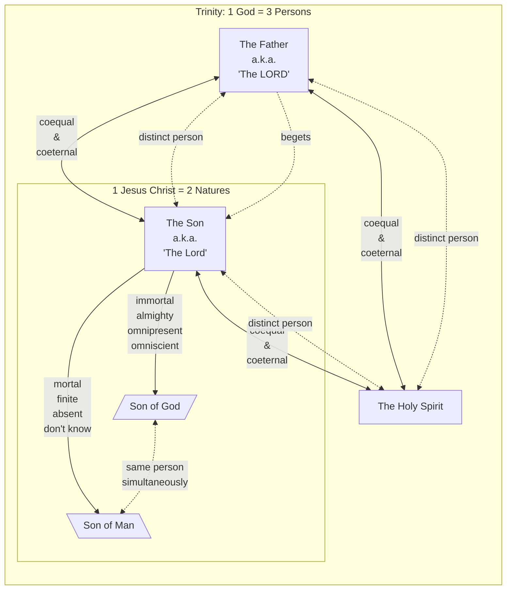

# Benefits of a Human Christ

The Bible is clear that the mediator between God and humanity is a human.

> "For there is one God, and there is **one mediator** between God and men, **the man Christ Jesus**." — 1 Timothy 2:5 (ESV)

The text emphasizes that Jesus is the "man Christ Jesus," not the "God Christ Jesus" for several important reasons:

## Understandable Gospel

The [classical Trinitarian formulation](https://www.vatican.va/archive/ENG0015/__P17.HTM) describes *one God in three distinct persons*. Its [account of Jesus](https://www.vatican.va/archive/ENG0015/__P1J.HTM) describes *"[the Word of God](../name/word.md) united to himself according to the hypostasis"* which means one of the Trinity persons *has both divine and human natures*.

> [!NOTE]
> The Holy Spirit is a separate person from Jesus, yet Jesus as a "fully human" also have his own human spirit and soul. So technically there are 3 persons, 3 minds/wills, 2 logically incompatible natures and 2 spirits.

The following great Christian authors affirmed the Trinity:

Martin Luther — Protestant reformer:

> “O shameless reason! How can we poor, **miserable mortals grasp this mystery of the Trinity**?” — [“Trinity Sunday” (1535), second sermon, §3; English translation by H. L. Burry.](https://en.wikisource.org/wiki/Trinity_Sunday_(Luther,_tr._Burry))

A. W. Tozer — Christian pastor and author:

> “Our sincerest effort to grasp the **incomprehensible mystery of the Trinity must remain forever futile**, and only by deepest reverence can it be saved from actual presumption.” — [*The Knowledge of the Holy*, chapter 4, “The Holy Trinity.”](https://www.paidionbooks.org/tozer/koth4.htm)

Charles Spurgeon — Baptist preacher:

> “Though **we understand not the mystery of the Trinity**, let us believe and worship.” — [Spurgeon Library, “8 Spurgeon Quotes on the Trinity.”](https://www.spurgeon.org/blog/8-spurgeon-quotes-on-the-trinity/).

John Wesley — founder of Methodism:

> “I believe this fact also, (if I may use the expression,) that **God is Three and One**. But **the manner how I do not comprehend** and I do not believe it.” — [“On the Trinity,” Sermon 55, §15](https://wesley.nnu.edu/john-wesley/the-sermons-of-john-wesley-1872-edition/sermon-55-on-the-trinity).

For context: *“I do not believe it”* refers to an unrevealed explanation of *how*, not rejection of the Trinity.

Charles Ryrie — evangelical theologian:

> “Trinity is, of course, **not a biblical word. Neither are triunity, trine, trinal, subsistence, nor essence.** Yet we employ them, and often helpfully, in **trying** to express this doctrine which is so **fraught with difficulties**.” — [“The Trinity (Triunity) of God.”](https://bible.org/article/trinity-triunity-god)

Walter Martin — Christian apologist and Christian Research Institute founder:

> “**No man can fully explain the Trinity**, though in every age scholars have propounded theories and advanced hypotheses to explore this **mysterious Biblical teaching**. But despite the worthy efforts of these scholars, the Trinity is still largely **incomprehensible** to the mind of man.” — [“The Trinity (Triunity) of God.”](https://bible.org/article/trinity-triunity-god)

### Simplicity of the True Gospel

Jesus affirms [the Shema’s confession](../shema.md) of **one God**:

> “Hear, O Israel! **[Yahweh](https://ofgod.info/name#yhwh) is our God, [Yahweh](https://ofgod.info/name#yhwh) is one!** You shall love **[Yahweh](https://ofgod.info/name#yhwh) your God** with all your heart and with all your soul and with all your might. — Deuteronomy 6:4-5 (LSB)

That is the whole "formulation". It was quoted by Jesus himself (Mark 12:29-30) and affirmed by a scribe (Mark 12:32-33).

The truth is so simple that **even a child can understand it** (Deuteronomy 6:7), yet so profound that the wisest cannot fully comprehend it (Matthew 11:25). [Thousands of souls got saved without the complexities of the Trinitarian formulation](concerns/salvation.md).

> [!NOTE]
> I quoted from the LSB because most popular English translations render "the LORD" which could be easily confused with "the Lord Jesus" in the bible. [Jesus is not Yahweh](../human/denies-being-god.md).

Regarding Jesus, Peter identifies Jesus as [a man](../human.md) attested by God, recounts his death, and says God raised him and made him Lord and Christ (Acts 2:22–36). Together, these texts present no paradox. There is 1 God Almighty whoe commands (send) His 1 Christ. Jesus Christ [obeys and serves](../human/serve-god.md) [*Yahweh* his God](../human/has-a-god.md). Not only that, but they have a close “Father” and “Son” relationship, such that the Son represent the Father's character and authority by example (John 5:17–23; 10:30–38; 14:6–11). Paul names “**one God, the Father**” and “**one Lord, Jesus Christ**” [distinctively](../human/distinct.md) (1 Corinthians 8:6). John writes so readers may believe Jesus is [the Christ](https://kingdom.ofgod.info/christ) *(the anointed one by God)*, [the Son of God](../index.md) *(the loved one by God)* (John 20:30–31).

## Restoring Humanity

God creates humans in his image, entrusts them with rule over living creatures and the earth. The original commission concerns spreading God's *kingdom* (garden) over the earth (Genesis 1:26–28, 2:15).

Adam’s sin reveals human failure. It does not, by itself, establish that the Creator’s design was defective. Jesus, who is also a human, reclaims the human right to rule and fulfills what Adam failed to accomplish.

> "What is man that you are mindful of him, and the son of man that you care for him? Yet you have made him a little lower than the heavenly beings and **crowned him with glory and honor**. You have given him **dominion over the works of your hands**; you have put **all things under his feet**." — Psalm 8:4-6 (ESV)

This psalm describes humanity's original calling, which the New Testament applies to Jesus who is the human who fulfilled humanity's intended purpose.

Peter says Jesus committed no sin, and Paul contrasts one man’s disobedience with the obedience of one man (1 Peter 2:22; Romans 5:18–19).

Jesus’s faithful human life counters the claim that *“being human itself makes obedience impossible.”* **God did not make a design** flaw in humans. **He created us "very good"** (Genesis 1:31).

The Apostle Paul refers to Jesus as the "Last Adam" or "Second Adam" in his letters, drawing a sharp contrast between the disobedience of the first man and the obedience of Christ.

> "For as **by a man** came death, **by a man** has come also the resurrection of the dead. For as in Adam all die, so also in Christ shall all be made alive." — 1 Corinthians 15:21-22 (ESV)

> "Thus it is written, 'The first man Adam became a living being'; **the last Adam** became a life-giving spirit. The first man was from the earth, a man of dust; the second man is from heaven." — 1 Corinthians 15:45, 47 (ESV)

> "For as by the one man's disobedience the many were made sinners, so **by the one man's obedience** the many will be made righteous." — Romans 5:19 (ESV)

The repeated emphasis on "by a man" and "one man's obedience" highlights the significance of Jesus' humanity in the plan of salvation.

## Human Temptations

Jesus enters the wilderness hungry after fasting. His need for food is real (Matthew 4:1–2). Matthew records three offers there and, later, Peter’s counsel against Jesus’s foretold suffering (Matthew 4:3–10; 16:21–23). Jesus was really [tempted](../human/temptations.md) by on multiple levels: identity, provision, protection, and plan:

1. **Bread:** Satan challenges Jesus to prove he is God’s Son by turning stones into bread (Matthew 4:2–4). Eating is not wrong; the pressure is to answer the challenge on Satan’s terms rather than trust the Father’s word. Jesus answers with the lesson about dependence on God in Deuteronomy 8:3.
2. **The temple:** Satan urges Jesus to jump and demand divine protection (Matthew 4:5–6). Jesus refuses to put God to the test (Matthew 4:7; Deuteronomy 6:16). Trust does not require manufacturing danger to compel a display of rescue.
3. **The kingdoms:** Satan offers the world’s kingdoms in exchange for worship (Matthew 4:8–9). Jesus refuses and insists on worshiping and serving God alone (Matthew 4:10; Deuteronomy 6:13). The offer suggests a shortcut to kingship instead of the costly path Jesus later foretells. Therefore, Jesus could say that he lays down his life willingly (John 10:17–18).
4. **Peter’s counsel:** When Jesus foretells his suffering, death, and resurrection, Peter objects. Jesus rebukes that counsel as a hindrance set on human rather than divine concerns (Matthew 16:21–23). This is pressure voiced by a disciple, not a fourth wilderness offer or a claim that Peter is Satan himself.

Because Jesus was human, he can sympathize with our weaknesses and provide an example for us to follow.

> "For we do not have a high priest who is unable to **sympathize with our weaknesses**, but one who in every respect **has been tempted as we are**, yet without sin." — Hebrews 4:15 (ESV)

Jesus’s real temptation matters for how we understand humanity, honor him, and trust the Father:

1. **Humanity was not a mistake.** The Father made humanity **“very good”** (Genesis 1:31); Ecclesiastes 7:29 says that “God made man **upright**, but they have sought out many schemes.” Jesus’s faithful human obedience demonstrates that yielding to the devil is not an unavoidable consequence of being human. A human can resist temptation through trust in the Father. This does not mean obedience requires no help from God; Jesus’s answers emphasize dependence on him (Matthew 4:4, 7, 10).

2. **Real temptation gives us greater reason to honor Jesus.** His obedience was not an effortless performance untouched by hunger, distress, or the prospect of suffering. He remained faithful when obedience cost him dearly. Philippians 2:8–9 connects that obedience with his exaltation: he became “**obedient to the point of death**, even death on a cross. **Therefore God has highly exalted him**.” Recognizing what he endured deepens our appreciation of the honor he received.

3. **His refusal of rescue demonstrates loyalty and strengthens our trust.** Jesus said he could appeal to the Father for more than twelve legions of angels, yet chose to fulfill the Scriptures instead (Matthew 26:53–54). His submission was not simply the helplessness of someone with no alternative. He accepted the Father’s will despite his expressed desire that the cup pass from him (Matthew 26:39). Such voluntary faithfulness gives us stronger reason to trust him: he did not abandon his mission when obedience became painful.

4. **Our judge understands temptation firsthand.** Jesus knew hunger, sorrow, and pressure to turn aside from obedience (Matthew 4:2–10; 26:38–39). Hebrews confirms the significance: “because he himself has **suffered when tempted**, he is able to help those who are being tempted” (Hebrews 2:18; compare 4:15). The Father “has given **all judgment to the Son**” (John 5:22), and will judge the world in righteousness through the man he appointed (Acts 17:31). Jesus therefore judges with firsthand understanding of human weakness, not ignorance of it. His fairness also rests on his loyalty to the Father: “my judgment is **just**, because I seek not my own will but the will of him who sent me” (John 5:30).

5. **We can and should trust the Father’s provision even while suffering.** Jesus refused to make immediate relief the condition of obedience. During suffering, he “continued **entrusting himself** to him who judges justly,” leaving an example for us to follow (1 Peter 2:21–23). Trust does not promise freedom from hunger, persecution, or death; it means remaining faithful rather than treating suffering as permission to abandon the Father’s ways. Accordingly, those who suffer according to his will should “entrust their souls to a **faithful Creator while doing good**” (1 Peter 4:19).

## Human Obedience

Some say: *“Humans cannot be like Jesus because he is God. We should only try our best.”*

It often encourages a passive sinful lifestyle expect a divine Jesus to spread the Gospel Himself with his power and miracles. This hopeless view is not what Scripture teaches.

Jesus describes his dependence on the Father: “I can do **nothing on my own**” (John 5:30). He says that “the Father Who dwells in me **does His works**” (John 14:10). The Father sent and empowered a genuinely human Son and Messiah. His obedience therefore offers a human pattern of trust in the Father, rather than a display of self-sufficient power.

### Imitation Is a Command

John makes imitation a duty, not merely an aspiration: “whoever says he abides in him ought to **walk in the same way in which he walked**” (1 John 2:6). The preceding verses connect knowing Jesus with keeping his commandments (1 John 2:3-5). Peter likewise says that Christ suffered, “leaving you an **example**, so that you might **follow in his steps**” (1 Peter 2:21). The following verses identify sinless conduct, truthful speech, refusal to retaliate and trust in the Father’s just judgement as the pattern (1 Peter 2:22-23).

Jesus calls people to follow him and learn from him (Matthew 4:19, 11:28-30; John 12:26). A disciple is to become like the teacher (Matthew 10:24-25). Remaining in Jesus’s word marks genuine discipleship (John 8:31-32). Following him includes self-denial and accepting the cost of faithfulness (Matthew 16:24-25; Mark 8:34-35).

This pattern also shapes life together. Paul calls believers to imitate him as he imitates Christ (1 Corinthians 11:1). Ephesians 5:1-2 connects imitation of the Father with Christ’s self-giving love. Philippians 2:5-8 presents Jesus’s humble obedience as the attitude believers should share. Romans 8:29 describes the Father’s purpose as conformity to His Son.

Jesus says, “If you love me, you will **keep my commandments**” (John 14:15). He distinguishes doing the Father’s will from merely calling him Lord, and hearing and doing his words from hearing without doing (Matthew 7:21-27). Making disciples includes teaching them to observe his commands (Matthew 28:19-20). James likewise contrasts hearing with doing (James 1:22-25).

John 14:21,23-24, 15:9-14,17 links love for Jesus with obedience and mutual love. Faith in the Father’s Son and love for one another belong together (1 John 3:23-24). Love for the Father and his children is expressed in keeping his commands (1 John 5:2-4; 2 John 6).

### God Requires Obedience

Moses told Israel that the covenant command was “**not too hard for you**, neither is it far off” (Deuteronomy 30:11). The word was near them “so that **you can do it**” (Deuteronomy 30:14). Deuteronomy 30:11-14 concerns Israel’s covenant responsibility. It rejects treating the revealed command as inaccessible to the people addressed. Jeremiah 6:16 likewise connects rest with walking in the good way, while recording the people’s refusal to walk in it.

Jesus calls disciples to “**learn from me**” and says that “my **[yoke is easy](../divine/claims/yoke.md)**, and my **burden is light**” (Matthew 11:28-30). Taking his yoke means accepting his teaching and discipleship, not escaping all duties. His gentle leadership contrasts with the crushing burdens described in Matthew 23:4. It does not cancel self-denial or the suffering involved in following him (Matthew 16:24).

> For to this you have been called, because Christ also suffered for you, **leaving you an example**, so that you might **follow in his steps**. He committed no sin, neither was deceit found in his mouth. When he was reviled, he did not revile in return; when he suffered, he did not threaten, but continued entrusting himself to him who judges justly. — 1 Peter 2:21-23 (ESV)

John says that the Father’s “**commandments are not burdensome**” (1 John 5:3). The next verse connects overcoming the world with being born of God and with faith (1 John 5:4). The claim is not that obedience never costs anything, but that the Father’s commands are not an unbearable burden from which believers must be excused.

Philippians 2:12-13 joins responsible action with the Father’s help. Believers are commanded to work out their salvation because “it is **God who works in you**, both **to will and to work** for his good pleasure”. The Father’s work does not remove their responsibility.

The Father’s faithfulness also matters when [temptation](#human-temptations) comes. 1 Corinthians 10:13 promises a way of escape so that temptation can be endured. It concerns temptation to sin, not a guarantee of escape from every hardship. Obedience may be costly, but yielding to temptation is not therefore inevitable.

Romans 8:3-4,12-14 connects the Father’s work through His Son with walking by the Spirit and putting sinful deeds to death. Galatians 5:16,22-25 describes walking by the Spirit and the resulting qualities of love, patience and self-control. Titus 2:11-14 presents grace as training people to reject ungodliness and live upright lives. 2 Peter 1:3-8 pairs God’s provision for life and godliness with diligence in growing in goodness, knowledge, self-control and love.

These passages do not promise automatic obedience or an easy life. They present real human choices sustained by the Father’s help. Jesus’s human obedience offers a pattern for God-enabled choices, not a demand for unaided perfection.

### The Standard

Sincere effort has a place in discipleship, but it does not replace the command with a lower standard. Believers are called to obey rather than assume beforehand that hatred, dishonesty or refusal to forgive must be unavoidable. That duty must not be confused with claiming to have no sin.

John warns that “If we say we have **no sin**, we deceive ourselves, and the truth is not in us” (1 John 1:8). He also promises forgiveness when believers confess their sins (1 John 1:9-10). His stated purpose is “so that you may **not sin**”, yet he provides for anyone who does sin through [an advocate with the Father](#a-human-mediator-and-advocate), Jesus Christ the righteous (1 John 2:1-2). Confession answers failure without approving it.

Philippians 3:12-16 describes Paul pressing on rather than claiming already to have reached the goal. Growth in maturity does not mean lowering the call to love or obey. Ephesians 2:8-10 presents salvation as the Father’s gift of grace, not something earned by works, while describing those in Christ as created for good works. Obedience is not a payment that purchases salvation.

A spotless personal history is not the starting point of this call. An individual failure is not, by itself, proof of unbelief. Nor is forgiveness permission to abandon Jesus’s commands. The response to sin is confession and renewed obedience. Believers are called to follow the human Lord, depend on the Father and continue growing in faithful obedience.

### Law of Agency

The [***Law of Agency***](https://biblehub.com/commentaries/matthew/10-40.htm) describes a principle of representation: a sender commissions an authorised messenger to carry a message or fulfil a mission on the sender’s behalf. Receiving or honouring the messenger in that capacity counts as receiving or honouring the sender.

> “Whoever **receives you receives me**, and whoever **receives me receives him who sent me**.” — Matthew 10:40 (ESV)

Jesus addresses his disciples: receiving those he sends counts as receiving him, and receiving Jesus counts as receiving the Father who sent him. The disciples represent Jesus and [Jesus represents the Father](../divine/claims/receive-god.md). Matthew illustrates this relationship.

This principle supports the preceding [distinction](../human/distinct.md) between the Father Who grants authority and Jesus who exercises it, and the later account of authority given to disciples. A messenger can speak and act with the sender’s delegated authority without being the same person or becoming the sender. Receiving or honouring language alone therefore does not establish deity.

## God Works Through Humans

If Jesus’s miracles are presented as works only a divine being could do, they can seem beyond ordinary believers.

Yet, Jesus operated by the Holy Spirit, not inherent divinity. Peter likewise describes Jesus as **a man through whom God did mighty works** (Acts 2:22). God anointed him with the Holy Spirit and power:

> "God anointed Jesus of Nazareth **with the Holy Spirit and with power**. He went about doing good and healing all who were oppressed by the devil, for God was with him." — Acts 10:38 (ESV)

This makes his obedience meaningful and his example achievable for believers:

God restored a child’s life in answer to Elijah’s prayer (1 Kings 17:20-22). James describes Elijah as a man with a nature like ours (James 5:17-18).

Jesus gives **the twelve disciples** [authority to heal and cast out unclean spirits](#law-of-agency) (Matthew 10:1,7-8). Peter heals in Jesus’s name but rejects the idea that his own power or piety caused the healing (Acts 3:6,12,16). Jesus also promises that believers will do his works, connecting that promise to his going to the Father (John 14:12). These accounts give believers hope: **God can work through us too.** We do not need to be divine to serve as his agents. The power comes from God, not from ourselves.

This hope is not a promise of miracles on demand or a harm-free life. Jesus warns his followers of trouble (John 16:33). Acts recounts James’s death and Peter’s deliverance in the same period (Acts 12:1-11). Yet suffering **cannot separate believers from God’s love** (Romans 8:35-39). Human weakness does not put anyone beyond the Father’s love or ability to work through them.

## The Father's Love and Glory

If Jesus is God the Father, then the apostles would be witnessing God's *self-love*. Self-love is not significant and does not establish the gift of another beloved person. The relational reading instead presents **the Father giving the human Son He loves**.

### The Father genuinely loves this human Son

At Jesus’s baptism, the Father identifies him as his beloved Son:

> “This is my **beloved Son**, with whom I am **well pleased**.”  — Matthew 3:17 (see also Mark 1:11)

At the transfiguration, the Father repeats this declaration and commands others to listen to Jesus:

> “This is my **beloved Son**, with whom I am **well pleased**; listen to him.” — Matthew 17:5 (see also Mark 9:7)

John states the Father’s love for the Son directly (John 3:35, 5:20, 15:9).

Jesus prayer makes more sense as a human praying to God that connects the Father’s love for him with love for his disciples:

> “I in them and You in me, that they may become perfectly one, so that the world may know that **You sent me** and **loved them even as you loved me**.
>
> Father, I desire that they also, whom You have given me, may be with me where I am, to see **my glory that You have given me** because **You loved me before the foundation of the world**.
>
> O righteous Father, even though the world does not know You, I know You, and these know that You have sent me.
>
> I made known to them Your name, and I will continue to make it known, that **the love with which You have loved me** may be in them, and I in them.”
>
> — John 17:23–26

The prayer expressly includes love “before the foundation of the world”. If this was an expression of self-love it may give the empression that that the disciples thought there were a point that *God did not love Himself*. As a distinct person, this statement is significant because it describes that **the Father’s loved Jesus even before he could proof to be obedient**.

### Giving the beloved Son is a personal gift

Once we understand the the Father's love to the Son is *not self-love*, then John statement about the Father's love to the world is much more significant:

> “For God so **loved the world**, that he **gave His only Son**, that whoever believes in him should not perish but have eternal life.” — John 3:16

Paul emphasises that the Father did not spare the Son he calls his own:

> He who **did not spare His own Son but gave him up for us all**, how will he not also with him graciously give us all things? — Romans 8:32

**The cost is personal**, not a shortage of creative power. The Father could have created another human to replace Jesus, but Jesus was special ([holy](https://word.ofgod.info/terms/holy)) to Him.

## Human Blood Required

God is immortal and cannot die (1 Timothy 1:17). However, the penalty for humanity's sin is death.

> "For the wages of sin is **death**; but the gift of God is eternal life through Jesus Christ our Lord." — Romans 6:23 (KJV)

For a savior to pay this specific penalty, he had to assume a nature capable of mortality. Scripture emphasizes that Christ's death was a legal and spiritual necessity for salvation.

### Defining Death

In order for a divine Christ to die, all sorts complex theologies had to be defined to explain:

- *[Death](https://kingdom.ofgod.info/death) is not really death*, based on Greek mythology which each person has an [immortal soul](https://kingdom.ofgod.info/death/immortal).
- *Jesus had [2 natures](https://church.ofgod.info/evolution/451-chalcedon)*, only 1 nature died so that he was not fully dead.
- *Jesus is almighty, therefore he could resurrect himself from the dead*. This is a [mystery](https://word.ofgod.info/terms/mystery) we should just blindly [believe](https://word.ofgod.info/terms/faith).

Christ did not faked his death, nor did only a part of him died. A **real human Christ with real human blood** was necessary to pay the wages of **humanity**.

### The Guilt Offering

The prophets foretold that the Messiah would be a deliberate sacrifice for sin.

> "Yet it was the will of the Lord to crush him... when **his soul makes an offering for guilt**... because he **poured out his soul to death** and was numbered with the transgressors; yet he bore the sin of many." — Isaiah 53:10, 12 (ESV)

If Jesus were a divine being incapable of physical death, the crucifixion would have been an illusion. He had to be fully human to "taste death for everyone" (Hebrews 2:9).

### A Ransom for Humanity

Jesus explicitly stated that his mission required him to give up his life to purchase the freedom of others.

> "Even as the Son of Man came not to be served but to serve, and to **give his life as a ransom** for many." — Matthew 20:28 (ESV)

## More Honour To Jesus

Jesus’s sacrifice was a life given, not a display that left him untouched. In Gethsemane he was truly deeply distressed, asks whether the cup might pass, and submits to the Father’s will (Mark 14:33–36). The servant bears others’ sins and pours out his life (Isaiah 53:11–12). Jesus describes giving his life as a ransom for many (Mark 10:45). Peter says he bore sins in his body on the tree and died for sins (1 Peter 2:24; 3:18). His life, willingly given through real suffering, is the price Scripture describes.

Jesus’s distress, trust, and chosen death belong to one vulnerable human life like a real human. The crucifixion was no surprise to Jesus. He foretold his resurrection. Although he said that he could appeal to his Father for angels and he knew what was waiting for him, he still choosed the path by which Scripture is fulfilled (Matthew 26:53–54). This bring **even more honor to Jesus** than [the Chalcedonean narative](https://church.ofgod.info/evolution/451-chalcedon) of a *[dual-nature](../dual-nature.md) divine Christ limited himself* on a cross.

That fact that Jesus obeyed even through death is a fair reason for God to exalt him. The resulting honor of Jesus brings glory to the Father (Philippians 2:8–11).

> [!NOTE]
> Paul places the obedience of one man at the center of his account of many being made righteous (Romans 5:19).

## His resurrection is our hope

When God raised Jesus, death no longer had dominion over the risen Christ (Acts 2:24, 32; Romans 6:9). Paul says **resurrection comes through a man** and calls Christ [the firstfruits](../divine/firstborn.md) of those who will be raised. Those who belong to him follow at his coming (1 Corinthians 15:21–23). Christ reigns while death remains the last enemy to be destroyed, and the Father who [grants his authority](#law-of-agency) is excepted from those subjected to him (1 Corinthians 15:24–28). The Father advances humanity’s calling through a faithful human Son rather than abandoning it after Adam’s failure. **Victory over death** is the Father’s gift through [the man](../human.md) He raised, not an ability humanity possessed independently (Genesis 2:7; Acts 17:31; 1 Corinthians 15:21–23).

If Jesus were a spirit being or a non-human entity, his resurrection would have no bearing on the fate of humanity. The core of the Christian hope is the resurrection of the *human body*. For Jesus' resurrection to serve as a guarantee for us, he had to be of the same "crop" or species as those he came to save.

Paul applies the resurrection act of God to believers’ future: “And God raised the Lord and **will also raise us up by his power**” (1 Corinthians 6:14). He calls the risen Christ the firstfruits of those who have died:

> "But in fact Christ has been raised from the dead, **the firstfruits** of those who have fallen asleep. For as by a man came death, by a man has come also the resurrection of the dead." — 1 Corinthians 15:20-21 (ESV)

In the biblical metaphor of "firstfruits," the first sample of a harvest represents the nature and quality of the entire crop. If the firstfruits are human, the harvest is human. If Jesus were a demi-god, his rising would not prove that humans will rise. By rising as a man, he became the pioneer of a new, resurrected humanity.

Jesus’s resurrection is not an isolated display of power. That fact that God showed that He can and is willing to resurrect humans from the dead gives **hope to humanity**.

> But our citizenship is in [heaven](https://word.ofgod.info/terms/heaven), and from it we await a Savior, the Lord Jesus Christ, who will **transform our lowly body to be like his glorious body**, by the power that enables him even to subject all things to himself. — Philippians 3:20-21 (ESV)

The same God Who raised Jesus, will also give life to believers’ mortal bodies through His Spirit dwelling in them (Romans 8:11).

> [!WARNING]
> The promise belongs to those who belong to Christ, not automatically to everyone because they share his humanity (1 Corinthians 15:23).

Jesus shared humanity makes him a fitting forerunner. The Father’s power and promise give believers reason to expect resurrection for themselves.

## Humans in God’s Family

If the title "Son of GOd" means to be a deity, then believers are also called sons would also be *gods*. Scripture instead describes humans welcomed into the Father’s family through Jesus Christ, with adoption, freedom and inheritance.

### Human Sonship in Scripture

The Father explicitly calls human beings His children. In the command to Moses concerning Pharaoh, He identifies Israel as His Son:

> “Thus says the **LORD**, Israel is my **firstborn son**” — Exodus 4:22 (ESV)

Hosea 1:10 likewise promises that people previously called “not my people” will be called children of the living God. These descriptions do not make Israel another God. They establish that sonship can express the Father’s recognition of human people and their relationship with him.

Peter describes Jesus as “a **man attested to you by God**” (Acts 2:22). At Jesus’ baptism, the Father publicly recognises this human Son:

> “This is my **beloved Son**, with whom I am **well pleased**.” — Matthew 3:17 (ESV)

Being human is no barrier to the Father’s recognition and love. Jesus’ example illuminates the significance of humans belonging to the Father’s family.

### Adoption, Freedom and Inheritance

The Father adopts humans as His Sons and daughters through Jesus Christ (Galatians 4:4-7; Ephesians 1:5). Paul explains that the Father sent His Son to redeem those under the law “so that we might receive **adoption as sons**” (Galatians 4:4-5).

> For you did not receive the spirit of **slavery** to fall back into **fear**, but you have received the **Spirit of adoption as sons**, by whom we cry, “**Abba! Father!**” — Romans 8:15 (ESV)

“Abba” means “Father”. Believers are welcomed to address the Father as family, rather than remaining slaves driven by fear. The Spirit’s witness confirms that they are His children (Romans 8:16). Paul calls them “**heirs of God and fellow heirs with Christ**, provided we **suffer with him** in order that we may also be **glorified with him**” (Romans 8:17).

Adoption therefore gives real belonging and a promised inheritance alongside Christ. The qualification joins suffering with future glory. It does not promise an easy life. Galatians 4:6-7 connects the Spirit of the Son with the same cry to the Father and declares the believer no longer a slave, but a son and an heir. The change concerns relationship, freedom and inheritance, not entrance into deity.

### Brothers and Sisters of Jesus

Jesus teaches disciples to pray to “Our **Father** in heaven” (Matthew 6:9). He also identifies disciples as his family:

> And stretching out his hand toward his disciples, he said, “Here are my **mother and my brothers**! For **whoever does the will of my Father in heaven** is my **brother and sister and mother**.” — Matthew 12:49-50 (ESV)

The condition is doing the Father’s will, and sisters are explicitly included. The apostles likewise describe the Father’s sons and daughters (2 Corinthians 6:18). This kinship does not require identical nature and cannot, by itself, settle every claim about Jesus’ nature.

After his resurrection, Jesus calls the disciples his brothers and gives them this message:

> “I am ascending to **my Father and your Father**, to **my God and your God**.” — John 20:17 (ESV)

The shared Father is also Jesus’ God and theirs. Jesus distinguishes the Father from himself and the disciples, while affirming their belonging to the same family. Human sonship is therefore meaningful recognition, love and relationship, not an empty metaphor or a claim to divine nature.

The benefit combines [human sonship and public recognition](#human-sonship-in-scripture), [adoption and inheritance](#adoption-freedom-and-inheritance), and [family belonging](#brothers-and-sisters-of-jesus). *“The Father brings people into his family through his unique Son; adopted believers do not become members of deity.”* See [Godhead](../trinity/godhead.md) and [God’s family](https://eternal.family.net.za/god/family).

## A human mediator and advocate

Jesus knew hunger and fatigue, and endured suffering without retaliation (Matthew 4:2; John 4:6; 1 Peter 2:21–23). This makes him a fitting representative of mankind. He truly knows the pressures and cost of obedience through a vulnerable human life. Hebrews 4:15 corroborates this firsthand experience of testing: he was “in every respect **tempted as we are**, yet **without sin**.”

Scripture identifies the [human mediator](concerns/mediation.md#jesus-the-human-mediator) as “the **man Christ Jesus**,” who “gave himself as a **ransom for all**” (1 Timothy 2:5–6). He suffered once “that he might **bring us to God**” (1 Peter 3:18). His representation serves a concrete purpose: bringing people to the Father. Through faith, believers receive peace with the Father and access to his grace (Romans 5:1–2).

Mediation brings us to the Father. Advocacy addresses believers’ continuing need when they sin: “if anyone does sin, we have an **advocate with the Father**, Jesus Christ the **righteous**” (1 John 2:1). The risen Jesus also “is **interceding for us**” (Romans 8:34). The human representative who suffered to bring us to the Father continues to act on our behalf as advocate and intercessor who can fully represent the human race before God.

## Jesus and the Father Are Two Witnesses

Deuteronomy 19:15 (ESV) sets the legal standard for establishing a charge:

> “Only on the evidence of **two witnesses** or of **three witnesses** shall a charge be established.”

Jesus applies this principle to his testimony in John 8:17–18:

> “In your Law it is written that the testimony of **two people** is true. I am the one who bears witness about **myself**, and **the Father Who sent me** bears witness about me.”

If Jesus and God the Father were the same God, this would count one witness twice, not provide two witnesses. Such a reading would not satisfy the [distinction](../human/distinct.md) on which Jesus bases his appeal.

Jesus names himself as one witness and the Father who sent him as the other. The passage presents both Jesus’s own testimony and the Father’s testimony about him.

## God Remains Trustworthy and Unchanged

Jesus experiences anguish and truly dies, while the Father raises him (Mark 14:33–36; 1 Peter 3:18; Acts 2:24, 32).

God is immortal (1 Timothy 6:16). God is holy and without iniquity (Leviticus 19:2; Deuteronomy 32:4). Rather than ever taking our iniquity upon Himself, violoating His holyness, the LORD lays it on his servant instead (Isaiah 53:6).

The Father grounds Israel’s continued existence in his unchanged character.

> “For **I the LORD do not change**; therefore you, O children of Jacob, are not consumed. — Malachi 3:6 (ESV)

Unlike creation, which wears out, he remains (Psalm 102:25–27). He does not slumber or sleep while keeping Israel, does not grow weary, and is immortal (Psalm 121:3–4; Isaiah 40:28; 1 Timothy 1:17). James calls him the giver of good gifts with no variation due to change (James 1:17). **Such steadiness gives even more a reason to trust God** (Nehemiah 9:6).

> The God Who made the world and everything in it, being Lord of heaven and earth, does not live in temples made by man, nor is he served by human hands, as though he needed anything, since **He Himself gives to all mankind life and breath and everything**. — Acts 17:24-25 (ESV)

## Conclusion

The *dual-nature* Christ of the [Trinity](../trinity.md):

- Strips God from his honour because it present a [*incarnating* God](#god-remains-trustworthy-and-unchanged) Who adapts to human mistakes.
- Strips Jesus of his honour because it presents a [*divine* Christ](#more-honour-to-jesus) who pretends to suffer and die.
- Sets [hopelessly unfair standards](#the-standard) to human disciples who can never measure up to a *divine* Christ.

A human Christ makes better sense of [one God, sending and empowering His Son](#understandable-gospel) [representing humanity](#a-human-mediator-and-advocate) before God Whom [we should follow and obey](#human-obedience), because:

It presents God as:

- The [holy, mmortal, unchanging God](#god-remains-trustworthy-and-unchanged) is trustworthy and do not need to change Himself to adapt to our mistakes.
- The One giving up a unique son that the Father truly loved, really cost an almighty God and shows [the love of God](#the-fathers-love-and-glory).

It presents Jesus as:

- [The "last Adam" restoring humanity's calling and purpose, through one man’s obedience](#restoring-humanity).
- The human Son who suffered real [hunger, distress and costly choices](#human-temptations) and despite this it was still possible [as to be obedient](#human-obedience) to God the Father.
- A human Jesus sets a realistic [standard for discipleship](#the-standard).
- [God's empowered human agent that healed](#god-works-through-humans) people both physically and spiritually.
- [A truly honourable Christ](#more-honour-to-jesus) instead of being a divine being pretending to suffer.
- One of our kind, a genuine human, paid the required [blood sacrifice as ransom](#human-blood-required) for our sins.

These witnesses encourages us too to trust God to work through us, even though we are not divine.

- The [Father’s raising of the human Christ](#his-resurrection-is-our-hope) as "firstfruits" grounds believers’ resurrection hope in divine power and promise, because we too are humans like the Christ that was resurrected.
- The [human mediator represents humanity before God as our advocate](#a-human-mediator-and-advocate).
- Believers receive [adoption into the Father’s family](#humans-in-gods-family) without having to be divine.
