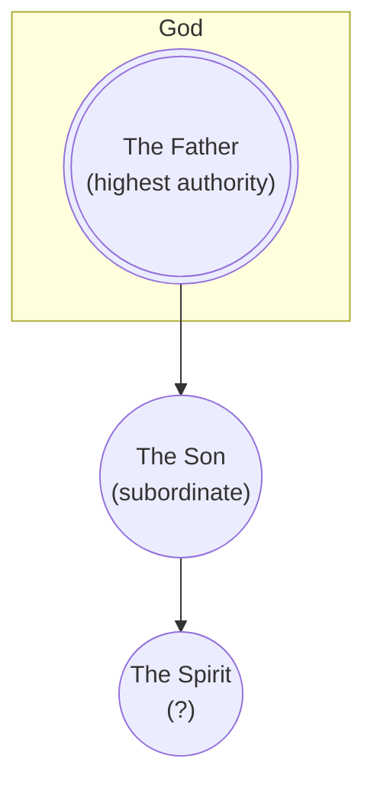

# Subordinationism (1 God + 1 Lessor God)

Subordinationism is an umbrella term. A useful critique must distinguish unequal authority from a claim about unequal divine being.

## Definition

The term can describe rank, origin, function, or nature. Tertullian's [*Against Praxeas* 8–9](https://www.newadvent.org/fathers/0317.htm) uses derivation and portion imagery while arguing for distinction without separation. In [“The Recipient of Prayer in Its Four Moods”](https://ccel.org/ccel/origen/prayer.xi.html), Origen says that prayer strictly speaking is offered to the Father through Christ as High Priest: *“we may not ever pray to any begotten being, not even to Christ himself, but only to the God and Father of All.”* His surrounding distinctions allow requests and intercessions to be addressed to Christ, so this is not a universal ban on addressing Jesus. These passages answer different questions and cannot establish one uniform historical doctrine. Subordinationism is also not [partialism](partialism.md). The rank between agents does not mean that they are pieces of one whole.

The category remains broad because the arrow may represent authority only, origin, or an asserted inequality of being.

## Biblical Tests

Although 1 Corinthians 11:3 says “the **head** of Christ is God” and Jesus says, “the Father is **greater** than I” in John 14:28, the LORD says, “before me no **god** was formed, nor shall there be any after me” in Isaiah 43:10, and “besides me there is **no god**” in Isaiah 44:6. This seems like a contradiction if one belief that Jesus is also a god.

Jesus calls the Father “**the only true God**” in John 17:3. Acts 2:22 calls Jesus “a **man** attested to you by God,” and 1 Timothy 2:5 calls him “[the **man**](human.md) Christ Jesus.”

## Premises and Inferences

Tertullian's derivation imagery may be read as preserving a shared source and it may also be read as making the Son a subordinate extension. Origen's narrower distinction concerns recipients for different modes of address and does not by itself settle metaphysics. Both writers require interpretation on their own terms.

However, the bible is clear that the Father alone is Almighty God and Jesus is [the human](human.md) [Son](index.md) and Christ, [dependent](human/has-a-god.md) on and [commissioned](human/serve-god.md) by the Father. It preserves actual subordination without converting it into a chain of lesser *deities*.

Because “subordinationism” is a later umbrella label, it can conceal important differences. A writer may subordinate the Son in authority, derive the Son's existence from the Father, or assign the Son a lesser kind of being. Those claims do not entail one another. Historical evidence should therefore establish each claim separately instead of treating the label as a complete account of either Tertullian or Origen.

## Conclusion

Biblical [authority order](#biblical-tests) is not itself the problem called subordinationism. The disputed step is the [added lesser-deity ontology](#premises-and-inferences), whereas the Father-alone reading retains Jesus' real dependence without partialism.
