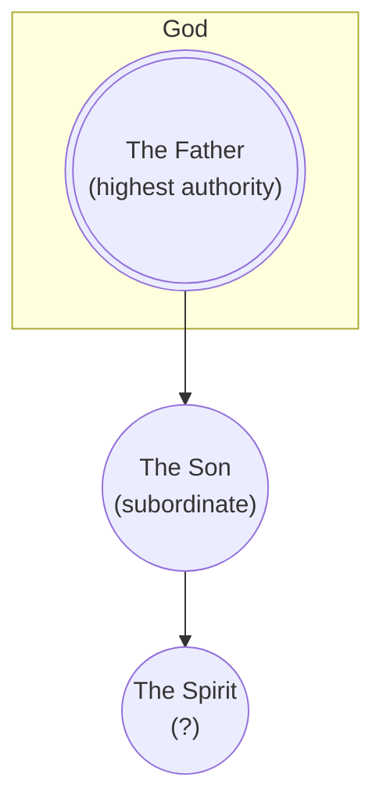

# Subordinationism (1 God + Lessor Gods)

Subordinationism is an umbrella term. A useful critique must distinguish unequal authority from a claim about unequal divine being.

## Definition

The term can describe rank, origin, function, or nature. Tertullian's [*Against Praxeas* 8–9](https://www.newadvent.org/fathers/0317.htm) uses derivation and portion imagery while arguing for distinction without separation. In [“The Recipient of Prayer in Its Four Moods”](https://ccel.org/ccel/origen/prayer.xi.html), Origen says that prayer strictly speaking is offered to the Father through Christ as High Priest: *“we may not ever pray to any begotten being, not even to Christ himself, but only to the God and Father of All.”* His surrounding distinctions allow requests and intercessions to be addressed to Christ, so this is not a universal ban on addressing Jesus. These passages answer different questions and cannot establish one uniform historical doctrine. Subordinationism is also not [partialism](partialism.md). The rank between agents does not mean that they are pieces of one whole.

The category remains broad because the arrow may represent authority only, origin, or an asserted inequality of being.

## Biblical Tests

The Father's declarations provide a starting point: “before me no **god** was formed, nor shall there be any after me” (Isaiah 43:10), and “besides me there is **no god**” (Isaiah 44:6). A literal second god alongside the Father conflicts with these explicit denials. Jesus calls the Father “**the only true God**” (John 17:3).

### Old Testament Lesser-Deity Test

The lesser-deity proposal holds that Jesus existed before his human life as a second god alongside the Father. If that were so, Old Testament revelation could reasonably be expected to identify this deity as such, rather than only anticipate a future Messiah. No prophecy about Jesus identify him as an already active second deity.

A progressive-revelation reply holds that later scripture can disclose an identity not stated explicitly in the Old Testament. Missing names alone therefore cannot settle pre-existence. However, the proposed second god must still be reconciled with the [explicit denials of other gods](#biblical-tests) in Isaiah 43:10 and Isaiah 44:6.

### The Angel of the LORD

The opposing interpretation identifies [the angel of the LORD as the pre-incarnate Son](name/son-as-angel.md) because the messenger speaks in God's first person, exercises divine authority and bears God's name.

Exodus 3:2-6 introduces an angel at the bush, but then describes the Father speaking from it. Genesis 16:7-13 likewise moves from the angel's speech to Hagar's recognition that the Father has spoken to her. Neither account simply separates the speakers at every point. Nevertheless, this overlap **does not by itself establish that the messenger is specifically Jesus**. In Mark 12:26, **Jesus attributes the bush speech to God**.

Other passages support an agency reading, in which the messenger conveys the sender's speech and authority. In Genesis 22:15-16 the angel says, “By myself I have sworn, **declares the LORD**”. The first-person oath carries an explicit attribution to the Father. Exodus 23:20-25 distinguishes the sender's “I send **an angel**” from the representative who bears his name: “**my name is in him**”. Verse 22 pairs obedience to the angel's voice with doing “**all that I say**”. Divine speech and name-bearing can therefore be understood as authorised representation rather than proof of a second deity.

Zechariah 1:12-14 records the angel of the LORD petitioning the Father, followed by the Father's reply and the communicating angel's “**Thus says the LORD**”. In Judges 13:16 the angel directs the burnt offering to the Father. These passages distinguish sender and messenger. That distinction alone does not disprove identification with Jesus, since the proposed identity already distinguishes Jesus from the Father.

## Premises and Inferences

Tertullian's derivation imagery may be read as preserving a shared source and it may also be read as making the Son a subordinate extension. Origen's narrower distinction concerns recipients for different modes of address and does not by itself settle metaphysics. Both writers require interpretation on their own terms.

However, the bible is clear that the Father alone is Almighty God and Jesus is [the human](human.md) [Son](index.md) and Christ, [dependent](human/has-a-god.md) on and [commissioned](human/serve-god.md) by the Father. It preserves actual subordination without converting it into a chain of lesser *deities*.

Because “subordinationism” is a later umbrella label, it can conceal important differences. A writer may subordinate the Son in authority, derive the Son's existence from the Father, or assign the Son a lesser kind of being. Those claims do not entail one another. Historical evidence should therefore establish each claim separately instead of treating the label as a complete account of either Tertullian or Origen.

## Conclusion

Biblical [authority order](#biblical-tests) does not itself establish an [added lesser divine being](#premises-and-inferences).* The [Old Testament test](#old-testament-lesser-deity-test) challenges a literal second god, and the [angel passages](#the-angel-of-the-lord) do not establish Jesus as that deity. The [Father-alone reading](#premises-and-inferences) retains Jesus' real dependence without making him a lesser god or part of the Father.
