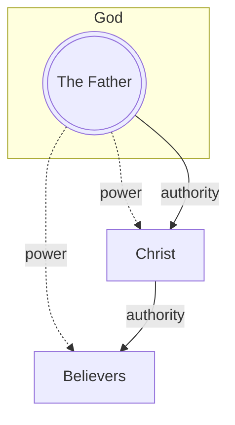
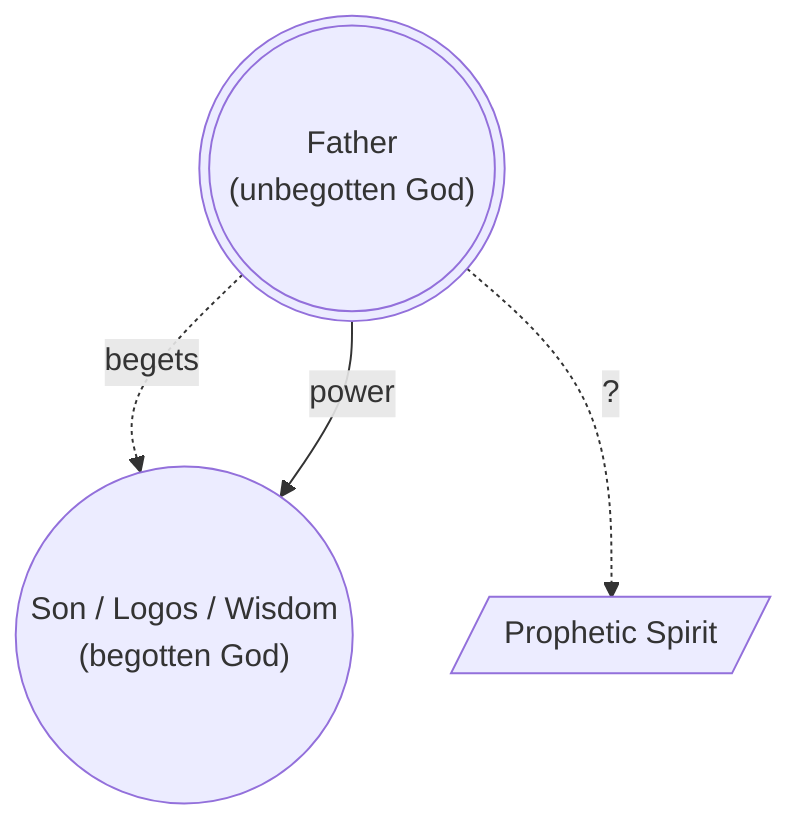
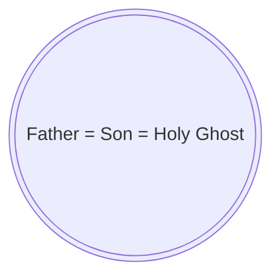
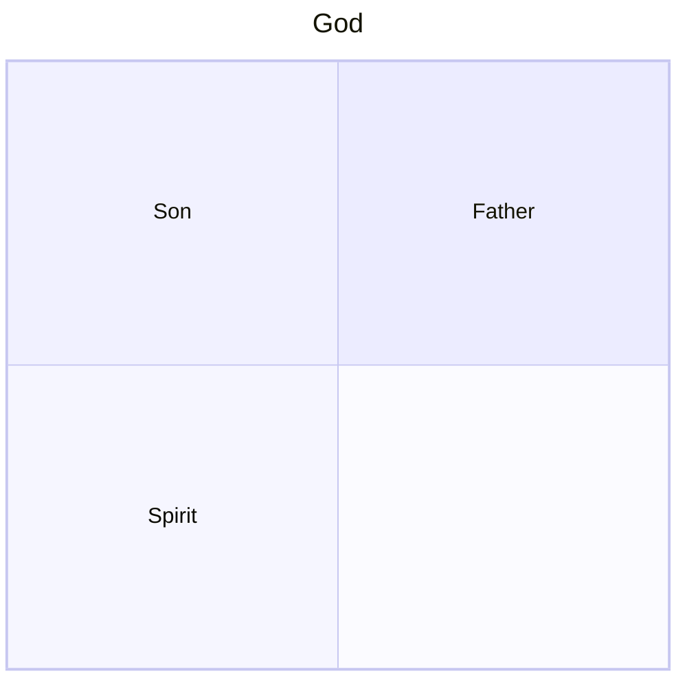
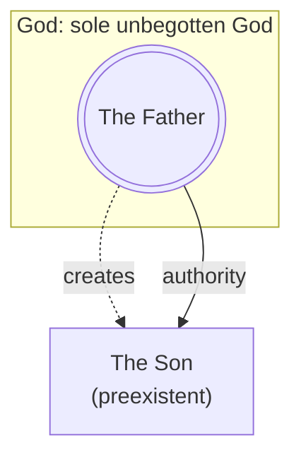
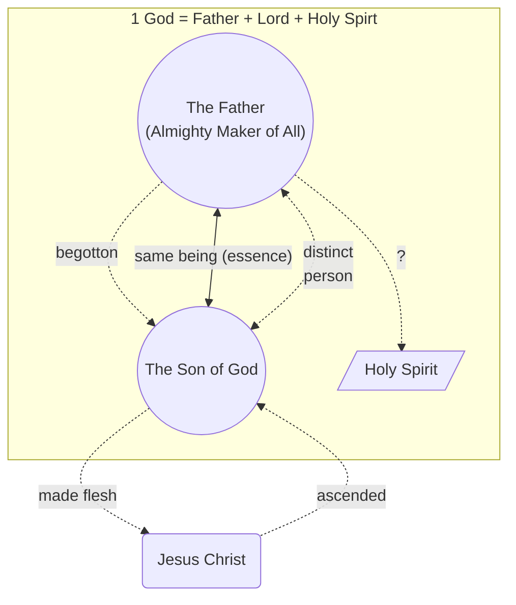
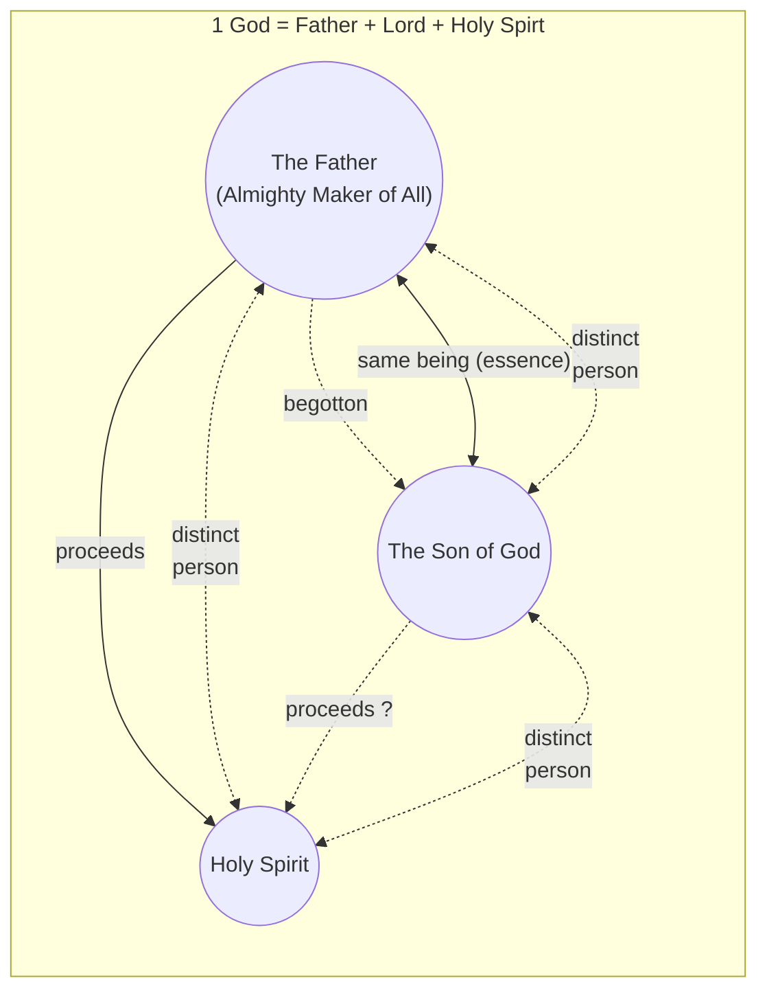
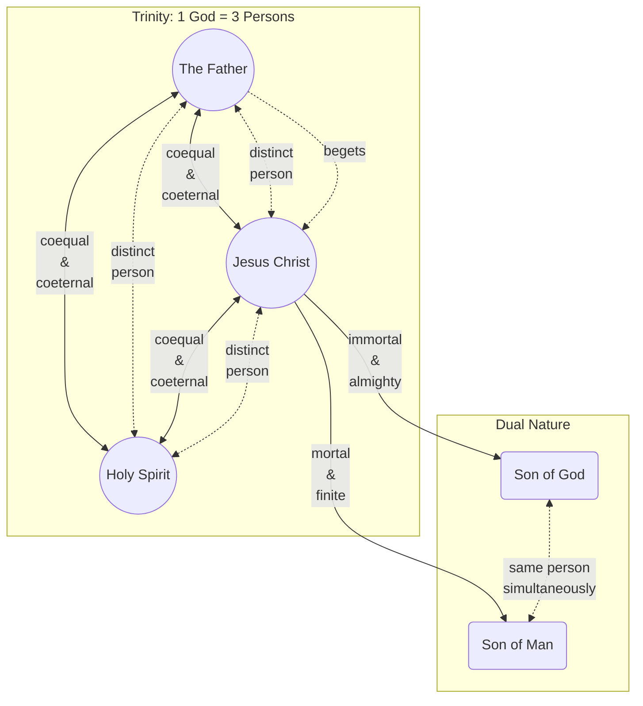

# The Trinity

When I first studied [the Bible](https://word.ofgod.info) as a new believer, I accepted the Trinity as a fundamental truth in Trinitarian Christianity. But as I dug deeper into Scripture, historical documents, and early church writings, troubling questions emerged:

* If the Trinity is central to Trinitarian Christianity, why do [even Trinitarian scholars admit the doctrine isn't found in the Bible?](https://thegodofjesus.com/reasons-to-believe/shocking-admissions)
* How could the apostles preach salvation without ever mentioning it in their letters?
* Why did it take over 300 years after Christ for [the church](https://church.ofgod.info) to [formalize this doctrine](https://church.ofgod.info/evolution)?
* Why are there so [many variations of the Trinity doctrine](#the-development-of-the-trinity-theology) and which one is correct?

## The Development of the Trinity Theology

### Monotheism

#### ~1300 BC: Shema

Moses made [the monotheistic declaration](shema.md) to the Israelites that only one God exists:

> "Hear, O Israel: The [LORD](https://ofgod.info/name) our [God](https://eternal.family.net.za/god), the [LORD](https://ofgod.info/name) is **one**!" — Deuteronomy 6:4 (NKJV), Mark 12:29

#### ~500 BC: Zechariah's Declaration

The prophet Zechariah states that only one God exists:

> And the [LORD](https://ofgod.info/name) will be king over all the earth. On that day the [LORD](https://ofgod.info/name) will be **one** and His name **one**. — Zechariah 14:9 (ESV)

#### ~450 BC: Malachi's Declaration

The prophet Malachi states that only one God exists:

> Have we not all **one** Father? Has not **one** God created us? — Malachi 2:10 (ESV)

#### ~30 AD: Jesus quoted the Shema

Jesus quoted [the Shema](shema.md) that Moses declared according to Mark 12:29.

#### ~60 AD: Paul's Monotheistic declaration

According to 1 Corinthians 8:6, Paul also taught that only one God existed.

Paul presents God as Christ’s head:

> But I want you to understand that the head of every man is Christ, the head of a wife is her husband, and **the head of Christ is God** — 1 Corinthians 11:3 (ESV)

The Apostle Paul frequently used the phrasing "the God and Father of our Lord Jesus Christ" in his letters to the early churches: Ephesians 1:3; Ephesians 1:17, Romans 15:6; 2 Corinthians 1:3; 2 Corinthians 11:31

Paul's model:

> For though He was crucified in weakness, yet **he lives by the power of God**. For we also are weak in Him, but **we shall live with Him by the power of God toward you**. — 2 Corinthians 13:4 (ESV)

### Hierarchical Triad

Around 165 AD [Justin Martyr](https://www.britannica.com/biography/Saint-Justin-Martyr) did not describe the later Nicene model of three coequal persons sharing one essence. His surviving writings present a **hierarchical order**:

1. **The Father** is the only unbegotten God and Maker of everything.
2. **The Son** is also called Logos and Wisdom. The Father begot him before all creatures. He is numerically distinct from and subject to the Father.
3. **The prophetic Spirit** occupies third place. Justin associates the Spirit with prophecy but does not clearly explain the Spirit’s origin or ontological nature.

Justin calls the Father:

> “the only unbegotten God” — Justin Martyr, [*First Apology* 14](https://www.newadvent.org/fathers/0126.htm#14)

He places the Son and Spirit in an explicit order:

> “He is the Son of the true God Himself, and holding Him in the **second place**, and the prophetic Spirit in the third” — Justin Martyr, [*First Apology* 13](https://www.newadvent.org/fathers/0126.htm#13)

Justin identifies **Wisdom with the Son and Logos**, rather than treating Sophia as another divine member:

> “the Son, again Wisdom … and then Lord and Logos” — Justin Martyr, [*Dialogue with Trypho* 61](https://www.newadvent.org/fathers/01285.htm#P61_2360)

He says that the Father begot this Logos before creation:

> “God begot before all creatures a Beginning, [who was] a certain rational power [proceeding] from Himself” — Justin Martyr, [*Dialogue with Trypho* 61](https://www.newadvent.org/fathers/01285.htm#P61_2360)

Justin describes the Logos as distinct from the Father without being separated from the Father’s substance:

> “this power … is indeed something numerically **distinct**” and was “begotten from the Father, by His power and will, but not by abscission” — Justin Martyr, [*Dialogue with Trypho* 128](https://www.newadvent.org/fathers/01289.htm#128)

He also calls the Logos:

> “**another God** and Lord subject to the Maker of all things” — Justin Martyr, [*Dialogue with Trypho* 56](https://www.newadvent.org/fathers/0128.htm#56)

### Modalism

In the late 2nd century, Noetus is often recognized as the first to openly preach Modalism.

Praxeas brought these ideas to Rome and North Africa. He famously drew the ire of Tertullian, who wrote a massive treatise against him (Adversus Praxean). Tertullian famously mocked Praxeas’s strict stance by writing that Praxeas "did two works for the devil in Rome: he drove out prophecy and he brought in heresy; he put to flight the Paraclete *[Holy Spirit]* and he crucified the Father."

[Sabellius was a Christian priest](https://en.wikipedia.org/wiki/Sabellius), the most famous proponent of this theology, and was therefore excommunicated by Pope Callixtus I. Sabellius wrote:

> "Father, Son and Holy Ghost are **three names for the same God**"

Modalism often compares God with water. Just as water has 3 modes (ice, water, gas), they believe God has 3 modes (Father, Son, Spirit).

However, this theology fails when:

* Jesus prays to the Father
* Father loves the Son
* Father sends the Spirit
* Spirit points people to the Son

According to Modalism, the *Father is His own son!*

Modalism fails when Daniel (Daniel 7:14), Stephen (Acts 7:55-56), and John (Revelation 4:2 and 5:2-6) saw [Jesus as a distinct person from God](son-of-man/distinct.md).

### Subordinationism

Although the Trinity concept was developed by this time, Tertullian was the first Christian author to use the Latin term ***"Trinitas"*** translated as "Trinity" in the 3rd century.

However, Tertullian's version of the Trinity was different. According to him, God is 1 substance, but 3 distinct persons.

It is often compared with a tree:

* The Father is like the roots (origin)
* The Son is like the branches (what we see)
* The Spirit is like the fruit (what we enjoy)
* Yet all 3 components are 1 tree

Another popular example is:

* The Father is like the sun (energy source)
* The Son is like the rays (what we see)
* The Spirit is like the warmth (what we feel)
* Yet all 3 components are considered sunlight

In the simplest terms, according to Subordinationism, the Father, Son, and Spirit are different parts of the same God.

This theology influenced Origen of Alexandria, who laid massive structural foundations for Christian theology.

For example ["On Prayer" (De Oratione)](https://ccel.org/ccel/origen/prayer/prayer) in Chapter XV (15), Section 1–4, Origen systematically **argues against praying directly to the Son or the Holy Spirit as distinct final recipients**, maintaining instead that the ultimate object of worship and prayer must be God the Father alone (Case, 2006). However, because of the distinct roles within the Trinity, this prayer is offered by means of **the mediation of the Son** and is **empowered within the context of the Holy Spirit** (Rambo, n.d.).

However, the Subordinationist theology fails because it leads to a chain of command:

* The Father is the most important authority
* The Son has lesser authority
* The Spirit has the least authority

This subordination clashes with the modern Trinity theology that *all are equal*!

### Arianism

In 318 AD, Arius from Alexandria began preaching [his theology](https://www.britannica.com/topic/Arianism) that Jesus, [the Son of God](https://son.ofgod.info), was created by God and not eternally divine or of the same substance as God the Father. This challenged the [Subordinationism view](#subordinationism) that Jesus is God and split the church, resulting in [Arianism](https://en.wikipedia.org/wiki/Arianism).

### Nicene Creed

Because of Arianism, church leaders gathered in 325 AD at [the council of Nicaea](https://www.historyskills.com/classroom/ancient-history/council-of-nicaea/) to prevent further church splits by:

* defining the *divinity* of Jesus;
* [condemning Arianism as heretical](https://www.rca.org/about/theology/creeds-and-confessions/the-nicene-creed/);
* establishing church hierarchy;
* separating Christian practices from Jewish traditions;

The council primarily defined the relationship between the Father and the Son. Its creed mentioned belief in the Holy Spirit but did explain the Spirit’s divinity, procession, or relationship to the Father and the Son. 

Because many Christians initially rejected the Trinity doctrine for fear of polytheism (worship of multiple gods), the council had to carefully and clearly define the Trinity to avoid misunderstandings.

This led to the establishment of [the Nicene Creed](https://www.fourthcentury.com/urkunde-24/), which declared:

> * We believe in [one God](#monotheism), [the Father Almighty](https://ofgod.info),
>   * Maker of all things seen and unseen.
> * And in one Lord, Jesus Christ [the Son of God](https://son.ofgod.info),
>   * begotten of the Father,
>   * the only-begotten, that is, of ***the essence of the Father***,
>   * ***God from God, Light from Light, true God from true God***,
>   * begotten, not made, of ***the same being as the Father***,
>   * ***through whom all things came to be, both the things in heaven and on earth***,
>   * who for us humans and for our salvation ***came down and was made flesh, becoming human***,
>   * who suffered and rose again on the third day,
>   * ascended into heaven,
>   * who is coming to judge the living and the dead.
> * And in the Holy Spirit.
> * The catholic and apostolic ***church condemns*** those who say concerning the Son of God that ***“there was a time when he was not”*** or ***“he did not exist before he was begotten”*** or ***“he came to be from nothing”*** or who claim that he is of another subsistence or essence, or a creation, or changeable, or alterable.

The council's version of the Trinity was:

1. **"Homoousios"** (Of the Same Substance): The Son shares the exact same, identical divine substance. If the Father is the supreme, uncreated God, then the Son, sharing the same substance, is also the supreme, uncreated God.
2. **"Begotten, Not Made"**: The Son was "not made" (not created), but instead was "begotten" (brought forth from the same kind, like humans delivering babies)
3. **"True God from True God"**: The Son was not merely a "Second God" or a reflection of the true light.
The Trinitarian model:

This theology is also not without problems:

#### The Problem with "Homoousios"

In 4th-century Greek philosophy, the word "ousia" (substance) was notoriously ambiguous:

* Primary Substance (Individual): It could mean a specific, individual thing (e.g., this specific horse). If Nicaea meant this, then saying the Father and Son are the same individual substance implies they are the exact same person which inadvertently loops right back into [Modalism](#modalism) (Sabellianism).
* Secondary Substance (Generic): It could mean a generic category or material class (e.g., Peter and Paul are both "human" because they share the same human nature). If Nicaea meant this, it solved the Modalism problem but opened the door to **Tritheism** (worshipping distinct Gods who happen to belong to the same "divine species").

The meaning of [the word 'one'](godhead.md#the-unified-god) in [the Shema](shema.md) also had to change accommodate the theology: "It’s not one person, it’s one substance shared by three persons". This new meaning explain why every singular pronoun referring to God may accommodating 3 distinct divine persons without violatig the Monotheistic belief.

#### The Problem with "Begotten, Not Made"

This analogy suffers from deep logical incoherence when applied to an immaterial, timeless God:

* In the natural world, begetting is an event that requires a **change in state**. **A father exists before he begets a child**, and **the act occurs at a specific point in time**. Nicaea asserted that the Son was begotten **eternally** which turns it into a paradox.
* Biological begetting involves a **physical separation or extraction** of matter from the parent to form a **new individual**. If the Son is begotten from the *ousia* of the Father, it implies that the divine essence is **divisible or material**, which contradicts the absolute **immateriality and simplicity** of God.

#### The Problem with "True God from True God"

When combined with strict monotheism, the preposition "from" (ek) introduces a severe metaphysical conflict:

The word "from" inherently denotes a **source** and a **derivation**. Philosophically, **a derived entity is dependent on its source for its existence**.

If the Father is the source and the Son is derived from the source, then it means that **the Son's existence is derived from the Father**.

Yet Nicene theology asserts that **the Son is fully equal (co-equal) to the Father**.

Logically, you cannot have an entity that is **completely equal while being dependent** on an external source for its being.

#### The Problem with Scriptural Contradictions

A literal interpretation of certain scriptures (Psalm 2:7; 2 Samuel 7:14; Isaiah 7:14-16; Mark 10:18, 13:32; Luke 1:30-35, 2:52; John 3:34, 5:19, 5:26, 8:28, 14:28; Acts 1:11; 1 Corinthians 11:3, 15:28, 15:46; Galatians 4:4; Hebrews 2:18; Revelation 1:18) reveals that **the Son is NOT co-equal with the Father**.

### Niceno-Constantinopolitan Creed

The creed adopted at Nicaea in 325 did not provide a developed doctrine of the Holy Spirit. It ended that part of its confession with only: “And in the Holy Spirit.” The creed commonly called the **Nicene Creed** today is the expanded form traditionally associated with the [First Council of Constantinople in 381](https://www.newadvent.org/fathers/3808.htm). Its more precise name is the **Niceno-Constantinopolitan Creed**.

It retained Nicaea’s teaching about the Father and the Son, but expanded its statement about the Holy Spirit:

> “And [we believe] in the Holy Ghost, the Lord and Giver-of-Life, who proceedeth from the Father, who with the Father and the Son together is worshipped and glorified, who spake by the prophets.” — [Niceno-Constantinopolitan Creed](https://www.newadvent.org/fathers/3808.htm)

This addition established several important claims:

1. The Holy Spirit is **Lord** and the source of life.
2. The Holy Spirit **proceeds from the Father**.
3. The Holy Spirit is worshipped and glorified together with the Father and the Son.
4. The Holy Spirit spoke through the prophets.

The original Greek creed said that the Spirit proceeds **“from the Father.”** Western churches later added the words **“and the Son”**, known by the Latin term *Filioque*. This addition was not part of the creed associated with Constantinople and became a major disagreement between Eastern and Western Christianity.

The most contested Trinitarians believes are:

1. ***"There is only 1 God"*** ([the Shema](shema.md) is very clear): If they dismiss it, then they have to accept paganism (many gods).
2. ***"Jesus is not the Father"*** ([they interacted with each other](son-of-man/distinct.md)): If they dismiss it, then they reduce Jesus to an avatars of God (puppet show).
3. ***"Jesus was 100% human"*** ([according to both Bible](son-of-man/human.md) and creed): If they dismiss it, then they have to accept that Jesus deceived his disciples, did not really suffer/die so sacrifice was fake
4. ***"The Father is God, Jesus is God, the Holy Spirit is God"*** (according to creed): If they dismiss it, then they invalidate their own creed.

The problem with consolidating all these points of the Nicene theology is that:

* To say all 3 Trinity Members are 1 God and 1 person, just different modes/names: is [Modalism](#modalism).
* To say all 3 Trinity Members are parts of 1 God: is [Partialism](#subordinationism)
* To say all 3 Trinity Members are 1 God and 1 mind, but 3 different personalities: is a *fragmented/split/mixed* personality God (nobody will accept it)
* To say only the Father is Almighty God and Jesus was a lessor god/angel: is [Arianism](#arianism)

The simple solution is to dismiss statement #4 and accept there is truly only 1 God, [the Father](https://ofgod.info), and that [Jesus is not God](nature.md), but [the Son of God](index.md), [the Christ](https://kingdom.ofgod.info/christ), a human Lord [glorified](https://word.ofgod.info/terms/glory) by [his God](son-of-man/has-a-god.md).

However, Trinitarians solve this problem by adding a few more yet another definition to solve the Son's *"Dual-Nature"* problem.

### Dual-Nature

In 451, the [Council of Chalcedon](https://www.newadvent.org/fathers/3811.htm) defined Christ as **one** person existing in **two** natures, divine and human, “without confusion, without change, without division, without separation.”

The reasoning is that this **Dual-Nature** explain how Jesus could [simultaneous](https://sourcebooks.fordham.edu/basis/chalcedon.asp):

  1. be *the divine immortal allmighty omniscient omnipresent* "Son of God" to satisfy the Trinity doctrine, and
  2. be the human "Son of Man" whenever a scripture require a human Jesus. Therefore Trinitarians have no problem to acknoledge that Jesus was a human even when the concept of a human Jesus contradict the Trinity.

A still later Western document, the [Athanasian Creed](https://www.ccel.org/creeds/athanasian.creed.html), expressed the doctrine more explicitly:

> “We worship one God in Trinity, and Trinity in Unity; neither confounding the Persons, nor dividing the Substance.”

It described the three persons as **coeternal** and **coequal**.

Even the "Dual-Nature" still does not resolve all problems. Therefore the final solution it to use abstract Greek philosophy and words like *hypostasis* and *consubstantiality* to make a blatant contradiction sound like a [complex deep spiritual mystery](https://church.ofgod.info/terms/mystery). Therefore some Trinitarians will quote scriptures like 1 Timothy 3:16 and 1 Corinthians 13:12 out of context to prove that people must have faith in ["the mysteries of God"](https://church.ofgod.info/terms/mystery).

Despite the definition of the "Dual-Nature" it is still hard to explain how it is possible that Jesus could be both God and have an [incompatible human nature](nature.md) simultaneous. To solve that problem they would assert that **people cannot comprehend** an infinite, immaterial, higher-dimensional God that exists outside space and time with **a finite brain**.

## Witnesses

### Did Jesus Believe in the Trinity?

There is no evidence that Jesus believed in the Trinity. Mark recorded:

> One of the teachers of the law came and heard them debating. Noticing that Jesus had given them a good answer, he asked him, “Of all the commandments, which is the most important?”
>
> “**The most important one**,” answered Jesus, “is this:
>
>> ‘Hear, O Israel: The LORD our God, **the LORD is one**. Love the Lord your God with all your heart and with all your soul and with all your mind and with all your strength. -- Deuteronomy 6:4-5
>
> The second is this: ‘Love your neighbor as yourself.’
>
> There is no commandment greater than these.”
>
> “Well said, teacher,” the man replied. “You are right in saying that **God is one and there is no other but Him**. To love him with all your heart, with all your understanding and with all your strength, and to love your neighbor as yourself is more important than all burnt offerings and sacrifices.”
>
> When Jesus saw that he had answered wisely, he said to him, “You are not far from [the kingdom of God](https://kingdom.ofgod.info).”
>
> And from then on no one dared ask him any more questions.
>
> -- Mark 12:28-34 (ESV)

The scribe restated [the Shema](shema.md) as the confession that God is one and that no other is beside Him. Jesus approved this answer.

This would have been the perfect opportunity for Jesus to correct the teacher and explain to him that he misunderstood the Trinity, but instead he said: "Well said, teacher... You are not far from the kingdom of God".

The typical Trinitarian response is that the Shema identifies the one God but does not, by itself, exclude Jesus from that divine identity. However, Mark 12:29-34 does not explicitly address that claim. Yet its immediate language identifies God as the one to whom Israel gives exclusive devotion, and Mark continues to distinguish the Son from the Father (Mark 13:32).

In Mark's Gospel, Jesus calls God “your Father” (Mark 11:25) and distinguishes himself from “the Father,” who alone knows the day and hour (Mark 13:32). In this context, the passage supports the Father-alone reading: the one God whom Jesus affirms is the Father.

### Did the Jews Believe in the Trinity?

In John 10:30 Jesus made the statement:

> "I and the Father are one". -- John 10:30 (ESV)

The Jews misunderstood Jesus and wanted to kill him for saying it (John 10:31-33):

> "...you, being a man, make yourself God".

If the Jews did believe in the Trinity, they would have considered that Jesus could be God's human avatar.

### Did the Apostles Believe in the Trinity?

The Trinity theology requires that all Trinity members are co-equal.

Most arguments about the Father having more power and authority than Jesus are dismissed because the reasoning is that the scripture only applies when Jesus was incarnate (limited) as a human being.

However, Paul wrote about the end times:

> Then comes the end, when he *[the Son]* delivers the kingdom to **God the Father** after destroying every rule and every authority and power.
>
> For he *[the Son]* must reign until he *[the Son]* has put all his *[the Son]* enemies under his *[the Son]* feet. The last enemy to be destroyed is death. For
>
>> “**God** has put all things in subjection under his [the Son] feet.”
>
> But when it says, “all things are put in subjection,” it is plain that He *[the Father]* is excepted Who put all things in subjection under him *[the Son]*. When all things are subjected to him *[the Son]*, then the Son himself will also be subjected to Him *[the Father]* Who put all things in subjection under him *[the Son]*, that **God** *[the Father]* may be all in all.
>
> -- 1 Corinthians 15:24-28 (ESV)

According to Paul, **the Father and the Son are not equal** in power and authority, even at the end times.

## Proving the Trinity

* Some Trinitarians argue that "God is one" actually means ["God is unified"](godhead.md#the-unified-god) which is supposed to mean "God is made up of 3 united members". However, the same Hebrew and Greek words for "one" could also mean "only", "alone", "single" or even "united" depending on the context or interpretation. When Jesus quoted Deuteronomy 6:4-5 in Mark 12:28-34, the scribe explained that his understanding of "one" means "no other but Him" instead of "unified." Jesus did not correct him, but instead applauded him.
* Some Trinitarians argue [God is plural](godhead.md#the-plural-god). In general, the Hebrew word "Elohim" means gods in the plural. However, in the Bible, the word "Elohim" could also [technically be considered a singular God](godhead.md#the-plural-god) for example: Moses (Exodus 7:1), a single idol (Exodus 22:20), Baal (Judges 6:31), Chemosh (Judges 11:24) and Dagon (1 Samuel 5:7) was also referred as "elohim".
* Some Trinitarians argue that [plural pronounce often refer to God](godhead.md#singular-pronouns). According to [Spirit & Truth Fellowship International](https://www.biblicalunitarian.com/why-bu), there are over 20,000 singular pronouns, like "I", "My", and "He" which refers to God. If God was a collection of different members, then these pronouns would not make sense.
* Some Trinitarians argue that [multiple "members" create man](godhead.md#god-created-in-partnership) (Genesis 1:26; 3:22; 11:7). This is purely an assumption because [the LORD of hosts](https://ofgod.info) often [partner with His angels ("hosts") or Cherubim](godhead.md#god-doing-divine-things-in-partnership), [mankind](godhead.md#people-make-people), and prophets (Isaiah 6:8, 48:16).
* Some Trinitarians argue that [the Trinity appeared to Abraham](trinity/abraham-3-visitors.md) (Genesis 18:1-3). Yet, there is no evidence that [God appears](https://ofgod.info/appearance) as a "man" that you can invite for dinner. It was most likely 3 [angels who spoke on behalf of God](https://eternal.family.net.za/bible/concepts/angel) to Abraham. Abraham was speaking to the LORD through the angel. Even if it was the LORD Himself that personally appeared to Abraham, the other two "men" were identified as "angels" instead of God or Trinity members.

### Father, Son and Spirit is God

1. The Father is God (1 Corinthians 8:6; Psalm 68:5; Matthew 23:9)
2. The Son is God (according to the Trinitarians [by a variety of reasons](son-as-god.md))
3. The Holy Spirit is God (implied by Peter in Acts 5:3-4)

However, Trinitarian Christians practise [Monotheism](#monotheism), which means there can only be 1 God. The purpose of the Trinity theology or ["Godhead"](godhead.md) is to solve this paradox.

### The Godhead

The term "Godhead" in the KJV is often quoted to proof the presence of the Trinity in the bible.

Although, the English word "Godhead" is found in the King James Version (KJV) of the Bible, most other popular [translations](https://word.ofgod.info/translations) does not include that word like the ESV, NIV, NAS, AMP, LSB, NLT, NRSV, CSB, NET, REV and even the NKJV.

[The Godhead article](godhead.md) explore in more depth the evidence for and against the use of the word "Godhead".

### Biased bible translations

Some modern Bible translators defend the Trinitarian doctrine with biased translations, instead of translating what the original text originally meant to say. For example:

* [Matthew 28:19](trinity/baptism-formula.md)
* [John 1:18](son-as-god/john-1-18.md)
* [1 John 5:7-8](trinity/3-witnesses.md)

### Paul's Closing

> 1. The grace of the Lord Jesus Christ and
> 2. the love of God and
> 3. the fellowship of the Holy Spirit
>
> be with you all.
>
> — 2 Corinthians 13:14 (ESV)

This verse does not list the Trinity members. Instead, Paul concludes with the 3 main topics of his letter and blesses his readers with the information thereof. The structure of the letter itself supports that reading, because each of these themes is developed throughout 2 Corinthians:

* Grace of the Lord Jesus Christ: 2 Corinthians 1:12; 4:15; 8:9; 12:9; 13:13-14.
* Love of God: 2 Corinthians 2:4; 5:14-15; 6:6; 8:7-9; 13:11.
* Fellowship of the Holy Spirit: 2 Corinthians 1:21-22; 3:3-6; 6:6; 8:4; 9:13; 13:13.

In other words, Paul’s closing sounds less like a formal Trinitarian formula and more like a summary blessing that gathers together the major themes of the letter.

Paul explicitly applies the title "God" (ho theos) to only one entity in the list, separating Him entirely from the Lord Jesus and the Holy Spirit. If Paul intended to show that all three were distinct persons within a single God, applying the word "God" to only the Father would logically exclude the other two. Rather than outlining a metaphysical Trinity, Paul is highlighting three distinct spiritual dynamics the believers desperately needed for unity.

### God is Love Argument

Another Trinitarian argument is that when John wrote that "God is love" (1 John 4:8,16), it implies multiple persons must exist within God to love each other. The reasoning is that love is usually given or received, but if God is eternal and immaterial, it would mean there had to be a time when a strict monotheistic God did not have anyone to love before He created anyone. To solve this problem, they argue that *God needs distinct eternal persons within Himself to love each other*.

However, the context of 1 John 4 reveals that John was not lecturing the Trinity. Instead, next verse 1 John 4:9 shows that John was referring to outward love towards us instead of Himself. John was possibly fighting some form of Proto-Gnosticism which taught that the supreme God was entirely detached from the physical world and didn't care about humans.

God does not need a recipient to possess the capacity of love. Just as God had the capacity to create before He created, God also possessed **the capacity for love without needing a partner**.

## Critique

### Missing evidence

* There are no scriptures that define God as being Father, Son, and Holy Spirit.
* There are no scriptures that define God as 3, 3 in 1, or a combination of personalities, parts, modes or aspects.
* The Jewish Rabbis, Scribes, Pharisees, and Priests spend a great deal of time studying the Tanach (Old Testament) in their own language. If there was any proof of a Trinity, they would have noticed it. Yet we see through history the Jews fiercely defended the facts that there is only one God.
* There are no scriptures that say that Jesus has two natures or two minds or that he is a God-man, or that he is fully God and fully man.
* There are no scriptures of people praying to Jesus (except face to face conversations).
* There are no scriptures of people praying to the Holy Spirit.
* There are no scriptures of people worshipping the Holy Spirit.

### People got saved without knowing about the Trinity

| Scripture               | Description                                                                                                                       |
| ----------------------- | --------------------------------------------------------------------------------------------------------------------------------- |
| Luke 7:36-50            | Jesus converted a woman [without telling her that he is God](https://eternal.family.net.za/god/son/essence/not-god/salvation).    |
| Acts 2:14-47            | Peter converted 3000 people [without telling them Jesus is God](https://eternal.family.net.za/god/son/essence/not-god/salvation). |
| Acts 13:13-44; 17:22-34 | Paul converted people [without telling them Jesus is God](https://eternal.family.net.za/god/son/essence/not-god/salvation).       |

### The Death of Christ

If the Son was an Immortal God, how did He [die](https://kingdom.ofgod.info/christ/crucifixion)?

A typical response would be that the Son became man and then returned to God. However, that reasoning also clashes with scripture that states that God does not change: Malachi 3:6; Numbers 23:19; Psalm 102:25–27.

Therefore it is essential that Christ should not be an immortal God otherwise his [crucifixion](https://kingdom.ofgod.info/christ/crucifixion) was only a show.

### Jesus was not God

[Scripture shows that Jesus had a God](son-of-man/has-a-god.md), [denies being God](son-of-man/denies-being-god.md), but instead he was considered [the Son of God](index.md). Therefore, he could not have qualified to be a member of the Trinity.

### The apostle's greetings

#### Paul names only 2 members of the Trinity

Note that the Holy Spirit is always missing from Paul's blessings, which implies that Paul did not consider the Holy Spirit important enough to be considered as part of the "Trinity".

Paul mentions:

* God our Father
* Lord Jesus Christ
* ***but the Holy Spirit is missing***

> Paul, a bondservant of **Jesus Christ**, called to be an apostle, separated to the gospel of **God** which He promised before through His Prophets in the Holy Scriptures, concerning **His son Jesus Christ our Lord**... — Romans 1:1-3 (NKJV)

> Paul, called to be an apostle of Jesus Christ through the will of God, and Sosthenes our brother, to the church of God which is at Corinth, to those who are sanctified in Christ Jesus, called to be saints, with all who in every place call on the name of Jesus Christ our Lord, both theirs and ours: Grace to you and peace from **God our Father** and the **Lord Jesus Christ**. — 1 Corinthians 1:1-2 (NKJV)

> Paul, an apostle of Jesus Christ by the will of God, and Timothy our brother, to the church of God which is at Corinth, with all the saints who are in all Achaia: Grace to you and peace from **God our Father** and the **Lord Jesus Christ**. — 2 Corinthians 1:1-2 (NKJV)

> Paul, an apostle (not from men nor through man, but through Jesus Christ and **God the Father** who raised Him from the dead), and all the brethren who are with me, to the churches of Galatia: Grace to you and peace from **God the Father** and our **Lord Jesus Christ**, who gave Himself for our sins, that he might deliver us from this present evil age, according to the will of our **God and Father**, to whom be glory forever and ever. Amen — Galatians 1:1-4 (NKJV)

> Paul, an apostle of Jesus Christ by the will of God, to the saints who are in Ephesus, and faithful in Christ Jesus: Grace to you and peace from **God our Father** and the **Lord Jesus Christ**. — Ephesians 1:1-2 (NKJV)

> Paul and Timothy, bondservants of Jesus Christ, to all the saints in Christ Jesus who are in Philippi, with the bishops and deacons: Grace to you and peace from **God our Father** and the **Lord Jesus Christ**. — Philippians 1:1-2 (NKJV)

> Paul, an apostle of Jesus Christ by the will of God, and Timothy our brother, to the saints and faithful brethren in Christ who are in Colosse: Grace to you and peace from **God our Father** and the **Lord Jesus Christ**. — Colossians 1:1-2 (NKJV)

> Paul, Silvanus, and Timothy, to the church of the Thessalonians in **God the Father** and the **Lord Jesus Christ**. — 1 Thessalonians 1:1 (ESV)

> Paul, Silvanus, and Timothy, to the church of the Thessalonians in **God our Father** and the **Lord Jesus Christ**. — 2 Thessalonians 1:1 (ESV)

> Paul, an apostle of Christ Jesus by command of God our Savior and of Christ Jesus our hope, to Timothy, my true child in the faith: Grace, mercy, and peace from **God the Father** and **Christ Jesus our Lord**. — 1 Timothy 1:1-2 (ESV)

> Paul, an apostle of Christ Jesus by the will of God according to the promise of the life that is in Christ Jesus, to Timothy, my beloved child: Grace, mercy, and peace from **God the Father** and **Christ Jesus our Lord**. — 2 Timothy 1:1-2 (ESV)

> Paul, a servant of God and aan apostle of Jesus Christ, for the sake of the faith of God’s elect and their knowledge of the truth, which accords with godliness, in hope of eternal life, which God, who never lies, promised before the ages began and at the proper time manifested in his word through the preaching with which I have been entrusted by the command of God our Savior; To Titus, my true child in ma common faith: Grace and peace from **God the Father** and **Christ Jesus our Savior**. — Titus 1:1-4 (ESV)

> Paul, a prisoner for Christ Jesus, and Timothy our brother, to Philemon our beloved fellow worker and Apphia our sister and Archippus our fellow soldier, and the church in your house: Grace to you and peace from **God our Father** and the **Lord Jesus Christ**. — Philemon 1:1-3 (ESV)

#### James names only 2 members of the Trinity

James mentions:

* God
* Lord Jesus Christ
* ***but the Holy Spirit is missing***

> James, a servant of God and of the Lord Jesus Christ, to the twelve tribes in the Dispersion: Greetings. — James 1:1 (ESV)

#### Peter names only 2 members of the Trinity

Peter mentions:

* God the Father
* Jesus Christ
* the Spirit (missing in the second letter of Peter)

However, in the context of 1 Peter:1, "the Spirit" is complementing the "blood", but the "blood" is not considered as a fourth member of the Trinity.

> Peter, an apostle of Jesus Christ, to those who are elect exiles of the Dispersion in Pontus, Galatia, Cappadocia, Asia, and Bithynia, according to the foreknowledge of
>
> * **God the Father** in the sanctification of ***the Spirit***,
> * for obedience to **Jesus Christ** and for sprinkling with ***his blood***:
>   May grace and peace be multiplied to you.
>
> — 1 Peter 1:1-2 (ESV)

If the Spirit is proven to be "God" by this greeting, then the "blood" should also be a "god" making the Trinity 4 members not 3.

> Simeon Peter, a servant and apostle of Jesus Christ, to those who have obtained aa faith of equal standing with ours by the righteousness of **our God** and **Savior Jesus Christ**: May grace and peace be multiplied to you in the knowledge of **God** and of **Jesus our Lord**. — 2 Peter 1:1-2 (ESV)

#### John names only 2 members of the Trinity

John mentions:

* God the Father
* Jesus Christ the Father's Son
* ***but the Holy Spirit is missing***

> That which was from the beginning, which we have heard, which we have seen with our eyes, which we looked upon and have touched with our hands, concerning the word of life — the life was made manifest, and we have seen it, and testify to it and proclaim to you the eternal life, which was with the Father and was made manifest to us — that which we have seen and heard we proclaim also to you, so that you too may have fellowship with us; and indeed our fellowship is with **the Father** and with His son **Jesus Christ**. And we are writing these things so that our joy may be complete. — 1 John 1:1-4 (ESV)

> The elder to the elect lady and her children, whom I love in truth, and not only I, but also all who know the truth, because of the truth that abides in us and will be with us forever: Grace, mercy, and peace will be with us, from **God the Father** and from **Jesus Christ** the Father’s Son, in truth and love. — 2 John 1:1-3 (ESV)

> The elder to the beloved Gaius, whom I love in truth. — 3 John 1:1 (ESV)

#### Jude names only 2 members of the Trinity

Jude mentions:

* God the Father
* Jesus Christ
* ***but the Holy Spirit is missing***

> Jude, a servant of Jesus Christ and brother of James, to those who are called, beloved in **God the Father** and kept for **Jesus Christ**. — Jude 1:1 (ESV)

#### The author of Hebrews names only 2 members of the Trinity

The author mentions:

* God of peace
* our Lord Jesus, the great shepherd
* ***but the Holy Spirit is missing***

> Now may the **God of peace** who brought again from the dead **our Lord Jesus, the great shepherd** of the sheep, by the blood of the eternal covenant, equip you with everything good that you may do His will, working in us that which is pleasing in His sight, through Jesus Christ, to whom be glory forever and ever. — Hebrews 13:20-21 (ESV)

## The Effects of Faith in the Trinity

| Triune God                                                                                                                                            | Single God                                                                                                                                                                 |
| ----------------------------------------------------------------------------------------------------------------------------------------------------- | -------------------------------------------------------------------------------------------------------------------------------------------------------------------------- |
| Complexity: Complex to reason, witness or share the Gospel of God                                                                                     | Clarity: Simple to explain and the Gospel is easy to understand                                                                                                            |
| Confusion: Cannot understand the "[mysteries of God](https://church.ofgod.info/terms/mystery)"                                                        | Clarity: No contradictions                                                                                                                                                 |
| Idolatry: Potentially [worshipping the wrong member](https://eternal.family.net.za/bible/concepts/idolatry) of the Trinity                            | Clarity: Only [1 God to serve and worship](https://eternal.family.net.za/god/son/essence/as-god/worship)                                                                   |
| Christianity: Some adherents live only for the [glory of Jesus](https://eternal.family.net.za/god/son/essence/as-god/claims/glory)                    | Purpose: [The Father is the purpose of existence](https://eternal.family.net.za/creation#the-purpose-of-the-creation) and Jesus is the way to the Father (Ephesians 1:3-6) |
| Outsiders: [The Godhead is complete](godhead.md), adherents are outsiders (sinners)                                                                   | Adopted: As the Father accepted Jesus as His Son, [people can be adopted](https://eternal.family.net.za/god/family) too                                                    |
| No miracles: [A Jesus God does miracles by himself](https://eternal.family.net.za/god/son/essence/as-god/miracles), which is impossible for adherents | Miracles: [Jesus did miracles by God's Spirit](https://eternal.family.net.za/god/son/essence/as-god/miracles) which people can also receive                                |
| No sacrifice: A Jesus God could escape suffering (adherents will not know)                                                                            | Sacrifice: Jesus was 100% human, therefore he earns the highest honour                                                                                                     |
| Doubt: If Jesus was not really dead (immortal God), adherents have no proof of a resurrection                                                         | Assurance: If [God truly resurrected Jesus from the death](https://eternal.family.net.za/god/son/essence/as-god/resurrected), He can do the same for people                |
| Limited empathy: A Jesus God could not fully understand human suffering                                                                               | Real empathy: A human [Jesus understand people's struggles 100%](https://eternal.family.net.za/god/son/essence#how-jesus-relates-to-his-father-and-disciples)              |
| Fake witness: A Jesus-Father who is the same person is no witness at all.                                                                             | True witness: Jesus with a distinct free will is a true witness with God (John 8:17-18)                                                                                    |
| Unrealistic standards: It's impossible to live like a Jesus God                                                                                       | Realistic standards: Jesus set a realistic standard to live by                                                                                                             |
| Obscure: Prevents monotheistic religions like Jews and Muslims from believing Christ                                                                  | Accessible: Much more approachable to monotheistic religions like Jews and Muslims                                                                                         |

## What Should You Believe?

Having examined the historical evidence, biblical references, and logical consistency of Trinitarian doctrine, you now face a choice.

Will you accept tradition simply because "that's what some churches teach," or will you search the Scriptures yourself like the Bereans in Acts 17:11?

I'm not asking you to abandon your faith. I'm asking you to deepen it. Here's what you can do:

1. [Research the church history](#the-development-of-the-trinity-theology) and verify if the evidence in this article is true.
2. [Study the passages](#did-jesus-believe-in-the-trinity) cited in this article. Read them in their full context, not just isolated verses.
3. [Ask honest questions](#critique). [If the Trinity is essential for salvation](#people-got-saved-without-knowing-about-the-trinity), why did the apostles [not explicitly teach the Trinity](#missing-evidence)? Why is it [missing from their greetings and letters](#the-apostles-greetings)? How can an [immortal God die](#the-death-of-christ)?
4. **Pray for wisdom**. Ask God to reveal the truth to you through [His Word](https://word.ofgod.info), not through human tradition.
5. [Consider the effects](#the-effects-of-faith-in-the-trinity). Does the Trinity doctrine bring you closer to the Father, or does it create confusion and complexity?
