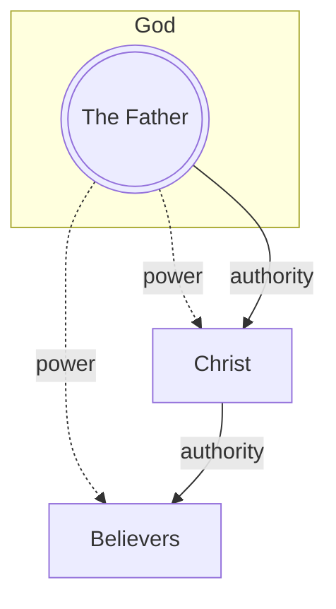
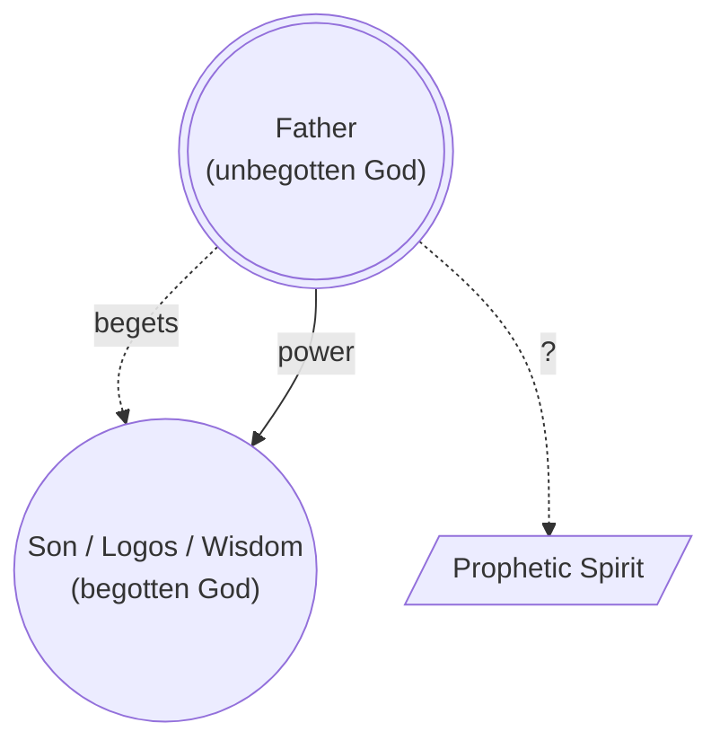
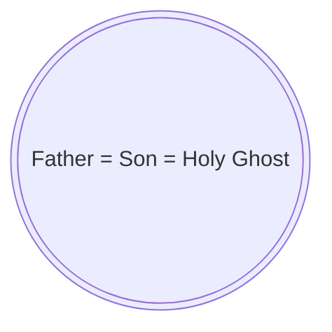
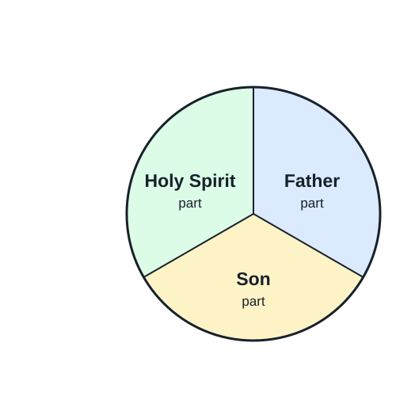
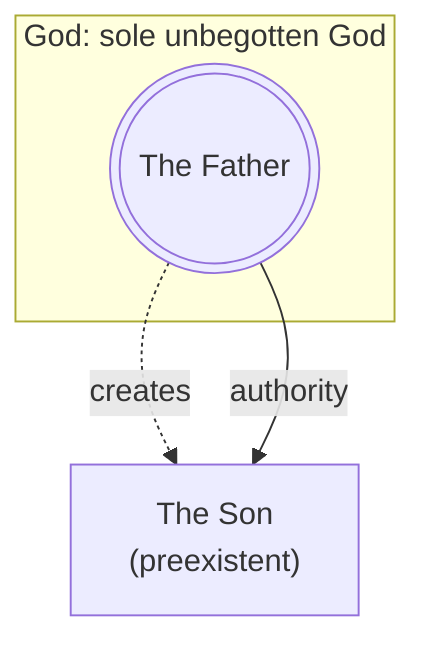
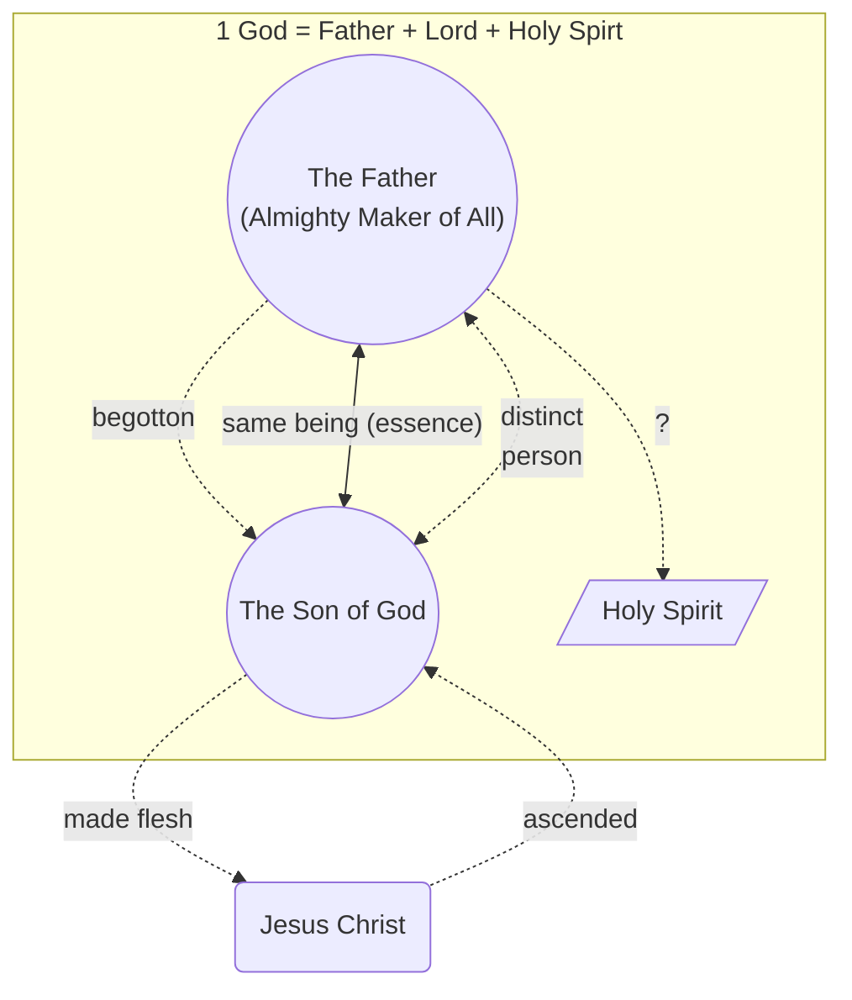
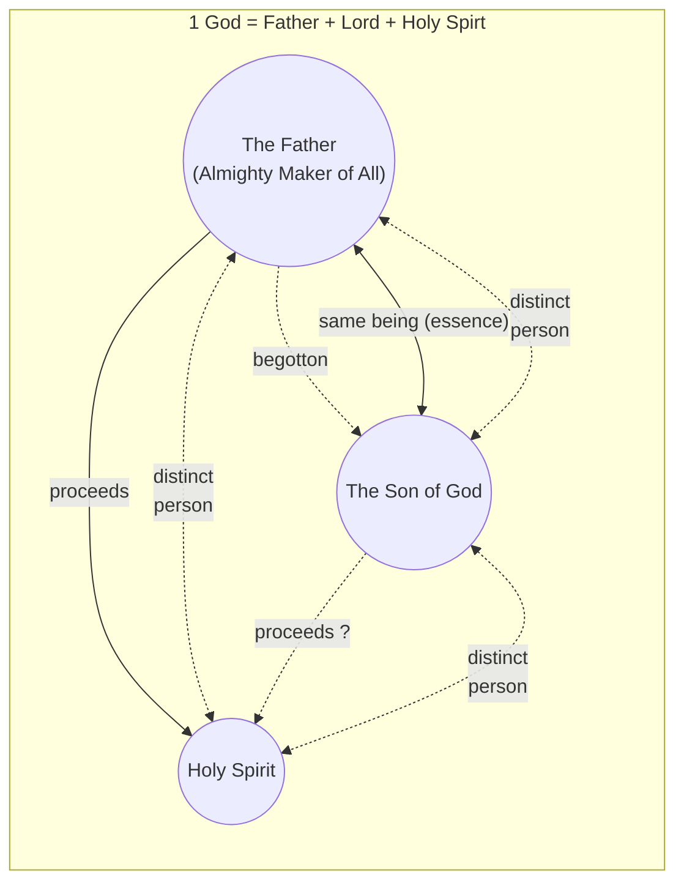
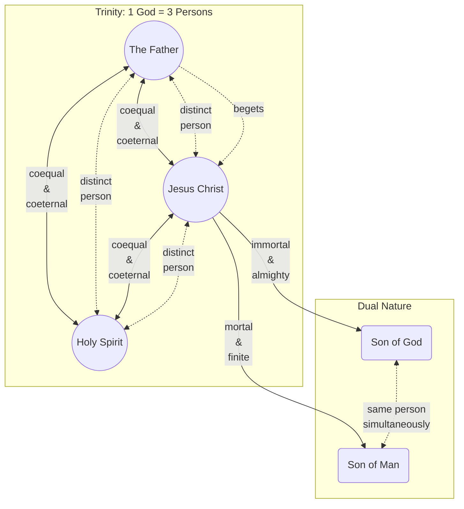

# The Development of the Trinity Theology

Trinitarian theology did not yet exist when the monotheistic Bible was written. It developed gradually through later debates, creeds, and definitions into a theology to which churches could conform.

## Monotheism

### ~1300 BC: Shema

Moses made [the monotheistic declaration](../shema.md) to the Israelites that only one God exists:

> "Hear, O Israel: The [LORD](https://ofgod.info/name) our [God](https://eternal.family.net.za/god), the [LORD](https://ofgod.info/name) is **one**!" — Deuteronomy 6:4 (NKJV), Mark 12:29

### ~500 BC: Zechariah's Declaration

The prophet Zechariah states that only one God exists:

> And the [LORD](https://ofgod.info/name) will be king over all the earth. On that day the [LORD](https://ofgod.info/name) will be **one** and His name **one**. — Zechariah 14:9 (ESV)

### ~450 BC: Malachi's Declaration

The prophet Malachi states that only one God exists:

> Have we not all **one** Father? Has not **one** God created us? — Malachi 2:10 (ESV)

### ~30 AD: Jesus quoted the Shema

Jesus quoted [the Shema](../shema.md) that Moses declared according to Mark 12:29.

### ~60 AD: Paul's Monotheistic declaration

According to 1 Corinthians 8:6, Paul also taught that only one God existed.

Paul presents God as Christ’s head:

> But I want you to understand that the head of every man is Christ, the head of a wife is her husband, and **the head of Christ is God** — 1 Corinthians 11:3 (ESV)

The Apostle Paul frequently used the phrasing "the God and Father of our Lord Jesus Christ" in his letters to the early churches: Ephesians 1:3; Ephesians 1:17, Romans 15:6; 2 Corinthians 1:3; 2 Corinthians 11:31

Paul's model:

> For though He was crucified in weakness, yet **he lives by the power of God**. For we also are weak in Him, but **we shall live with Him by the power of God toward you**. — 2 Corinthians 13:4 (ESV)

## Hierarchical Triad

Around 165 AD [Justin Martyr](https://www.britannica.com/biography/Saint-Justin-Martyr) did not describe the later Nicene model of three coequal persons sharing one essence. His surviving writings present a **hierarchical order**:

1. **The Father** is the only unbegotten God and Maker of everything.
2. **The Son** is also called Logos and Wisdom. The Father begot him before all creatures. He is numerically distinct from and subject to the Father.
3. **The prophetic Spirit** occupies third place. Justin associates the Spirit with prophecy but does not clearly explain the Spirit’s origin or ontological nature.

Justin calls the Father:

> “the only unbegotten God” — Justin Martyr, [*First Apology* 14](https://www.newadvent.org/fathers/0126.htm#14)

He places the Son and Spirit in an explicit order:

> “He is the Son of the true God Himself, and holding Him in the **second place**, and the prophetic Spirit in the third” — Justin Martyr, [*First Apology* 13](https://www.newadvent.org/fathers/0126.htm#13)

Justin identifies **Wisdom with the Son and Logos**, rather than treating Sophia as another divine member:

> “the Son, again Wisdom … and then Lord and Logos” — Justin Martyr, [*Dialogue with Trypho* 61](https://www.newadvent.org/fathers/01285.htm#P61_2360)

He says that the Father begot this Logos before creation:

> “God begot before all creatures a Beginning, [who was] a certain rational power [proceeding] from Himself” — Justin Martyr, [*Dialogue with Trypho* 61](https://www.newadvent.org/fathers/01285.htm#P61_2360)

Justin describes the Logos as distinct from the Father without being separated from the Father’s substance:

> “this power … is indeed something numerically **distinct**” and was “begotten from the Father, by His power and will, but not by abscission” — Justin Martyr, [*Dialogue with Trypho* 128](https://www.newadvent.org/fathers/01289.htm#128)

He also calls the Logos:

> “**another God** and Lord subject to the Maker of all things” — Justin Martyr, [*Dialogue with Trypho* 56](https://www.newadvent.org/fathers/0128.htm#56)

## Modalism

In the late 2nd century, Noetus is often recognized as the first to openly preach Modalism.

Praxeas brought these ideas to Rome and North Africa. He famously drew the ire of Tertullian, who wrote a massive treatise against him (Adversus Praxean). Tertullian famously mocked Praxeas’s strict stance by writing that Praxeas "did two works for the devil in Rome: he drove out prophecy and he brought in heresy; he put to flight the Paraclete *[Holy Spirit]* and he crucified the Father."

[Sabellius was a Christian priest](https://en.wikipedia.org/wiki/Sabellius), the most famous proponent of this theology, and was therefore excommunicated by Pope Callixtus I. Sabellius wrote:

> "Father, Son and Holy Ghost are **three names for the same God**"

Modalism often compares God with water. Just as water has 3 modes (ice, water, gas), they believe God has 3 modes (Father, Son, Spirit).

However, this theology fails when:

* Jesus prays to the Father
* Father loves the Son
* Father sends the Spirit
* Spirit points people to the Son

According to Modalism, the *Father is His own son!*

Modalism fails when Daniel (Daniel 7:14), Stephen (Acts 7:55-56), and John (Revelation 4:2 and 5:2-6) saw [Jesus as a distinct person from God](../son-of-man/distinct.md).

## Subordinationism

Although the Trinity concept was developed by this time, Tertullian was the first Christian author to use the Latin term ***"Trinitas"*** translated as "Trinity" in the 3rd century.

However, Tertullian's version of the Trinity was different. According to him, God is 1 substance, but 3 distinct persons.

It is often compared with a tree:

* The Father is like the roots (origin)
* The Son is like the branches (what we see)
* The Spirit is like the fruit (what we enjoy)
* Yet all 3 components are 1 tree

Another popular example is:

* The Father is like the sun (energy source)
* The Son is like the rays (what we see)
* The Spirit is like the warmth (what we feel)
* Yet all 3 components are considered sunlight

In the simplest terms, according to Subordinationism, the Father, Son, and Spirit are different parts of the same God.

This theology influenced Origen of Alexandria, who laid massive structural foundations for Christian theology.

For example ["On Prayer" (De Oratione)](https://ccel.org/ccel/origen/prayer/prayer) in Chapter XV (15), Section 1–4, Origen systematically **argues against praying directly to the Son or the Holy Spirit as distinct final recipients**, maintaining instead that the ultimate object of worship and prayer must be God the Father alone (Case, 2006). However, because of the distinct roles within the Trinity, this prayer is offered by means of **the mediation of the Son** and is **empowered within the context of the Holy Spirit** (Rambo, n.d.).

However, the Subordinationist theology fails because it leads to a chain of command:

* The Father is the most important authority
* The Son has lesser authority
* The Spirit has the least authority

This subordination clashes with the modern Trinity theology that *all are equal*!

## Arianism

In 318 AD, Arius from Alexandria began preaching [his theology](https://www.britannica.com/topic/Arianism) that Jesus, [the Son of God](https://son.ofgod.info), was created by God and not eternally divine or of the same substance as God the Father. This challenged the [Subordinationism view](#subordinationism) that Jesus is God and split the church, resulting in [Arianism](https://en.wikipedia.org/wiki/Arianism).

## Nicene Creed

Because of Arianism, church leaders gathered in 325 AD at [the council of Nicaea](https://www.historyskills.com/classroom/ancient-history/council-of-nicaea/) to prevent further church splits by:

* defining the *divinity* of Jesus;
* [condemning Arianism as heretical](https://www.rca.org/about/theology/creeds-and-confessions/the-nicene-creed/);
* establishing church hierarchy;
* separating Christian practices from Jewish traditions;

The council primarily defined the relationship between the Father and the Son. Its creed mentioned belief in the Holy Spirit but did explain the Spirit’s divinity, procession, or relationship to the Father and the Son.

Because many Christians initially rejected the Trinity doctrine for fear of polytheism (worship of multiple gods), the council had to carefully and clearly define the Trinity to avoid misunderstandings.

This led to the establishment of [the Nicene Creed](https://www.fourthcentury.com/urkunde-24/), which declared:

> * We believe in [one God](#monotheism), [the Father Almighty](https://ofgod.info),
>   * Maker of all things seen and unseen.
> * And in one Lord, Jesus Christ [the Son of God](https://son.ofgod.info),
>   * begotten of the Father,
>   * the only-begotten, that is, of ***the essence of the Father***,
>   * ***God from God, Light from Light, true God from true God***,
>   * begotten, not made, of ***the same being as the Father***,
>   * ***through whom all things came to be, both the things in heaven and on earth***,
>   * who for us humans and for our salvation ***came down and was made flesh, becoming human***,
>   * who suffered and rose again on the third day,
>   * ascended into heaven,
>   * who is coming to judge the living and the dead.
> * And in the Holy Spirit.
> * The catholic and apostolic ***church condemns*** those who say concerning the Son of God that ***“there was a time when he was not”*** or ***“he did not exist before he was begotten”*** or ***“he came to be from nothing”*** or who claim that he is of another subsistence or essence, or a creation, or changeable, or alterable.

The council's version of the Trinity was:

1. **"Homoousios"** (Of the Same Substance): The Son shares the exact same, identical divine substance. If the Father is the supreme, uncreated God, then the Son, sharing the same substance, is also the supreme, uncreated God.
2. **"Begotten, Not Made"**: The Son was "not made" (not created), but instead was "begotten" (brought forth from the same kind, like humans delivering babies)
3. **"True God from True God"**: The Son was not merely a "Second God" or a reflection of the true light.
The Trinitarian model:

This theology is also not without problems:

### The Problem with "Homoousios"

In 4th-century Greek philosophy, the word "ousia" (substance) was notoriously ambiguous:

* Primary Substance (Individual): It could mean a specific, individual thing (e.g., this specific horse). If Nicaea meant this, then saying the Father and Son are the same individual substance implies they are the exact same person which inadvertently loops right back into [Modalism](#modalism) (Sabellianism).
* Secondary Substance (Generic): It could mean a generic category or material class (e.g., Peter and Paul are both "human" because they share the same human nature). If Nicaea meant this, it solved the Modalism problem but opened the door to **Tritheism** (worshipping distinct Gods who happen to belong to the same "divine species").

The meaning of [the word 'one'](../godhead.md#the-unified-god) in [the Shema](../shema.md) also had to change accommodate the theology: "It’s not one person, it’s one substance shared by three persons". This new meaning explain why every singular pronoun referring to God may accommodating 3 distinct divine persons without violatig the Monotheistic belief.

### The Problem with "Begotten, Not Made"

This analogy suffers from deep logical incoherence when applied to an immaterial, timeless God:

* In the natural world, begetting is an event that requires a **change in state**. **A father exists before he begets a child**, and **the act occurs at a specific point in time**. Nicaea asserted that the Son was begotten **eternally** which turns it into a paradox.
* Biological begetting involves a **physical separation or extraction** of matter from the parent to form a **new individual**. If the Son is begotten from the *ousia* of the Father, it implies that the divine essence is **divisible or material**, which contradicts the absolute **immateriality and simplicity** of God.

### The Problem with "True God from True God"

When combined with strict monotheism, the preposition "from" (ek) introduces a severe metaphysical conflict:

The word "from" inherently denotes a **source** and a **derivation**. Philosophically, **a derived entity is dependent on its source for its existence**.

If the Father is the source and the Son is derived from the source, then it means that **the Son's existence is derived from the Father**.

Yet Nicene theology asserts that **the Son is fully equal (co-equal) to the Father**.

Logically, you cannot have an entity that is **completely equal while being dependent** on an external source for its being.

### The Problem with Scriptural Contradictions

A literal interpretation of certain scriptures (Psalm 2:7; 2 Samuel 7:14; Isaiah 7:14-16; Mark 10:18, 13:32; Luke 1:30-35, 2:52; John 3:34, 5:19, 5:26, 8:28, 14:28; Acts 1:11; 1 Corinthians 11:3, 15:28, 15:46; Galatians 4:4; Hebrews 2:18; Revelation 1:18) reveals that **the Son is NOT co-equal with the Father**.

## Niceno-Constantinopolitan Creed

The creed adopted at Nicaea in 325 did not provide a developed doctrine of the Holy Spirit. It ended that part of its confession with only: “And in the Holy Spirit.” The creed commonly called the **Nicene Creed** today is the expanded form traditionally associated with the [First Council of Constantinople in 381](https://www.newadvent.org/fathers/3808.htm). Its more precise name is the **Niceno-Constantinopolitan Creed**.

It retained Nicaea’s teaching about the Father and the Son, but expanded its statement about the Holy Spirit:

> “And [we believe] in the Holy Ghost, the Lord and Giver-of-Life, who proceedeth from the Father, who with the Father and the Son together is worshipped and glorified, who spake by the prophets.” — [Niceno-Constantinopolitan Creed](https://www.newadvent.org/fathers/3808.htm)

This addition established several important claims:

1. The Holy Spirit is **Lord** and the source of life.
2. The Holy Spirit **proceeds from the Father**.
3. The Holy Spirit is worshipped and glorified together with the Father and the Son.
4. The Holy Spirit spoke through the prophets.

The original Greek creed said that the Spirit proceeds **“from the Father.”** Western churches later added the words **“and the Son”**, known by the Latin term *Filioque*. This addition was not part of the creed associated with Constantinople and became a major disagreement between Eastern and Western Christianity.

The most contested Trinitarians believes are:

1. ***"There is only 1 God"*** ([the Shema](../shema.md) is very clear): If they dismiss it, then they have to accept paganism (many gods).
2. ***"Jesus is not the Father"*** ([they interacted with each other](../son-of-man/distinct.md)): If they dismiss it, then they reduce Jesus to an avatars of God (puppet show).
3. ***"Jesus was 100% human"*** ([according to both Bible](../son-of-man/human.md) and creed): If they dismiss it, then they have to accept that Jesus deceived his disciples, did not really suffer/die so sacrifice was fake
4. ***"The Father is God, Jesus is God, the Holy Spirit is God"*** (according to creed): If they dismiss it, then they invalidate their own creed.

The problem with consolidating all these points of the Nicene theology is that:

* To say all 3 Trinity Members are 1 God and 1 person, just different modes/names: is [Modalism](#modalism).
* To say all 3 Trinity Members are parts of 1 God: is [Partialism](#subordinationism)
* To say all 3 Trinity Members are 1 God and 1 mind, but 3 different personalities: is a *fragmented/split/mixed* personality God (nobody will accept it)
* To say only the Father is Almighty God and Jesus was a lessor god/angel: is [Arianism](#arianism)

The simple solution is to dismiss statement #4 and accept there is truly only 1 God, [the Father](https://ofgod.info), and that [Jesus is not God](../nature.md), but [the Son of God](../index.md), [the Christ](https://kingdom.ofgod.info/christ), a human Lord [glorified](https://word.ofgod.info/terms/glory) by [his God](../son-of-man/has-a-god.md).

However, Trinitarians solve this problem by adding a few more yet another unbiblical definition to solve the Son's *"Dual-Nature"* problem.

> [!IMPORTANT]
> David wrote:
>> The testimony of the LORD is sure, making wise the **simple**. — Psalm 19:7 (ESV)
>
> The LORD's testimony is simple enough for the layman to understand and does not require years of theological studies or complex philosophy.

## Dual-Nature

In 451, the [Council of Chalcedon](https://www.newadvent.org/fathers/3811.htm) defined Christ as **one** person existing in **two** natures, divine and human, “without confusion, without change, without division, without separation.”

The reasoning is that this **Dual-Nature** explain how Jesus could [simultaneous](https://sourcebooks.fordham.edu/basis/chalcedon.asp):

  1. be *the divine immortal allmighty omniscient omnipresent* "Son of God" to satisfy the Trinity doctrine, and
  2. be the human "Son of Man" whenever a scripture require a human Jesus. Therefore Trinitarians have no problem to acknoledge that Jesus was a human even when the concept of a human Jesus contradict the Trinity.

A still later Western document, the [Athanasian Creed](https://www.ccel.org/creeds/athanasian.creed.html), expressed the doctrine more explicitly:

> “We worship one God in Trinity, and Trinity in Unity; neither confounding the Persons, nor dividing the Substance.”

It described the three persons as **coeternal** and **coequal**.

The final solution is to use abstract Greek philosophy and words like *hypostasis* and *consubstantiality* to make a blatant contradiction sound like a [complex deep spiritual mystery](https://church.ofgod.info/terms/mystery). Therefore some Trinitarians will quote scriptures like 1 Timothy 3:16 and 1 Corinthians 13:12 out of context to prove that people must have faith in ["the mysteries of God"](https://church.ofgod.info/terms/mystery).

Despite the definition of the "Dual-Nature" it is still hard to explain how it is possible that Jesus could be both God and have an [incompatible human nature](../nature.md) simultaneous. To solve that problem they would assert that **people cannot comprehend** an infinite, immaterial, higher-dimensional God that exists outside space and time with **a finite brain**.

However, James wrote:

> But the wisdom from above is first pure, then peaceable, considerate, submissive, full of mercy and good fruits, **without doubting**, without hypocrisy. — James 3:17 (LSB)

## Conclusion

The Trinitarian theology is a later development beyond biblical monotheism, shaped by attempts to reconcile claims about the Father, Son, and Holy Spirit. [Monotheism](#monotheism), [Hierarchical Triad](#hierarchical-triad), [Nicene Creed](#nicene-creed), and [Dual-Nature](#dual-nature) trace this development.
