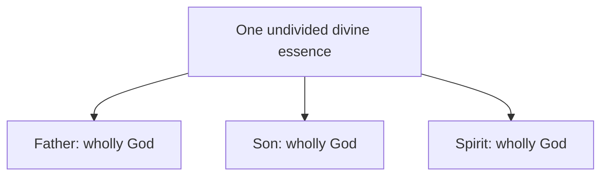

# The Athanasian Creed

The creed called Athanasian is influential in Western Christianity, but its historical setting and detailed definitions should be distinguished from the Bible. This draft expands the [development overview](../development.md).

## Definition

The text of [the Athanasian Creed](https://www.ccel.org/creeds/athanasian.creed.html) confesses one God in Trinity and Trinity in Unity. It says the Father, Son, and Holy Spirit are each uncreated, infinite, eternal, and almighty, yet not three Gods but one God. It also says they are coequal and coeternal. Its Christological section calls Christ equal to the Father according to divinity and inferior according to humanity. [Britannica's historical summary](https://www.britannica.com/topic/Athanasian-Creed) identifies it as a Latin Western document, probably composed in southern France during the fifth century, by an unknown author rather than Athanasius. Its exact author, place, and year remain uncertain, and it was not the creed adopted at Nicaea in 325. Its own wording, rather than its traditional title, is therefore the object of critique.

The diagram records the creed's intended essence-person distinction. It must not be read as one whole divided into three parts.

## Biblical Tests

### Old Testament

The LORD says, “before me no **god** was formed, nor shall there be any after me” in Isaiah 43:10 and “besides me there is **no god**” in Isaiah 44:6. Deuteronomy 6:4 identifies the LORD as “**one**.” These texts provide the common monotheistic concern shared by the creed and its critics. They do not list three coequal persons or distinguish uncreatedness among them. The [Shema](../../shema.md) reads this as the Father-alone baseline.

### New Testament

John 17:3 calls the Father “the only true **God**” and Jesus Christ the one sent. First Corinthians 8:6 identifies “one **God**, the Father” and “one **Lord**, Jesus Christ.” First Corinthians 11:3 says “the **head** of Christ is God.” Jesus' human dependence is also evident in Acts 2:22 and 1 Timothy 2:5. These passages fit the defended reading that the Father alone is Almighty God and Jesus is the distinct human Son and Christ.

The creed's actual defence distinguishes nature from role. It says the Son's inferiority belongs to his assumed humanity, while equality belongs to his divine nature. This is stronger than claiming the Son merely has a lesser job. A fair evaluation must answer that account rather than reduce it to functional subordination.

## Premises and Inferences

The creed assumes three real persons who each possess the one undivided divine essence. It also assumes that predicates of Jesus may be assigned according to either divine or human nature. From these premises it infers coequality despite statements of obedience and limitation. These are theological premises, not formal entailments of the titles “Father,” “Son,” and “Spirit.”

The Father-alone reading has different premises: biblical “God” most directly identifies the Father; Jesus is God's human Messiah; and the Spirit is God's active interaction. It can therefore read Jesus' inferiority and dependence as direct descriptions of the Son rather than attributes shifted to one nature. This reading is related to [Jesus having a God](../../son-of-man/has-a-god.md).

The creed carefully denies that eternity or almightiness is split into three examples. It also says none of the persons is before, after, greater, or less than another, while calling each God and Lord. Its claim is therefore stronger than shared purpose or membership in one class. It proposes one numerically undivided deity wholly possessed by three persons. The critical question is not whether that proposal has been stated consistently, but whether the biblical writers teach that specific relation.

## Strongest Defence and Reply

The strongest defence says the creed prevents three gods and protects Christ's full divinity and full humanity. The repeated “not three” clauses signal that its authors rejected tritheism, while the two-nature distinction lets gospel limitations be real without denying eternal divinity.

The reply is that repetition does not demonstrate numerical unity. If three persons are each almighty and fully God, the relation that makes them one God needs biblical explanation. Nature-versus-role reasoning may be coherent within the creed, but John 17:3 and 1 Corinthians 8:6 still explicitly reserve “one God” language for the Father. The creed's solution depends on its essence framework, which Scripture does not state in those terms.

## Conclusion

The Athanasian Creed is a [later Western confession](#definition), not the decision of Nicaea. Its [nature-versus-role defence](#new-testament) is more careful than a simple hierarchy, but its coequal essence claim remains an added interpretation of Father-exclusive biblical language.
