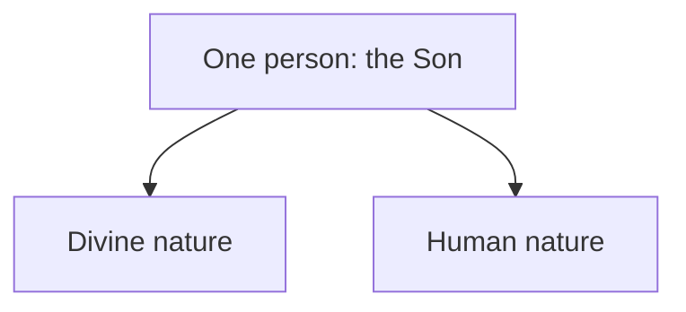

# Dual-Nature Christology

Chalcedon's formula aims to confess Jesus as truly human and truly divine without dividing him into two persons. This draft expands the [development overview](../development.md) by assessing its explanatory claims without creating a false picture of the position.

## Definition

The Definition of Chalcedon, preserved [here](https://www.newadvent.org/fathers/3811.htm), was issued in 451. It says Christ is one and the same Son, acknowledged in two natures, without confusion, change, division, or separation. It does not teach two persons, a changing divine role, or a merely apparent human life. Predicates may be assigned nature-relatively: hunger can be human and omniscience divine. Thus the formula does not assert a strict contradiction in the same respect.

Both branches belong to one personal subject. The diagram does not depict role-switching, mixture, or two persons cooperating.

## Biblical Tests

### Old Testament

The LORD is **holy** and unlike sinful humanity. The Old Testament promises a human Davidic king, for example “your **offspring** after you” in 2 Samuel 7:12 and a “**shoot** from the stump of Jesse” in Isaiah 11:1, rather than explicitly stating that the LORD will acquire a human nature. This supports a cautious distinction between God's identity and His anointed representative. It accords with the monotheistic framework in [the Shema](../../shema.md).

### New Testament

Mark 13:32 says that concerning the day or hour “nor the **Son**” knows, while James 1:13 says “God **cannot be tempted** with evil.” Jesus is nevertheless tempted. Acts 2:22 calls him “a **man** attested to you by God,” and 1 Timothy 2:5 calls him “the **man** Christ Jesus.” These passages provide strong positive evidence for Jesus' genuine humanity.

Chalcedonian readers answer that the Son can lack knowledge and be tempted according to his human nature, while remaining divine according to another nature. That is logically possible if nature-relative predicates and a single personal subject are established. The texts themselves, however, speak of Jesus as one acting and suffering subject. The question is whether two natures explain that subject better than the Father's empowering a fully human Son.

## Premises and Inferences

The dual-nature model assumes a pre-existent divine Son, incarnation, and a distinction between person and nature capable of carrying different predicates. It then infers that divine and human capacities can be attributed to the one person in different respects. This is a philosophical explanation, not a mathematical proof.

The defended reading starts elsewhere: the Father alone is Almighty God; Jesus is the real human Son and Christ; the Spirit is God's active interaction. It reads Jesus' prayer, ignorance, temptation, death, and dependence as properties of the same human person. This avoids requiring a divine personal subject to experience human limitation, but it must still interpret exalted passages about Christ responsibly.

Chalcedonian reasoning may also use the communication of attributes: because both natures belong to one person, statements about either nature can be said of the one Christ. This rule explains the creed's language, but it does not independently prove that two natures exist. The argument still needs biblical evidence that “nature” is the right bearer of knowledge, temptation, mortality, and divine power rather than a later framework organising the texts.

## Strongest Defence and Reply

The strongest defence says Chalcedon protects both sides of Scripture. A merely human Christ may seem unable to account for texts of pre-existence or divine action; a merely divine Christ may make temptation, suffering, and death unreal. Two natures permit both without confusion.

The reply grants that Chalcedon is not the crude claim that “God died” without qualification, and it should never be criticised through that strawman. The difficulty is biblical warrant and personal-subject explanation. If the one person is divine, who exactly does not know, pray, learn, and die? Nature-relative language can prevent a formal contradiction because predicates are qualified in different respects. It does not by itself explain how one personal subject possesses two ranges of awareness and experience, or how the subject relates to each nature. The human-Son reading takes the plain human predicates as direct description.

## Conclusion

Chalcedon is a carefully limited [one-person, two-natures formula](#definition), not a two-person theory. Its [nature-relative defence](#new-testament) avoids a strict contradiction, while the Father-alone reading questions whether Scripture requires its added personal-subject premises.
