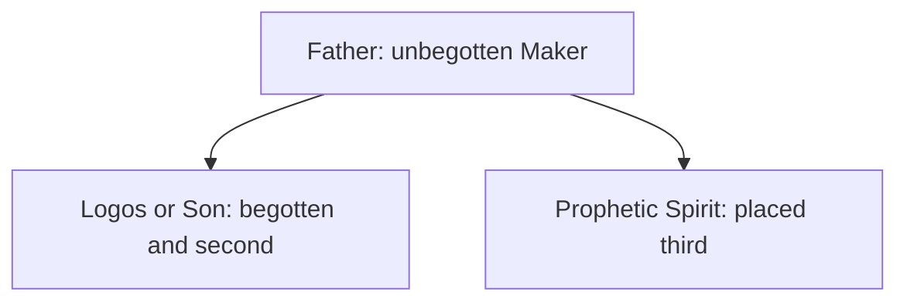

# Hierarchical Triad

This draft expands the [development overview](../development.md) by examining the ordered triad reconstructed from Justin Martyr rather than assuming that it is the later Nicene doctrine. Historical description and biblical interpretation must be kept distinct.

## Definition

A hierarchical triad places the Father first, the Logos or Son second, and the prophetic Spirit third. Justin's surviving writings present the Father alone as unbegotten and Maker, the Logos as begotten before creatures, and the Spirit in third place. This reconstruction rests on [*First Apology* 13–14](https://www.newadvent.org/fathers/0126.htm), [*Dialogue* 56](https://www.newadvent.org/fathers/0128.htm), [61](https://www.newadvent.org/fathers/01285.htm), and [128](https://www.newadvent.org/fathers/01289.htm). Those passages support an ordered pattern, but they do not make every detail equally certain. In particular, Justin's account of the Spirit's origin, personhood, and ontology remains underdefined. The reconstruction must not be imposed on every later writer.

The arrows represent Justin's order and derivation claims, not three equal parts and not a complete account of the Spirit.

## Biblical Tests

### Old Testament

The Old Testament repeatedly identifies the LORD as the “**one**” God and says, “there is **no other**,” without presenting a three-member ontology. Deuteronomy 6:4 and Isaiah 45:5 set the monotheistic baseline explored in [the Shema](../../shema.md). The Father-alone reading therefore begins with the LORD as Almighty God, not with an ordered set of divine beings. A second heavenly agent may be proposed only when the text requires it.

### New Testament

Jesus calls the Father “the only true **God**” in John 17:3 and identifies himself as the one sent. Paul similarly distinguishes “one **God**, the Father” from “one **Lord**, Jesus Christ” in 1 Corinthians 8:6. These texts naturally support authority and mission flowing from Father to Son. They do not directly establish Justin's pre-existent Logos. Acts depicts the Spirit as God's empowering activity, while its personal language requires careful reading rather than an immediate ontology.

## Premises and Inferences

The following are interpretive premises, not quoted biblical conclusions: the Logos is a personal pre-existent being; being begotten entails a lesser rank; and third place describes a distinct Spirit-person. From these premises Justin can infer a hierarchy. His statement that the Logos is *“another God and Lord subject to the Maker”* is evidence for Justin's own subordinating account. It is not proof that Scripture teaches two rival true gods. Whether “God” is honourific, representative, or ontological must be argued from context rather than assumed.

The defended reading instead treats the Father as the sole Almighty God, Jesus as the human Son and Christ whom God sent and exalted, and the Spirit as God's active interaction. This reading is developed alongside [Jesus' humanity](../../son-of-man/human.md) and [his distinction from God](../../son-of-man/distinct.md). It does not deny that Justin used lofty Logos language; it questions whether that premise is required by the apostolic texts.

## Strongest Defence and Reply

The strongest defence says Justin preserves both God's unity and the real distinction needed for Scripture's divine appearances and Christological language. In [*Dialogue* 128](https://www.newadvent.org/fathers/01289.htm#128), Justin says the Logos was *“begotten from the Father, by His power and will, but not by abscission.”* This language rejects a crude division of God, and a ranking of source and recipient need not mean different gods.

That is a serious historical point. Yet it does not turn a pre-existent subordinate deity into a merely functional order. If the Son is a numerically distinct heavenly being who receives the title God, the model adds an ontological claim beyond texts that call the Father the only true God. Conversely, authority order by itself is not the target: 1 Corinthians 11:3 explicitly says “the **head** of Christ is God.” The question is whether hierarchy entails another divine being. That further step is an inference, not a deduction.

## Conclusion

Justin's ordered triad is historically distinguishable from later coequal Trinitarian language and has an uncertain account of the Spirit. Its biblical plausibility depends on its added pre-existence premise, while the [Old Testament baseline](#old-testament) and [New Testament distinctions](#new-testament) support the Father as the one Almighty God and Jesus as His Christ.
