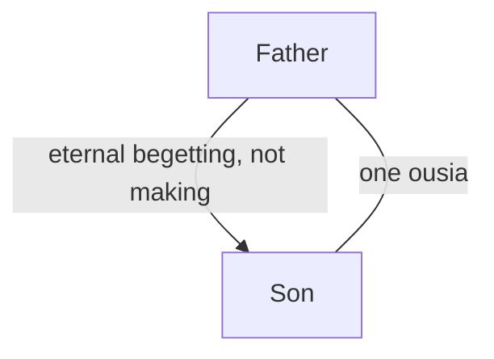

# The Nicene Creed of 325

The creed issued at Nicaea in 325 is a historical confession, not a biblical text. This draft expands the [development overview](../development.md) by testing its principal claims respectfully against Scripture.

## Definition

The text preserved in [the 325 creed](https://www.fourthcentury.com/urkunde-24/) confesses one God, the Father Almighty, and one Lord Jesus Christ. It calls the Son “God from God,” “true God from true God,” “begotten, not made,” and *homoousios* with the Father. Its anathemas reject those who say the Son came from nothing, is created, or was not before he was begotten. This is Nicaea 325, not the expanded creed associated with 381. The creed speaks primarily of Father and Son; its brief “and in the Holy Spirit” does not supply a developed doctrine of the Spirit.

The diagram distinguishes the creed's relation of origin from its claim of shared essence. Neither edge means biological generation, temporal creation, or identity of persons.

## Biblical Tests

### Old Testament

The LORD says, “I am the **first** and I am the **last**; besides me there is no god” in Isaiah 44:6. Deuteronomy 6:4 likewise says, “The LORD our God, the LORD is **one**.” These texts make the Father's unique identity central, as [the Shema](../../shema.md) explains. They do not contain *homoousios*, an extra-biblical Greek term chosen to exclude particular interpretations.

### New Testament

John 17:3 calls the Father “the only true **God**” and calls Jesus Christ the one sent. First Corinthians 8:6 names “one **God**, the Father” and “one **Lord**, Jesus Christ.” On the defended reading, these are direct distinctions: the Father alone is Almighty God and Jesus is His human Son and Christ. They are also disputed texts. Nicene readers may say “only true God” does not exclude the Son who shares the divine essence, and may take “one Lord” as including him in divine identity.

Acts 2:22 calls Jesus “a **man** attested to you by God,” and 1 Timothy 2:5 calls him “the **man** Christ Jesus.” These texts reinforce the [human account](../../son-of-man/human.md). They do not use the language of eternal generation or shared essence.

## Premises and Inferences

Nicaea distinguishes person from essence: Father and Son are not the same person, yet share one *ousia*. “Eternal begetting” is normally meant non-biologically and non-temporally; it does not mean a physical birth or a moment of creation. Derived origin therefore does not automatically imply inequality of nature. Nor is the generic-versus-individual substance distinction exhaustive: language may work differently in different philosophical settings.

These clarifications avoid weak criticism. Still, the creed's conclusion requires premises beyond biblical wording: that the Son existed eternally, that begetting identifies an eternal relation within deity, and that *homoousios* faithfully states the apostolic rule. The defended reading does not infer these premises. It reads the Father as the one God, Jesus as God's distinct Christ, and the Spirit as God's active interaction.

## Strongest Defence and Reply

The strongest defence says the creed protects the full meaning of John 1 and worship of Christ by denying that the Son is a creature. “Begotten, not made” distinguishes origin from manufacture, while *homoousios* prevents the Son from being merely a similar deity. It need not mean that Father and Son are interchangeable persons.

The reply grants that the formula is more careful than a biological metaphor or simple “two gods” accusation suggests. Its problem is biblical warrant. John 17:3 and 1 Corinthians 8:6 assign the defining title “one **God**” to the Father, and the creed asks readers to add an essence framework so that the Son is equally that God. That move may be coherent, but it remains interpretive rather than explicit apostolic speech. Person and essence are not interchangeable terms, so arithmetic about two persons cannot refute the creed. The narrower objection is that Scripture does not clearly introduce the required essence relation.

## Conclusion

Nicaea 325 clearly rejects a created Son through [its creed language](#definition). Its philosophical safeguards answer some simple objections, but its central essence premise remains disputed by the [Father-exclusive texts](#new-testament) and the human-Messiah reading.
