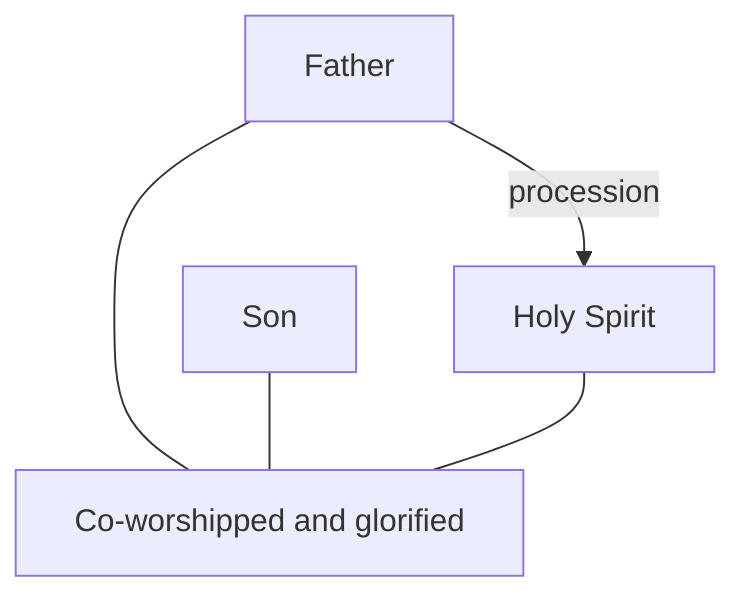

# The Niceno-Constantinopolitan Creed

The creed traditionally associated with Constantinople in 381 extends the earlier controversy to the Holy Spirit. This draft expands the [development overview](../development.md) by distinguishing its historical claims from deductions drawn from biblical language.

## Definition

The text available in [the traditional creed](https://www.newadvent.org/fathers/3808.htm) calls the Spirit “the Lord, the giver of life,” says he proceeds from the Father, and says he is worshipped and glorified with the Father and Son. Traditionally it is linked with 381. This account must not retroject the later Western *Filioque* clause into the text: its procession wording is from the Father. The creed expresses a mature theological account, not a quotation from the New Testament.

The diagram represents the traditional creed's claims. It does not insert the later claim that the Spirit proceeds from the Father and the Son.

## Biblical Tests

### Old Testament

Genesis 1:2 says “the **Spirit of God** was hovering over the face of the waters.” Numbers 11:25 and Psalm 51:11 likewise present the Spirit of the LORD as God's empowering presence and action. These texts provide important evidence for God's Spirit, but they do not explicitly define a distinct hypostasis, meaning an individual personal reality. The LORD remains the “**one**” God with “**no other**” in Isaiah 45:5. The [Shema](../../shema.md) therefore remains the starting point.

### New Testament

John 15:26 is the strongest procession text: Jesus says the Helper “**proceeds from the Father**” and that he will send him. Matthew 28:19 gives the baptismal wording “in the name of the **Father** and of the **Son** and of the **Holy Spirit**.” In Acts 5:3–4, Peter describes Ananias's purpose as “to **lie to the Holy Spirit**,” then concludes, “You have **not** lied to man but to **God**.” These are substantial texts for a high doctrine of the Spirit.

Yet agency language does not itself prove that the Spirit is a separate hypostasis, nor does it prove an impersonal force. Scripture can personify God's wisdom, word, and Spirit, while also describing the Spirit as teaching, speaking, and being grieved. The question requires cumulative interpretation. The defended reading understands the Spirit as God's active interaction, present and effective without being a second or third God.

## Premises and Inferences

The creed's conclusion uses added ontology: “Lord” is a divine title in the same sense as Father and Son; procession denotes an eternal personal relation; joint worship establishes equal deity; and the three baptismal names establish three coequal persons. Each may be defended, but none is simply restating a verse. Acts 5:3–4 may indicate that lying to God's Spirit is lying to God because the Spirit is God at work; it does not alone settle personal distinction. Conversely, calling the Spirit an impersonal force does not follow from agency language either. Both conclusions need an account of how biblical speech about God's presence works.

The Father-alone reading does not deny the Spirit's holiness, life-giving power, or divine authority. It asks whether those realities require a distinct divine person. It also preserves the scriptural distinction between God and His Christ, developed in [Jesus' distinction from God](../../son-of-man/distinct.md).

## Strongest Defence and Reply

The strongest defence combines the three texts. The Spirit proceeds, is sent, speaks, receives a name alongside Father and Son, and is treated as God. On that reading, an active force description seems too thin for the whole evidence.

The reply should not pretend that “force” settles every personal text. The model must explain how biblical personification and divine agency are to be distinguished from personal hypostasis. It must also show why its philosophical result does not alter the Father as the one God. A threefold liturgical formula establishes a close relation; equal eternal ontology is a further inference.

## Conclusion

The 381 creed makes a clear [historical confession](#definition) about the Spirit without the later *Filioque*. Its [strong biblical evidence](#new-testament) warrants serious attention, but the hypostasis and coequality claims depend on stated interpretive premises.
