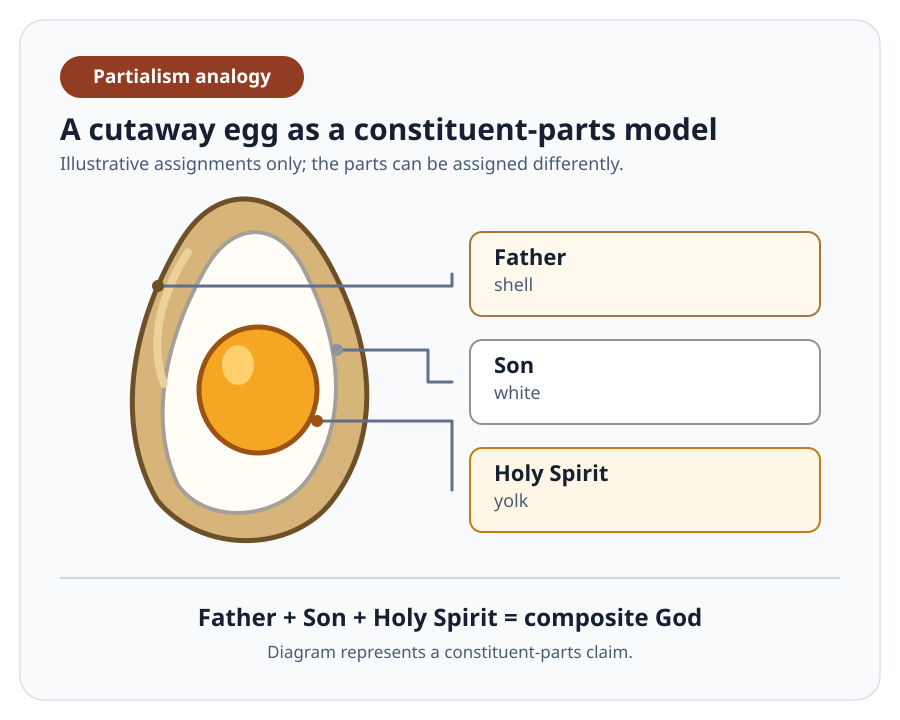

# Partialism

Partialism says that the Father, Jesus, and the Holy Spirit are proper parts. This means each part is less than the complete whole, and together they constitute God. This model's parts could be unequal.

[The Trinitarian doctrine](../development.md) also rejects partialism. This critique therefore does not attribute the belief to all who confess the Trinity. It addresses the specific claim that the Father, Jesus, and the Holy Spirit are constituent parts of one composite God.

An egg's shell, white, and yolk are parts of one egg. For that reason, this [common illustration](https://holyjoys.org/trinity-illustrations/) depicts partialism rather than proving it. The linked author rejects the egg analogy from a Trinitarian position because it presents God as composed of parts. This article also rejects the analogy, but for reasons examined below.

The question is whether Scripture gives grounds for a composite whole above the Father, or for assigning the Father, Jesus, and the Holy Spirit to divine parts.

## Biblical Identification

The first test is not whether a composite deity can be imagined. It is whether Scripture identifies God as such a whole. Israel's Scriptures first identify the LORD exclusively. The New Testament then identifies the Father and distinguishes Jesus as the one whom the Father sent.

### The LORD Is One

The [Shema](../../shema.md) confesses the LORD's unique identity:

> “Hear, O Israel: The LORD our God, the LORD is **one**.” — Deuteronomy 6:4 (ESV)

Isaiah states the same exclusive identity:

> “I am the LORD, and there is **no other**, besides me there is no God;” — Isaiah 45:5 (ESV, excerpt)

Isaiah also calls the LORD Israel's Father and Creator:

> “But now, O LORD, you are our **Father**; we are the clay, and you are our potter; we are all the work of your hand.” — Isaiah 64:8 (ESV)

Isaiah 64:8 is not a technical Old Testament definition of a later doctrine. In context, the Father is Israel's Creator. Yet it gives no picture of a larger God assembled from separate divine persons. The LORD speaks and is addressed as the one God.

The word **one** alone does not settle every philosophical question about composition. Singular pronouns alone do not do so either. These texts establish the scriptural starting point: the LORD is the one God, and Scripture does not introduce a composite divine object above him. A literal part-model therefore needs positive biblical evidence for its proposed parts.

### Father and Sent Christ

Jesus addresses the Father personally in prayer:

> “**Father**, the hour has come; glorify your Son that the Son may glorify you,” — John 17:1 (ESV, excerpt)

He then identifies the one addressed and distinguishes himself as the sent Christ:

> “And this is eternal life, that they know **you**, the only true **God**, and Jesus Christ whom you have sent.” — John 17:3 (ESV)

Paul gives the same distinction:

> “yet for us there is **one God, the Father**, from whom are all things and for whom we exist, and one Lord, Jesus Christ, through whom are all things and through whom we exist.” — 1 Corinthians 8:6 (ESV)

Paul also writes:

> “one God and **Father** of all, who is over all and through all and in all.” — Ephesians 4:6 (ESV)

In Ephesians 4:4-6, Paul names one Spirit, one Lord, and one God and Father. This threefold list does not describe three pieces of God. It identifies the Father as the one God while distinguishing the one Lord and the one Spirit.

### The Central Argument

On this scriptural reading, the argument against literal partialism is direct:

1. If the Father were a proper part of God, the whole God would exceed the Father.
2. John 17:3, 1 Corinthians 8:6, and Ephesians 4:6 identify the Father himself as the one God. They do not identify a composite whole above the Father.
3. If these texts are accepted as direct identifications of the Father himself as the only true God and the one God, the Father cannot be merely a proper part of a greater God. Treating them instead as references to a composite whole is a disputed alternative reading that needs contextual warrant.

Therefore, literal partialism is rejected on this stated scriptural reading. The conclusion does not rest merely on Scripture lacking the word *partialism*. It rests on Scripture's positive identification of the Father as the one God and of Jesus as the one whom the Father sent.

### A Fair Reply

A defender may say that *“Father” represents the whole God through part-for-whole speech.* Such speech is linguistically possible. It does not abandon partialism, because the Father would still be only a part. The proposal needs contextual warrant.

John 17 names the personal Father whom Jesus addresses as **you**, the only true God, while distinguishing Jesus as the sent Christ. Paul names **one God, the Father**, while naming Jesus separately as one Lord. These contexts support direct identification of the Father, not an unmentioned composite above him. Grammar does not settle every metaphysical theory, but the proposed part-for-whole reading is not stated by these passages.

## Human Analogy

A common literal model compares God with a human being:

*“The Father is soul, Jesus is body, and the Holy Spirit is spirit.”*

This analogy is an illustration, not evidence. Genesis says that the LORD God formed man from dust, breathed into him the breath of life, and man became a living creature (Genesis 2:7). Isaiah describes human seeking with both soul and spirit:

> “My **soul** yearns for you in the night; my **spirit** within me earnestly seeks you.” — Isaiah 26:9 (ESV)

Matthew distinguishes body and soul, and Paul mentions spirit, soul, and body (Matthew 10:28; 1 Thessalonians 5:23). The view that humans consist of three distinct elements remains disputed. Even if it were granted, it would not transfer human terms automatically to God or establish divine constituent parts.

### God's Soul and Spirit

Scripture uses soul and spirit with flexibility. The LORD says of his servant:

> “Behold my servant, whom I uphold, my chosen, in whom my **soul** delights; I have put my **Spirit** upon him;” — Isaiah 42:1 (ESV, excerpt)

Matthew applies this passage to Jesus (Matthew 12:18). The Father's **soul** expresses his delight, while his **Spirit** comes upon the servant. Possessive language alone does not prove that the Holy Spirit is impersonal. It does show that these labels are not fixed, exclusive names for anatomical portions of God.

Jesus says that true worshippers worship the Father in spirit and truth, and adds:

> “God is **spirit**, and those who worship him must worship in spirit and truth.” — John 4:24 (ESV)

This worship statement does not identify the Father with the Holy Spirit or divide God into soul and spirit components. It is compatible with understanding the Holy Spirit as God's active presence and action. Scripture's flexible vocabulary prevents an automatic Father-soul, Jesus-body, and Holy Spirit-spirit mapping. It does not by itself refute every theory of composition.

## Jesus' Human Inner Life

The Gospels present Jesus as a whole human subject with soul, spirit, will, sorrow, and obedience. In Gethsemane, he says:

> “My **soul** is very sorrowful, even to death;” — Matthew 26:38 (ESV, excerpt)

John records:

> “Now is my **soul** troubled.” — John 12:27 (ESV)

> “Jesus was troubled in his **spirit**,” — John 13:21 (ESV, excerpt)

He prays, “not as I will, but as you will” (Matthew 26:39). These passages do not require a theory about several immaterial substances within Jesus. They do show his own human inner life.

This creates a limited objection to the simple body-only version of partialism. A claim that Jesus is merely God's bodily component fails if it denies Jesus a human soul, spirit, and will. The objection does not refute every possible version of partialism.

*“A divine body-part could assume a complete human nature while retaining its divine relations.”* This stronger incarnation reply avoids the body-only objection. It also goes beyond the original analogy. It still needs separate biblical evidence that Jesus is a divine part, rather than the Father's sent human Son.

### Mediator and Agent

Paul distinguishes God from the human mediator:

> “For there is **one God**, and there is one **mediator** between God and men, the **man Christ Jesus**, who gave himself as a ransom for all, which is the testimony given at the proper time.” — 1 Timothy 2:5-6 (ESV)

The mediator is **the man Christ Jesus**, not merely divine anatomy. Peter describes the same direction of action:

> “Jesus of Nazareth, a **man** attested to you by **God** with mighty works and wonders and signs that **God did through him** ...” — Acts 2:22 (ESV, excerpt)

God acts through Jesus. The text does not describe Jesus as a bodily part of a composite God. This supports the Father's identity as God and Jesus' identity as God's human Messiah and mediator.

## Spirit, Power, and Presence

Paul distinguishes God's Spirit from the human spirit:

> “The Spirit himself bears witness with our **spirit** that we are children of God.” — Romans 8:16 (ESV)

Believers remain human when God's Spirit dwells and acts in them. Their human spirit does not become a constituent of God. Empowerment and indwelling therefore do not establish composition.

Peter describes Jesus in this pattern:

> “**God** anointed **Jesus** of Nazareth with the **Holy Spirit** and with power. ... for God was with him.” — Acts 10:38 (ESV, excerpt)

Jesus receives the Holy Spirit's empowerment from God. This is compatible with the understanding that the Holy Spirit is God's action and presence. It does not make the Holy Spirit a third constituent part of God, nor does it remove Jesus' human inner life.

## Continuing Relationship

After his resurrection, Jesus says:

> “I am ascending to my Father and your Father, to **my God** and your God.” — John 20:17 (ESV)

Paul also says that the Father is excepted from the subjects placed under the Son, and that the Son will be subjected to the Father (1 Corinthians 15:27-28). These passages show a continuing relationship between the Father and Jesus after the resurrection. Hierarchy alone does not logically refute composition, but it supports the direct Father-and-sent-Son identification rather than a theory of divine parts.

## Fullness in Christ

Colossians must be taken seriously:

> “For in him the whole **fullness of deity** dwells bodily.” — Colossians 2:9 (ESV)

This cannot be weakened into a claim that Jesus merely possesses admirable divine qualities. Neither can the fullness believers receive in him make their fullness identical with Christ's in degree or kind (Colossians 2:10).

Yet the text says that the whole fullness of deity dwells in Christ. It does not identify Christ as a bodily fraction of God. It does not assign the Father to a soul fraction or the Holy Spirit to a spirit fraction. The passage supplies no Father-soul, Son-body, and Spirit-spirit mapping.

The verse alone does not settle every account of God's nature. It remains strong testimony about Christ, but it does not overturn the direct scriptural identifications of the Father as the one God and Jesus as the sent Christ.

## Conclusion

Literal partialism is false doctrine on [the direct-identification argument](#the-central-argument). [The Father is identified as the one God, while Jesus is his sent Christ](#father-and-sent-christ). [Jesus is the human Messiah and mediator through whom God acts](#mediator-and-agent). [The Holy Spirit empowers Jesus without making either Jesus or the Holy Spirit a constituent part of God](#spirit-power-and-presence). [Human analogies do not provide the missing part-to-person mappings](#human-analogy), and [fullness in Christ does not overturn these identities](#fullness-in-christ). This is a theological judgement from Scripture, not a claim that all scholars agree.
