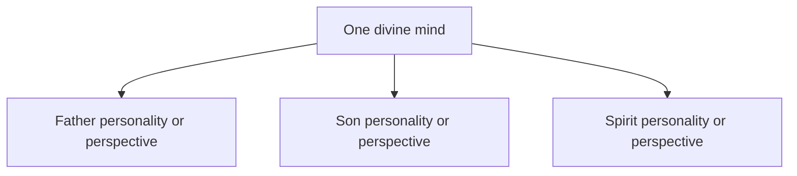

# Shared-Mind Models

Some modern explanations compare God to one mind expressed through three personalities. This draft expands the [development overview](../development.md) by evaluating the analogy without treating it as a historical school or a medical diagnosis.

## Definition

A shared-mind model proposes one divine mind with three personalities, perspectives, roles, or expressions. It is not a recognised historical named school. It is also not a medical diagnosis, and clinical language should not be used as a shortcut or insult. “Mind,” “person,” and “role” are not interchangeable terms. A mind can be a capacity; a person can be an agent; and a role can be an office or manner of action. The analogy must define which meaning it intends before it can explain biblical relations.

The branches remain ambiguous until “personality” identifies either a role of one subject or a genuinely distinct agent.

## Biblical Tests

### Old Testament

Deuteronomy 6:4 says the LORD is “**one**,” and Isaiah 45:5 says, “there is **no other**.” These statements establish God's unique identity but do not describe a shared mind with three personalities. The [Shema](../../shema.md) should therefore not be made to teach either the analogy or its denial.

### New Testament

Jesus identifies himself and “the **Father who sent me**” as witnesses in John 8:17–18 and calls the Father “the only true **God**” in John 17:3. He prays, is sent, and obeys. These are relations between agents in ordinary language. The Spirit is sent and acts in God's work, but agency language by itself does not decide whether the Spirit is another person or God's active interaction.

The defended reading takes the Father alone as Almighty God, Jesus as His distinct human Son and Christ, and the Spirit as God's active interaction. It accounts for Jesus' prayers as genuine communication with God rather than conversation within one personal mind. It also accords with [Jesus' humanity](../../son-of-man/human.md).

## Premises and Inferences

If “one mind” means one personal subject, the model tends toward modalism: Father and Son become roles or self-relations of that subject. If it means three genuinely distinct agents who perfectly share thoughts and will, their agreement establishes unity but not one numerical deity. A third undefined option is not impossible; it is simply missing the explanation needed to assess it.

This is not a fake logical proof. Human minds may be an inadequate analogy for God, and divine reality may exceed ordinary categories. But saying that ordinary categories fail does not establish a particular alternative. The model still needs to explain the distinction between the Father's knowledge and Jesus' statement that “nor the **Son**” knows in Mark 13:32, and between sender and sent in John 17:3.

Knowledge, will, and personal identity must also be separated. Two agents can know the same facts and choose the same end without becoming one mind or one being. One agent can adopt several roles without becoming several agents. If the analogy proposes a unique divine category between these options, it may be possible, but it must state what makes the distinctions personal and what makes the mind numerically one. Otherwise the analogy renames the problem rather than explaining it.

## Strongest Defence and Reply

The strongest defence says human psychology is only an analogy. God may have perfect unity of consciousness while retaining irreducible distinctions. This can warn against imagining three rival divine wills and can preserve the unity stressed by Scripture.

The reply agrees that an analogy need not map point for point. Yet an analogy offered as explanation must clarify something. If it makes the Father and Son one personal subject, it struggles with their mutual witness and prayer. If it makes them separate agents sharing a mind, it has explained cooperation rather than numerical deity. The Father-alone reading does not need to solve this dilemma because it does not begin with three divine personalities.

A limited use remains possible. Shared-mind language can illustrate complete agreement, absence of rivalry, or coordinated action. Those points do not establish one deity, three persons, or a relation of origin. Treating the analogy as a modest picture avoids overclaiming; treating it as an ontology requires the definitions and biblical premises which the picture itself does not provide.

## Conclusion

Shared-mind language is an [analogy, not a historical doctrine](#definition). Its meaning changes between one subject and three agents, while the [biblical relations](#new-testament) more plainly distinguish the Father from His human Christ.
