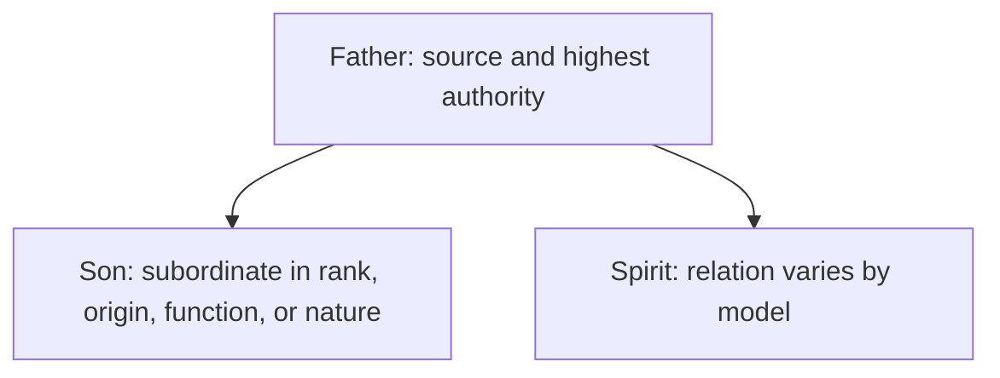

# Subordinationism

This draft expands the [development overview](../development.md). Subordinationism is an umbrella term. A useful critique must distinguish unequal authority from a claim about unequal divine being.

## Definition

The term can describe rank, origin, function, or nature. Tertullian's [*Against Praxeas* 8–9](https://www.newadvent.org/fathers/0317.htm) uses derivation and portion imagery while arguing for distinction without separation. In [“The Recipient of Prayer in Its Four Moods”](https://ccel.org/ccel/origen/prayer.xi.html), Origen says that prayer strictly speaking is offered to the Father through Christ as High Priest: *“we may not ever pray to any begotten being, not even to Christ himself, but only to the God and Father of All.”* His surrounding distinctions allow requests and intercessions to be addressed to Christ, so this is not a universal ban on addressing Jesus. These passages answer different questions and cannot establish one uniform historical doctrine. Subordinationism is also not partialism: rank between agents does not mean that they are pieces of one whole.

The category remains broad because the arrow may represent authority only, origin, or an asserted inequality of being.

## Biblical Tests

### Old Testament

The LORD says, “before me no **god** was formed, nor shall there be any after me” in Isaiah 43:10, and “besides me there is **no god**” in Isaiah 44:6. Those statements give the discussion its first boundary. They do not deny that God appoints servants, kings, angels, or a Messiah. But they do not plainly teach an eternally generated lesser divine person either.

### New Testament

First Corinthians 11:3 says “the **head** of Christ is God.” Jesus says, “the Father is **greater** than I” in John 14:28 and calls the Father “the only true **God**” in John 17:3. These passages establish a biblical authority relationship. Acts 2:22 calls Jesus “a **man** attested to you by God,” and 1 Timothy 2:5 calls him “the **man** Christ Jesus.” This accords with [Jesus' humanity](../../son-of-man/human.md).

None of those texts alone decides whether Jesus existed before his birth. A critique should not use authority as a shortcut to deny every pre-existence claim, nor use pre-existence, if argued elsewhere, as proof that Jesus is the Almighty. Those are separate inferences.

## Premises and Inferences

The target here is an added ontology: a pre-existent, lesser deity derived from the Father. It is not the simple claim that the Father has authority over His Messiah. Tertullian's derivation imagery may be read as preserving a shared source; it may also be read as making the Son a subordinate extension. Origen's narrower distinction concerns recipients for different modes of address and does not by itself settle metaphysics. Both writers require interpretation on their own terms.

The defended reading is more direct: the Father alone is Almighty God; Jesus is the human Son and Christ, dependent on and commissioned by the Father; the Spirit is God's active interaction. It preserves actual subordination without converting it into a chain of lesser deities.

Because “subordinationism” is a later umbrella label, it can conceal important differences. A writer may subordinate the Son in authority, derive the Son's existence from the Father, or assign the Son a lesser kind of being. Those claims do not entail one another. Historical evidence should therefore establish each claim separately instead of treating the label as a complete account of either Tertullian or Origen.

## Strongest Defence and Reply

The strongest defence holds that eternal origin and submission can coexist with equal divine nature. Fatherhood provides order, not inferiority; the Son's obedience then reveals love rather than ontological lack. This is a coherent proposal if its premises are granted.

The reply is limited. Derived origin does not automatically prove unequal nature, and it should not be treated as a formal contradiction. But neither does authority order prove coequal deity. When a model adds a pre-existent lesser divine being, it must explain how this fits the Father-exclusive language of John 17:3 and “one **God**, the Father” in 1 Corinthians 8:6. The authority texts themselves need no such addition.

## Conclusion

Biblical [authority order](#new-testament) is not itself the problem called subordinationism. The disputed step is the [added lesser-deity ontology](#premises-and-inferences), whereas the Father-alone reading retains Jesus' real dependence without partialism.
